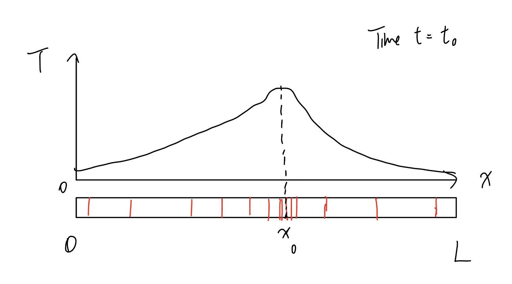
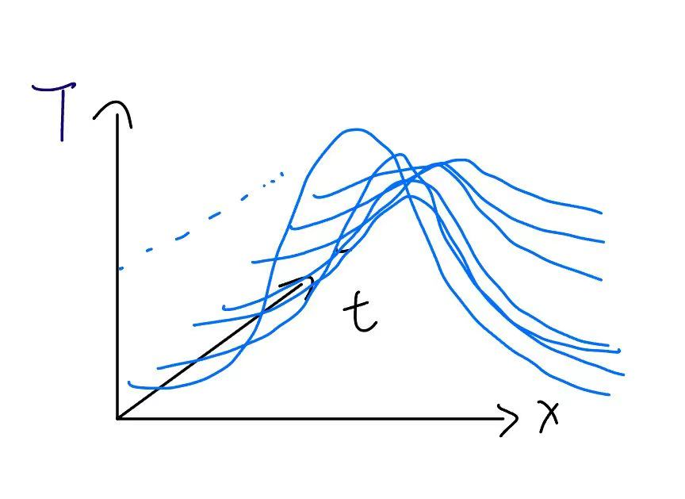
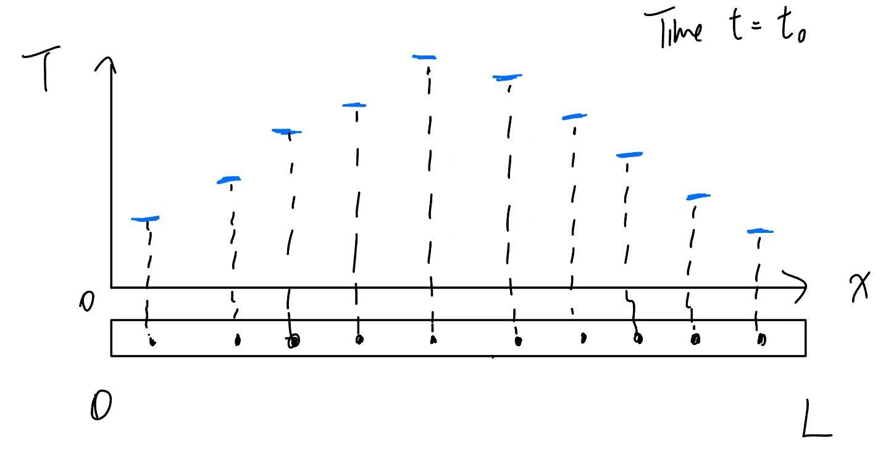
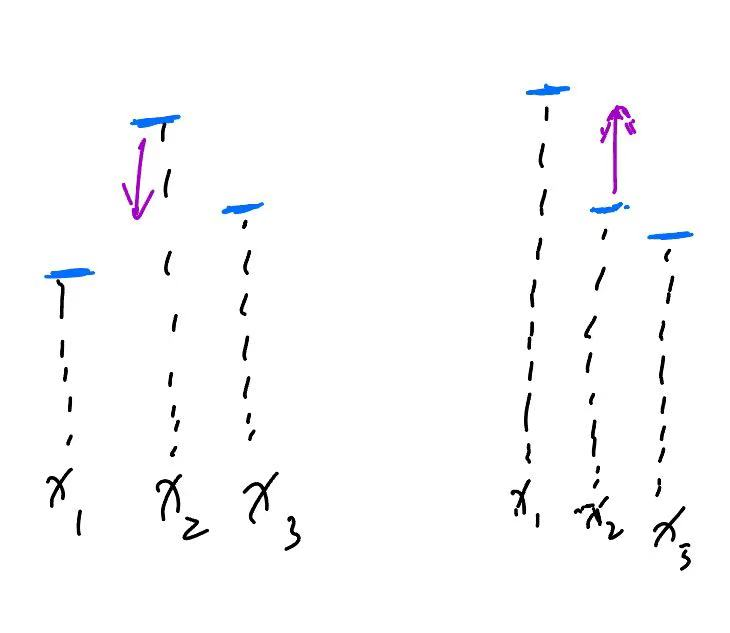

The heat equation, or the diffusion equation, models the conduction of heat throughout a solid (in one dimension only, though it is possible to generalize to more dimensions). 

To understand it, let us consider the case of a 1D metal rod with zero (or negligible) thickness, and some length $L$. Let the temperature of the rod at any given point $x$ along the rod at a time $t$ be $T(x,t)$, such that $T(x,0)$ describes the temperature distribution of the rod at time $t=0$, $T(x,1)$ at $t=1$, and so on:

At time $t_0$, every point on the rod has a temperature $T(x)$, and the value of $T(x)$ is expressed on the plot above. If we combine such plots for every value of $t$, we obtain something as follows:

Intuition tells us that as time elapses, the graph will "flatten out" (as shown above); heat will disperse evenly throughout the rod. If we can codify that sense of intuition into the language of differential equations, we'll have our heat equation. 

To do that, let's consider a discrete, rather than continuous, version of the rod. Say, for instance, that we are measuring the temperature of the rod at ten distinct points:

Let's consider only the behavior of a single point:

On the left-hand case, the point $x_2$ has a higher temperature than both of its neighbors $x_1$ and $x_3$, telling us that its temperature will tend to decrease; on the right-hand case, though $x_1$ has a higher temperature than $x_2$ and $x_3$ has lower, the average of $x_1$ and $x_3$ still exceeds $x_3$, making it tend to increase in temperature. 

Thus, we can write that for a discrete point $x_2$ on the rod with temperature $T(x_2,t)$, the rate of change of its temperature is proportional to the average of its temperature difference with its neighboring points:

$$
    \frac{\partial T}{\partial t} = \alpha(\frac{(T_3-T_2)-(T_2-T_1)}{2})
$$
for a certain proportionality constant $\alpha$. $(T_3-T_2)-(T_2-T_1) = \Delta T_2 - \Delta T_1 = \Delta \Delta T_1$, the *second difference* of $T_1$; as the distance between neighboring points becomes infinitesimal, the second difference is analogous to the second derivative with respect to $x$. Thus, we obtain the heat equation: 
$$
    \frac{\partial T}{\partial t}=\kappa \frac{\partial^2 T}{\partial x^2}
$$
where $\kappa$ is the *diffusivity* of the rod. 

Solutions to the heat equation lie once again in the method of changing variables from $(x,t)$ to a single variable $\eta$ such that the function $T$ can be rewritten entirely in terms of $\eta$: $T(x,t)=T(\eta)$. 

Note that this is the same method we used with solving the transport equation, where we had $x = x_0 + ct$ which yielded a function entirely in $t$. The question is, what is $\eta$? 

Unlike the transport equation, there are many, many different possible ways to define $\eta$ as some function of $t$ and $x$ such that it helps us solve the heat equation, so let us consider only one:
$$
    \eta = \frac{x}{2\sqrt{\kappa t}}
$$
where $\kappa$ is again the diffusivity. This is known as a *similarity solution*, as it only encompasses all solutions which are in exactly this form (can be written in terms of $\eta$) and are similar to one another. 

If we posit that $T(x,t)$ can be written entirely as $T(\eta(x,t))=F(\eta)$, a single-variable function of $\eta$, then we have
$$
    \begin{cases}
        \frac{\partial T}{\partial x} = \frac{\partial F}{\partial \eta} \frac{\partial \eta}{\partial x} \\
        \frac{\partial T}{\partial t} = \frac{\partial F}{\partial \eta} \frac{\partial \eta}{\partial t}
    \end{cases}
$$
and with $\eta = \frac{x}{2\sqrt{\kappa t}}$, we have 
$$
    \begin{cases}
        \frac{\partial \eta}{\partial x} = \frac{1}{2\sqrt{\kappa t}} \\
        \frac{\partial \eta}{\partial t} = -\frac{\kappa x}{4}(\kappa t)^{-\frac{3}{2}}
    \end{cases}
$$
resulting in
$$
    \begin{cases}
        \frac{\partial T}{\partial x} = \frac{1}{2\sqrt{\kappa t}}\frac{\partial F}{\partial \eta} \\
        \frac{\partial^2 T}{\partial x^2} = \frac{1}{2\sqrt{\kappa t}}\frac{\partial^2 F}{\partial \eta^2} \frac{\partial \eta}{\partial x} = \frac{1}{4\kappa t}\frac{\partial^2 F}{\partial \eta^2} \\
        \frac{\partial T}{\partial t} = \frac{\partial F}{\partial \eta} \frac{\partial \eta}{\partial t} = -\frac{\kappa x}{4}(\kappa t)^{-\frac{3}{2}}\frac{\partial F}{\partial \eta} = -\frac{1}{2}\frac{x}{2\sqrt{\kappa t}t}\frac{\partial F}{\partial \eta} = -\frac{\eta}{2t}\frac{\partial F}{\partial \eta}
    \end{cases}
$$
Substituting this into the original heat equation yields
$$
    \begin{aligned}
        -\frac{\eta}{2t}\frac{dF}{d\eta}&=\frac{1}{4t}\frac{d^2F}{d\eta^2} \\
        \frac{d^2F}{d\eta^2}+2\eta\frac{dF}{d\eta}=0
    \end{aligned}
$$
which solves to obtain $\frac{dF}{d\eta} = Ae^{-\eta^2}$ and thus the non-elementary $F=\alpha\ \text{erf}(\eta) + \beta$ for the error function erf, defined as 
$$
    \text{erf}(\eta)=\frac{2}{\sqrt{\pi}}\int_{0}^{\eta}e^{-u^2}\ du
$$

> Fin!
