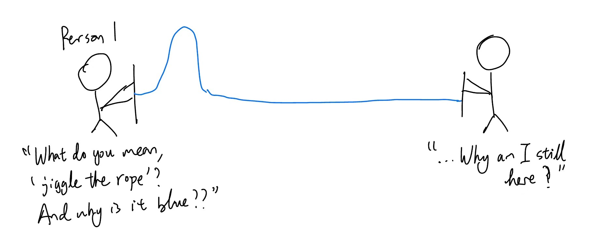
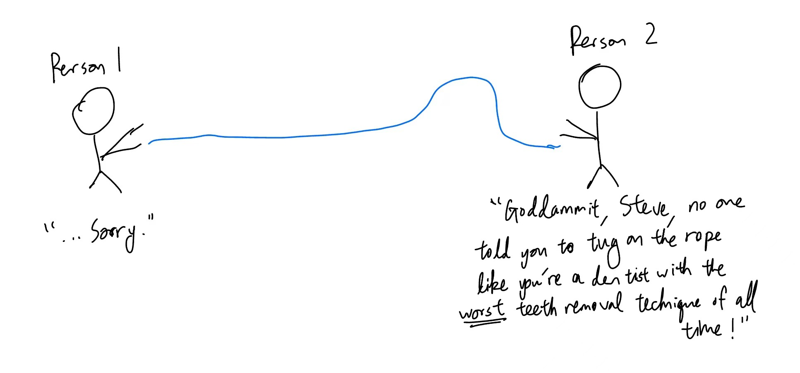
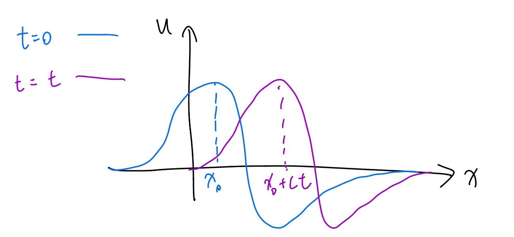
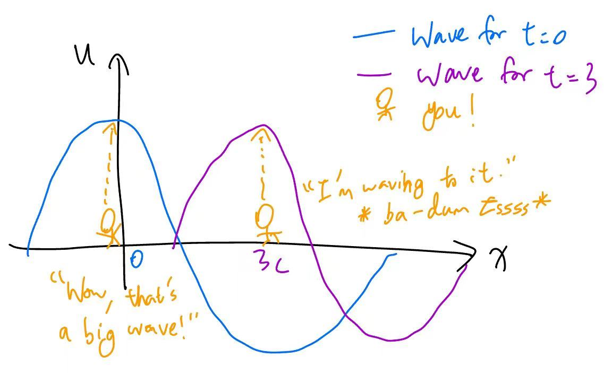

We begin our discussion of PDEs with a generalized example that can describe many different situations: a wave traveling in one direction. What do we mean by "wave", in this case? As an example, consider two people holding a rope. When one person jiggles the rope a little bit, there's going to be a displacement that occurs on that person's end:

Naturally, this disturbance on the rope is going to travel forward and reach the other person as time elapses:

What we mean by a "wave" is just any function - say a function with displacement $u$ at position $x$ - that travels forward as the time $t$ increases, much like how the "ripple" on the rope travels forward from left to right. 

Suppose that this wave had speed $c$; that is, if at one moment you had a point on the wave with position $x=x_0$ and displacement $u$, then $t$ seconds later, the same point would have travelled to position $x_0 + ct$ instead. 

At any one value of $t$, the wave has a single graph: you can say with certainty that, for every value of $x$, we have one displacement $u$. But as $t$ increases, the graph begins shifting to the right at a rate dictated by the speed of the wave $c$. 

As such, we can model a wave traveling forward as an infinite collection of graphs for $u$ against $x$, one for each value of time $t$, each being identical to the other except for being shifted to the left or right by a certain number of units ($ct$ units) - a multivariate function $u = f(x,t)$. 

What does this mean for us? Most importantly, it means that if we are traveling alongside the wave - if we also travel at a speed $c$, and in the same direction as the wave - we will not see the graph of the wave changing.

For example, let's say we start at the peak of the wave, at position $x=0$; three seconds pass, and by now, the peak of the wave is at position $x=3c$ for some wavespeed $c$. However, we are also traveling at a speed $c$, so three seconds later, we are also at $x=3c$; and thus we again see the peak of the wave, and nothing has changed. 

This means that, if we travel in the direction $x = x_0 + ct$ - if we travel at a speed of $c$, increasing our position $x$ by $c$ units every 1 unit of time $t$ - we will experience no change in the displacement of the wave $u$. In essence, if we keep up with the speed of the wave, the wave will look like it isn't changing at all; in differential-equation terms, its directional derivative along the direction we are traveling, $\begin{bmatrix}    c\\1
\end{bmatrix}$, is zero:

$$
\begin{bmatrix}
            c\\1
        \end{bmatrix}\cdot \begin{bmatrix}
            u_x \\ u_t
        \end{bmatrix} = 0
$$

yielding the *transport equation*

$$
u_t+cu_x=0.
$$

> Definition. The **transport equation**, which describes all wave functions traveling in one direction, is given by the PDE
$$
u_t+cu_x=0.
$$
> where $u(x,t)$ is the displacement of the wave, $x$ is its position, $t$ the time elapsed, and $c$ the wave speed.

In basic terms, this equation encodes the information that the dot product between the gradient and the direction $[c,1]$ - the direction of traveling at a constant speed $c$ in the $x$-direction - is zero; the displacement of the wave does not change if you travel in that direction.

How do we go about solving this equation? The crux of the matter again relies on the fact that the lines $x-ct=x_0$ are *characteristic lines* of the transport equation - they are lines where the function $u$ does not change at all with respect to time: $\frac{\partial u}{\partial t}=0$. If we move along these lines $x = x_0 + ct$, then $u(x,t)=u(x_0+ct, t)$ - a function in $t$ only - and we know that $\frac{\partial u}{\partial t}=\frac{du}{dt}=0$.

Thus we have the system of ordinary differential equations 

$$
\begin{cases}
        \frac{\partial u}{\partial t} = 0 \\
        x = x_0 + ct
    \end{cases}
$$

From the first equation, we know that $u$ is independent of $t$ along $x = x_0 + ct$ and only depends on $x$: $u = f(x)$. Substituting the second equation gives 

$$
u=f(x_0+ct)
$$

as our general solution for any function $f$ that is differentiable, or simply $u=f(x+ct)$ as $x_0$ is not fixed and can be any value of $x$. If the initial condition $u(x,0)=g(x)$ is imposed, then we have $u=g(x+ct)$.

> Theorem. The solution to the **transport equation** is given by $u(x,t) = f(x+ct)$ for a constant **wave-speed** $c$.

