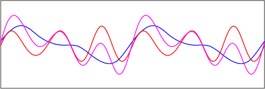
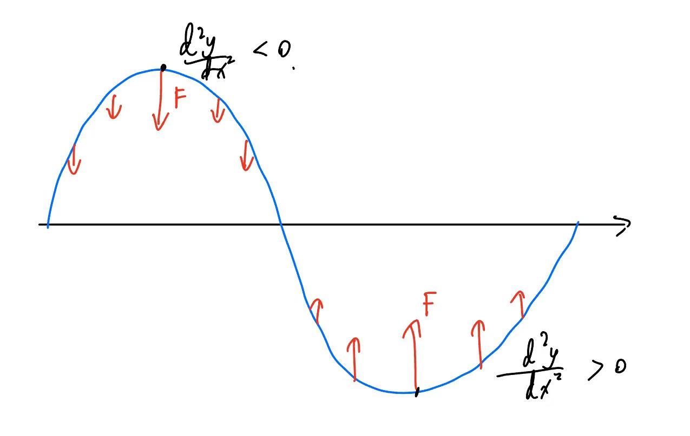
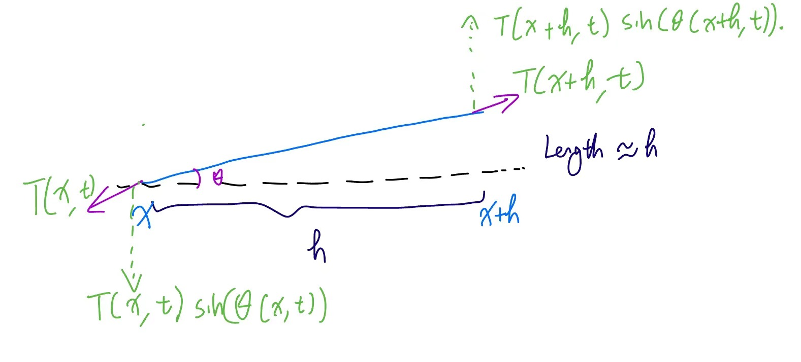

The transport equation gave a general model of a function that moved forward without changing its shape; for each value of $t$, the graph for the shape of the wave was identical barring a translation to the left or right. 

But in real life, many examples of waves do not simply translate; they also oscillate up and down as they translate forward, necessitating the use of another model. For instance, see the following animation:

As we can see, the red wave and the blue wave are both examples of solutions to the transport equation: they translate forward, but the graphs do not oscillate. The magenta wave, however, is an example of a solution to the wave equation: as it travels forward, its peaks and troughs oscillate and constantly change. 

The question is, what physical laws govern these oscillations? We know based on intuition that at the wave's peaks, there should probably be a *restoring force* pulling the wave downwards towards the zero-line, and at its troughs (bottom points), there should also be a force pulling the wave up.

When the wave is below the horizontal axis, the concavity (second derivative) is positive, as the gradient of the wave is increasing; when the wave is above the horizontal axis, the concavity is instead negative. This leads us to the hypothesis that the force on each point of the wave is proportional to the concavity of the point, or its second derivative; in other words, 

$$
\frac{\partial^2 u}{\partial t^2} = k\frac{\partial^2 u}{\partial x^2}
$$

for some constant $k$, where $u$ is the displacement of the wave (in a vertical direction), $u_{tt}$ is the second derivative with respect to time and thus the acceleration of the wave (proportional to the force on the wave, by Newton's Second Law), and $u_{xx}$ is the second derivative of the wave with respect to its horizontal displacement - in other words, its concavity along the $x$-axis.

This is a reasonable enough hypothesis, and it turns out we have enough information to prove it rigorously. Let's consider a tiny segment of the wave as follows, and make the following three assumptions:

1. This small section of the wave is nearly perfectly straight. ~~That means you won't see it making a profile on Grindr anytime soon~~
2. The angle of the section to the horizontal can be modelled by a function of $x$ and $t$, $\theta(x,t)$, which is nearly zero but not constant.
3. The vertical displacement of this small section is fairly small; we can make this assumption because the section itself is infinitely small, so the force acting on it will be of a similar magnitude. In other words, this small section of the wave is assumed to be nearly horizontal; if we take $\theta$ to be its angle with the horizontal, then its slope, $\tan \theta$, is very close to $\sin \theta$ (as $\cos \theta \approx 1$). 
4.  There are no external forces acting on the wave, only the force of its own tension $T(x,h)$ (if we imagine the wave to be a string); in other words, the wave or string is perfectly flexible.
5. The density of the section is constant: $\rho(x,t)=\rho$.

A visualization of this is shown below:

Let the starting point of the section be $(x,t)$ and the endpoint be $(x+h,t)$. The length of the section, being nearly horizontal, is approximately $h$. By Newton's Second Law, we know that the net force on the section is equal to $ma = mu_{tt}=\rho h u_{tt}$. There are no other forces acting on the section other than tension, so the net force is simply 

$$
T(x+h,t)\sin(\theta(x+h,t))-T(x,t)\sin(\theta(x,t))
$$

or the vertical component of the tension at the endpoint, subtracted by the vertical component of the tension at the starting point. The horizontal components can be assumed to be equal and opposite (since $T$ and $\theta$ change negligibly from $x$ to $x+h$). Thus, we write 

$$
T(x+h,t)\sin(\theta(x+h,t))-T(x,t)\sin(\theta(x,t)) = \rho h u_{tt}
$$

or, equivalently, dividing by $h$ obtains 
$$
    \frac{T(x+h,t)\sin(\theta(x+h,t))-T(x,t)\sin(\theta(x,t))}{h} = \rho u_{tt}
$$
where, by first principles of derivatives, the left-hand side is equal to 
$$
    \frac{\partial}{\partial x}(T(x,t)\sin\theta(x,t))
$$
The pesky fact of the matter here is that we have a $\sin \theta$ term that we do not want. As we stated earlier, however, the slope of our section (which can also be written $u_x$, since the section is infinitely small) is equal to $\tan \theta(x,t)$, which, when $\theta$ is very small, is approximately equal to $\sin \theta(x,t)$. Thus, the above expression is equivalent to 
$$
    \frac{\partial}{\partial x}(T(x,t)u_x)
$$
which, when we assume that tension is constant throughout the section, leaves us with simply
$$
    Tu_xx=\rho u_{tt}
$$
or 
$$
    c^2 u_xx= u_{tt}
$$
where $c$ is a constant. (We can show that $c$ is actually equal to the speed of the wave by means of dimensional analysis; $u_xx$ has dimensions $m^{-1}$, $u_{tt}$ has $m\ s^{-2}$, and thus their ratio is of dimension $m^2\ s^{-2}$ - the square of $m\ s^{-1}$.) This gives us our desired wave equation. 
 
The solution to the wave equation is motivated by its connection to the transport equation. To start with, we need to ask ourselves: does a solution to the transport equation satisfy the wave equation? Intuitively it does, since the solution to the transport equation is simply a wave with no oscillation at all, and should still satisfy the wave equation. To verify this, let's assume that 
$$
    cu_x + u_t=0
$$
such that some $u(x,t)$ satisfies the transport equation. We know that $u(x,t)$ is in the form $f(x+ct)$; this is the forward transport equation. Thus, we have 
$$
    u_{tt}=c^2f_{tt}(x+ct)=c^2 u_{xx}
$$
Therefore, the transport equation solves the wave equation too. But to obtain general solutions, we need another function $g$ that can create oscillations on top of the function $f$, which just moves forward without oscillating. This can happen if $g$ is a wave also satisfying the transport equation, but moving in the opposite direction; this way, the two waves will interfere due to superposition. Thus we have 
$$
    g(x-ct)
$$
as the second term of our solution; we can quickly verify that $g(x-ct)$ also solves the wave equation. Thus, our complete solution is 
$$
    u=f(x+ct)+g(x-ct)
$$
for any differentiable functions $f$ and $g$; essentially, the solution to the wave equation is two waves described by the transport equation moving in opposite directions. Quickly verifying this by plugging this back into the wave equation yields the system of equations 
$$
    \begin{cases}
        u_{t}+cu_x=g \\
        g_t-cg_x=0
    \end{cases}
$$
which gives back $u=f(x+ct)+g(x-ct)$. 

To prove that this is the most general solution, we observe that we can write the wave equation as 
$$
    \frac{\partial^2 u}{\partial t^2} - c^2\frac{\partial^2 u}{\partial x^2} = (\frac{\partial}{\partial t} + c\frac{\partial}{\partial x})(\frac{\partial}{\partial t} - c\frac{\partial}{\partial x})u = 0
$$
And thus $u$ solves either $u_t+cu_x=0$ or $u_t-cu_x=0$, yielding the previous two solutions.

(For a visualization of how the solutions to the wave equation arise from two solutions to the transport equation in opposite directions, see the animation above.)

