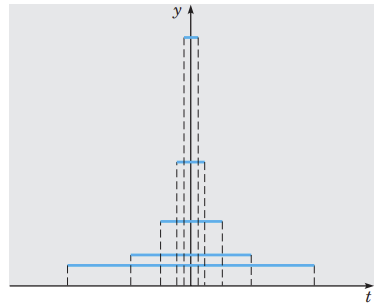

The last section was concerned with the existence of a persistent and periodic external force; however, in many cases, the forces that act on a system are not periodic, but \it impulsive \normalfont- a force of large magnitude that acts only over a short time interval. In other words, this section is concerned with systems modeled by differential equations of type

$$
au'' + bu' + cu = g(t)
$$

where $g(t)$ is large in a specific interval $t_0 - \tau < t_0 < t_0 + \tau$, but zero anywhere else. 

> Definition. We define the integral

$$
I(t) = \int_{t_0-\tau}^{t_0+\tau} g(t)\ dt
$$

> as the *impulse* of the force $g(t)$, a total measure of its strength; or, as $g(t)$ is zero everywhere outside of the interval, we can equivalently write

$$
    I(t) = \int_{-\infty}^{\infty} g(t)\ dt
$$

As an example of this, let us consider the following piecewise (discontinuous) function $g(t)$:

$$
g(t) = \begin{cases}
        \frac{1}{2\tau},\ -\tau < t < \tau\\
        0\ \text{otherwise}
    \end{cases}
$$

where it follows that $I(t)$ is always equal to 1, as is verifiable by simple integration. In an ideally impulsive scenario - that is, when this force is as impulsive as possible - the force will act over an infinitesimally small time period; that is, we want $\tau \to 0$, at which point $\lim_{\tau \to 0}I(t)$ is still 1. 

At this limit, the impulsive force is instantaneous; in physical terms, this can mean that for a ball bouncing on the ground, the duration of its contact with the ground is negligible. A figure of this limiting procedure is shown below:

Hence, we define the limit as $\tau \to 0$ of $g(t)$ to be 

> Definition. ** (Dirac delta function).** We define the idealized **unit impulse function**, or the **Dirac delta function** $\delta(t)$, as the function which satisfies:

$$
\begin{cases}
    \delta(t) = 0, t \neq 0 \\
    \int_{-\infty}^{\infty} \delta(t)\ dt = 1
\end{cases}
$$

This represents a function that is only equal to 1 at a discontinuity at $t = 0$; it must be noted that this is not a "function" in the usual sense, as it is zero everywhere except for one point, where it is essentially infinite. It follows from this definition that 

$$
\delta(t-t_0) = 0,\ t \neq t_0
$$

where $\delta(t-t_0)$ can be used to represent a unit impulse at time $t_0$.

> Theorem.** (Integrals involving delta functions).** For any function $g(x)$ continuous at $c$, we have

$$
\int_{-\infty}^{\infty}g(x)\delta(x-c)\ dx = g(c)
$$

> Proof.

First, by the definition of the delta function, we know that outside the specific interval $(c - \tau, c + \tau)$ as $\tau \to 0$, the function is zero:
$$
\int_{-\infty}^{\infty}g(x)\delta(x-c)\ dx = \lim_{\tau \to 0} \int_{c-\tau}^{c+\tau} g(x)\delta(x-c)\ dx
$$
as everywhere else the delta function is zero, resulting in the integral being zero as well. By the Mean Value Theorem, we know that in the interval $(c-\tau, c+\tau)$ there is a value $k$ such that 
$$
 g(k) = \frac{\int_{c-\tau}^{c+\tau} g(x)\delta(x-c)\ dx}{(c+\tau)-(c-\tau)} = \frac{\int_{c-\tau}^{c+\tau} g(x)\frac{1}{2\tau}\ dx}{(c+\tau)-(c-\tau)}
$$
by definition of $\delta$. The $\tau$ terms cancel and we are left with
$$
g(k) =\int_{c-\tau}^{c+\tau} g(x)\delta(x-c)\ dx
$$
However, as $\tau \to 0$, the interval becomes infinitely small and only contains the value $x = c$. As such, $c = k$ and the theorem is proven.

****

Let's see an example of the Dirac delta function in action for impulse problems. 

> Example. Consider a block of mass 1 kg applied to a spring with spring constant $k = 1$. Assume that there is no damping in this scenario, and set the initial conditions $u = 0$ at $t= 0$ and $t=\pi$. At $t = \frac{\pi}{2}$, there is an instantaneous impulsive force applied to the system, modeled by the delta function $\delta(t-1)$. Find an expression for the displacement $u(t)$.

> Solution.

We have:

$$
 u'' + u = \delta(t-\frac{\pi}{2})
$$

The homogeneous equation has solutions
$$
u =  A\sin t + B \cos t
$$
The initial conditions $u=0,\ t=0$ gives $B = 0$. To deal with the inhomogeneous part (the delta function), we utilize the delta function's piecewise definition and consider the intervals $t < \frac{\pi}{2}$, $t = \frac{\pi}{2}$ and $t > \frac{\pi}{2}$. We assume that $u$ is continuous (both because this is a physical system where discontinuities would not make sense, and because it simplifies the calculations). 

When $t < \frac{\pi}{2}$, $\delta(t-\frac{\pi}{2}) = 0$; thus the full solution is the same as the complementary function. When $t = \frac{\pi}{2}$, the delta function is infinite (and discontinuous), so we will have to use its limit definition inside an integral. First, we integrate both sides from $\frac{\pi}{2}^-$ to $\frac{\pi}{2}^+$:

$$
\int_{\frac{\pi}{2}^-}^{\frac{\pi}{2}^+} u'' \ dt + \int_{\frac{\pi}{2}^-}^{\frac{\pi}{2}^+} u \ dt = \int_{\frac{\pi}{2}^-}^{\frac{\pi}{2}^+} \delta(t-\frac{\pi}{2})\ dt
$$

As $u$ is continuous, the integral of $u$ at a single point is zero; the right-hand side equals 1 by definition. Thus we have

$$
[u']^{\frac{\pi}{2}^+}_{\frac{\pi}{2}^-} = 1 = A\sin\frac{\pi}{2} + B\cos\frac{\pi}{2} = A
$$

so $A = 1$. 

## Heaviside step function

> Definition. We define $H(x)$, the Heaviside step function, as 

$$
    H(x) = \int_{-\infty}^{x} \delta(t)\ dt.
$$

> Thus, we have

$$
H(x)=\begin{cases}
    0,\ x<0 \\
    1,\ x>0 \\
    \text{undefined, }x=0
\end{cases}
$$
> with $\frac{dH}{dx} = \delta(x)$ by the Fundamental Theorem of Calculus. These relationships can only be used inside of integrals. 

The Heaviside step function is useful in modeling many physical scenarios, namely systems like switches of an electronic circuit which can be turned on and off indefinitely.