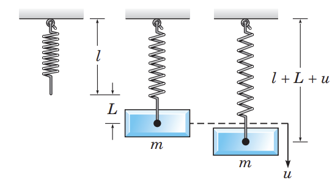
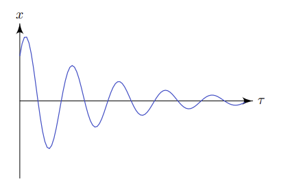
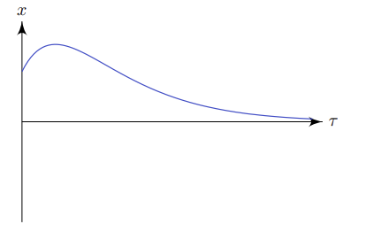
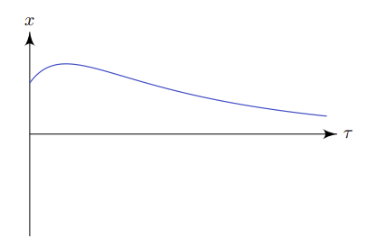
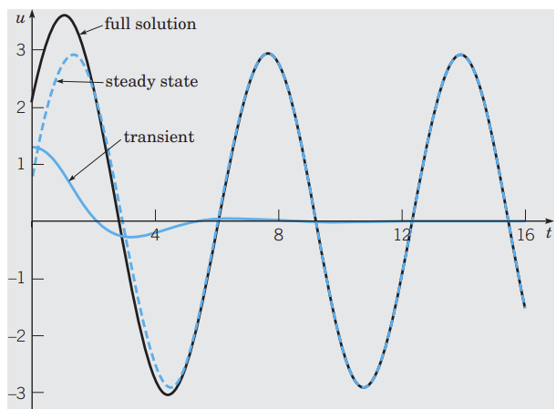
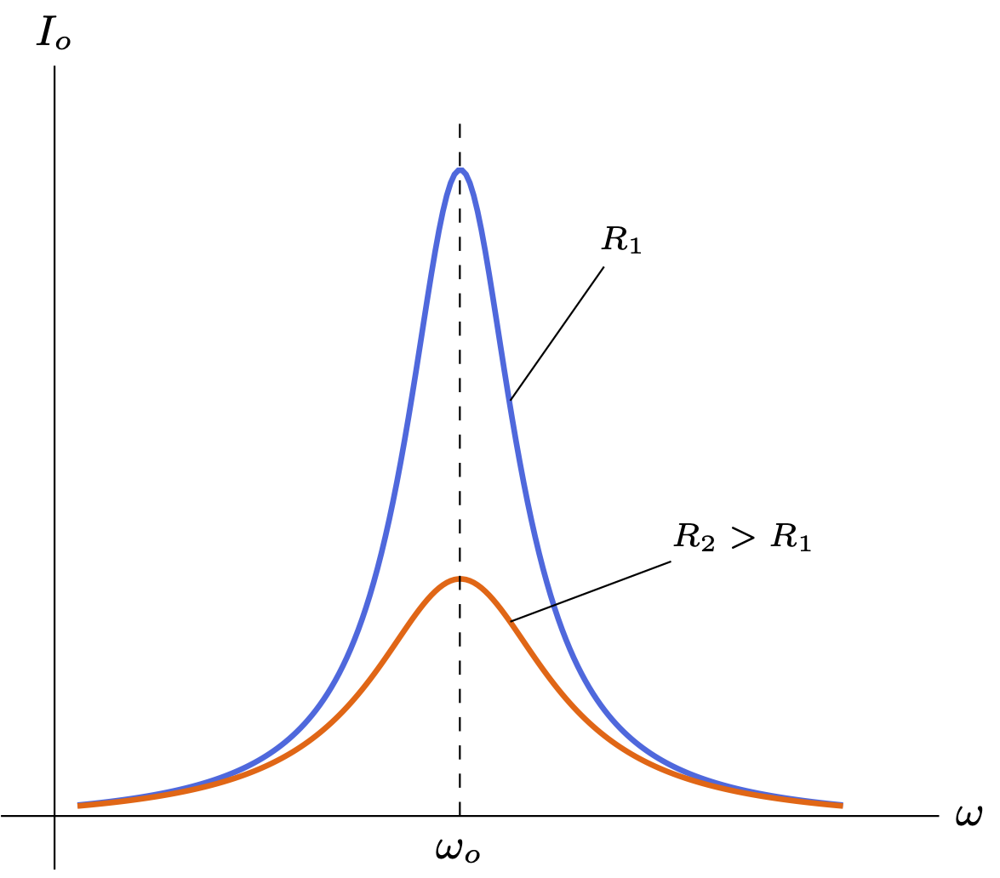

After much suffering, we have escaped the section where my endless onslaught of inaccuracies and awe-inspiring handwaves have attracted the murderous intent of all mathematicians around the world. Unfortunately, that does not mean the murderous intent is gone. It's going to be back with a vengeance, magnified to three times of its original size, and directed towards me by physicists rather than mathematicians (who are much more murderous, on average). 

> Theorem. If you're going to be murdered by someone, you'd rather be murdered by a physicist than a mathematician. This is because getting shoved into a particle accelerator and annihilated at the speed of light is a painless death, while getting stoned to death by someone hurling chalk at you is extremely painful. Don't ask me how I know.

As this section will hopefully elucidate, one of the true marvels of differential equations - second-order ones especially - is their prevalence in nature; countless physical models, from classical mechanics to electricity, rely on the same second-order DEs to tell their stories. 

We begin this discussion with the simple model of a mass on a spring.

Consider an object with mass $m$, and hence weight $W=mg$, hanging on a spring with original length $l$. Due to the application of the mass, the spring elongates to a length $l + L$; by Hooke's law, we know that when the extension $L$ is suitably small (within the limit of proportionality), the spring experiences a restoring force $F_s = -kL$ in the opposite direction to the mass's weight, where $k$ is the constant of proportionality of the spring. When the spring is in equilibrium, the net force is zero and thus we have
$$
    mg = kL.
$$
How does the system reach such an equilibrium? To answer this, we must study the displacement of the mass at time $t$ from this initial position, where the spring's extension is $L$. Call this displacement $u(t)$, or simply $u$, measured positively downwards from $l+L$. Thus, as shown in the figure, the length of the spring at any time is given by $l + L + u$, and hence the restoring force is given by 
$$
 F_s(t) = -k(L+u(t))
$$
This equation is always true even if $L+u$ is negative (the spring is compressed), as in that case the restoring force would be positive. The mass will always apply a constant weight $W=mg$ downward. We must also take into account the existence of a resistive force on the mass, due to either air resistance (or resistance from other mediums), energy dissipation, friction, or some other source. We assume that this resistive force is proportional to the speed $u'(t)$ of the mass, and directed upward:
$$
F_d(t) = -\gamma u'(t)
$$
where $\gamma > 0$ is the \it damping constant\normalfont. This equation demonstrates that no matter the direction of the motion of the mass, the resistive force is always in an opposite direction. Finally, there may be an external force applied to the mass that varies with time; this may be because the spring is moving, or because of some periodic source that forces the mass to move. We call this force $F(t)$. 

To summarize, our system involves the following forces:

1. A constant weight $W=mg$, directed downward.
2. A restoring force $F_s(t) = -k(L+u(t))$, originating from the tension in the spring and directed in the opposite direction to its displacement.
3. A resistive force $F_d(t) = -\gamma u'(t)$, opposite in direction to the mass's motion. Note that this simple model is not always accurate and can be questioned.
4. A variable external force $F(t)$.

By Newton's Second Law, we have:
$$
F_{net} = ma(t) = mu''(t)
$$
with $F_{net}$ being given by
$$
 F_{net} = mg + F_s(t) + F_d(t) + F(t) = mg - k(L+u(t)) - \gamma u'(t) + F(t)
$$
finally yielding the inhomogeneous constant-coefficient second-order differential equation
$$
mu''(t) + \gamma u'(t) + ku(t) = F(t)
$$

> Method **(Second-order differential equation modeling of a physical system).** The differential equation that governs the displacement of a spring $u(t)$ over time is given by
$$
mu''(t) + \gamma u'(t) + ku(t) = F(t)
$$
> where $\gamma$ governs a damping force that is proportional to velocity $u'(t)$, $k$ governs a restoring force that is proportional to the displacement $u(t)$, $mu''(t)$ is the net force by Newton's Second Law, and $F(t)$ is a variable external force.

Note that this equation makes several simplifying assumptions, namely that it assumes the restoring force is always under the limit of proportionality, that the resistive force is proportional to speed, and that the weight of the spring itself is negligible. 

## Undamped free vibrations

"Free" vibrations are ones where the external force $F(t)$ is zero (as opposed to "forced" vibrations, which are forced to happen by the external force). If we suppose that there is no damping, then the damping constant $\gamma$ is zero as well. This gives us the equation

$$
mu''(t)+ku(t) = 0
$$

which gives solutions

$$
 u = A\cos \omega_0 t + B\sin \omega_0 t
$$

where $\omega_0^2 = \frac{k}{m}$. We can conveniently rewrite this in the form $u = R\cos(\omega_0 t - \delta) = R(\cos\delta \cos \omega_0 t + \sin \delta \sin \omega_0 t)$, as comparing coefficients obtains

$$
\begin{cases}
A = R\cos \delta, B = R\sin\delta \\
R^2 = A^2 + B^2, \frac{B}{A} = \tan \delta
\end{cases}
$$

From $u = R\cos(\omega_0 t - \delta)$ we observe that the *amplitude* of the vibrations is $R$, the *period* is $\frac{2\pi}{\omega_0}$, the *phase* is $\delta$ (displaced $\delta$ radians rightward from normal), and the *natural frequency* is $\omega_0$. 

If no external force is applied, the system will continue oscillating without stopping, and will always vibrate at frequency $\omega_0$ regardless of initial conditions (though the amplitude will be affected). The period is proportional to $\sqrt{m}$ and inversely proportional to $\sqrt{k}$, so larger masses vibrate more slowly and stiffer springs vibrate faster.

## Damped free vibrations

In this case, the external force $F(t)$ remains zero but the damping coefficient $\gamma > 0$. Our equation is 
$$
mu''(t) + \gamma u'(t) + ku(t) = 0
$$
with characteristic equation
$$
m\lambda^2 + \gamma \lambda + k = 0
$$
yielding solutions
$$
\lambda_{1, 2} = \frac{-\gamma \pm \sqrt{\gamma^2 - 4km}}{2m}
$$
Thus, we will examine a few cases based on the value of $\gamma$.
1. $\gamma < \sqrt{4km}$. This is known as *underdamping*; the damping coefficient is very small, and the resistive force will also be fairly small in this case. As such, the solutions for $\lambda$ are complex with negative real part ($\gamma > 0$). We thus have 
$$
u(t) = e^{-\frac{\gamma}{2m}t}(A\cos \mu t + B\cos \mu t), \mu = \frac{\sqrt{4km-\lambda^2}}{2m}
$$

2. $\lambda = \sqrt{4km}$. This is the *critical damping* case, where the damping given ensures that the system returns to equilibrium in the shortest time. In this case, we write
$$
u(t) = (At+B)e^{-\frac{\gamma}{2m}t}
$$

3. $\lambda > \sqrt{4km}$. This is the \it overdamping \normalfont case, where the damping force is too large and the system returns to equilibrium slower than if critically damped. The equation gives
$$
u(t) = Ae^{\lambda_1 t} + Be^{\lambda_2 t}.
$$

(Images courtesy of Dexter Chua. Thanks!)

These three cases each yield different forms of solutions for $u(t)$, and each correspond to a different physical scenario. It is very important to note that in every case, the value of $u(t)$ decays to 0 as $t \to \infty$; this confirms our expectations that damping (resistive forces) would lead to the system gradually being pushed back to equilibrium.

In the latter two cases (critical and over-damping), no oscillations occur; in the underdamping case, however, the system does begin oscillating (though at a decreasing amplitude). Similar to the undamped case, we can rewrite $u(t)$ for underdamping as 
$$
u(t)=e^{-\frac{\gamma}{2m}t}(A\cos\mu t + B\sin\mu t) = Re^{-\frac{\gamma}{2m}t}\cos(\mu t - \delta)
$$

for certain $R$ and $\delta$, with $\mu = \frac{\sqrt{4km-\gamma^2}}{2m}$ being referred to as the *quasi-frequency*. Analogously, $\frac{2\pi}{\mu}$ is the *quasi-period*.

To examine the effect of underdamping on the system, let us compare the quasi-frequency to the undamped frequency $\omega_0 = \sqrt{\frac{k}{m}}$. We find that 
$$
    \frac{\mu}{\omega_0} = \frac{\sqrt{4km-\gamma^2}}{\sqrt{4km}} = \sqrt{1-\frac{\gamma^2}{4km}} \approx 1-\frac{\gamma^2}{8km}
$$
where the final approximation is due to the binomial expansion, when $\gamma$ is very small. Thus, the effect of underdamping is to slightly reduce the frequency of the system (and slightly increase the period). As $\frac{\gamma^2}{4km}$ gradually approaches 0, the frequency approaches 0, transforming the system into one that is critically damped.

## Forced vibrations

Forced vibrations occur when the external force $F(t)$ is nonzero, producing an inhomogeneous second-order DE. Usually, this force will be an oscillating force of the form $F(t) = F_0 \cos \omega t$ where $F_0$ and $\omega$ represent the amplitude and frequency, respectively. This results in the following differential equation:

$$
mu''(t) + \gamma u'(t) + ku(t) = F_0 \cos \omega t
$$

which, assuming that the solution of the inhomogeneous equation is $u = c_1u_1 + c_2u_2$, yields the solution

$$
 u(t) = c_1u_1 + c_2u_2 + A\cos\omega t + B\sin\omega t
$$

for some constants $A$, $B$. As shown in the above section, $c_1u_1 + c_2u_2$ decays to 0 as $t \to \infty$; thus, we refer to $u_c(t) = c_1u_1 + c_2u_2$ as the *transient solution*. As $t$ grows larger, it will eventually become negligible in magnitude compared to $U(t) = A \cos \omega t + B\sin \omega t$, which persists indefinitely and is referred to as the *steady-state solution* or the *forced response*.

The transient part of the solution allows for any initial conditions to be satisfied. However, it vanishes very quickly compared to the steady-state solution.

## Resonance
If our steady-state solution is rewritten algebraically as 

$$
U(t) = R\cos (\omega t - \delta)
$$
we are able to observe that its amplitude $R = \sqrt{A^2 + B^2}$ is dependent directly on $A$ and $B$, and thus dependent on the value of $F_0$. Through algebraic manipulation it is possible to show that:
$$
\begin{cases}
    R = \frac{F_0}{\Delta} \\
    \Delta = \sqrt{m^2(\omega_0^2 -\omega^2)^2 + \gamma^2\omega^2} \\
    \omega_0^2 = \frac{k}{m}
\end{cases}
$$
with $\omega_0$ referring to the system's natural frequency. We observe that when $\omega \to 0$, $R \approx \frac{F_0}{m\omega_0^2} = \frac{F_0}{k}$; and when $\omega \to \inf$, $R \approx 0$. Between those two extremes, there may be a value of $\omega$ that yields a maximum value of $R$; differentiation reveals that such a value $\omega_{max}$ lies at 
$$
\omega_{max}^2 = \omega_0^2(1-\frac{\gamma^2}{2mk})
$$
which only exists if $\frac{\gamma^2}{2mk} < 1$; otherwise, $R$ is monotonously decreasing. We observe that when $\gamma$ is small, $\omega_{max}$ is very close to $\omega_0$, the natural frequency. This phenomenon is known as *resonance*: at or near the natural frequency, the amplitude of the oscillations reaches a peak. This can have both positive and negative consequences, such as amplifying vibrations produced by vehicles across bridges and potentially causing a collapse.

