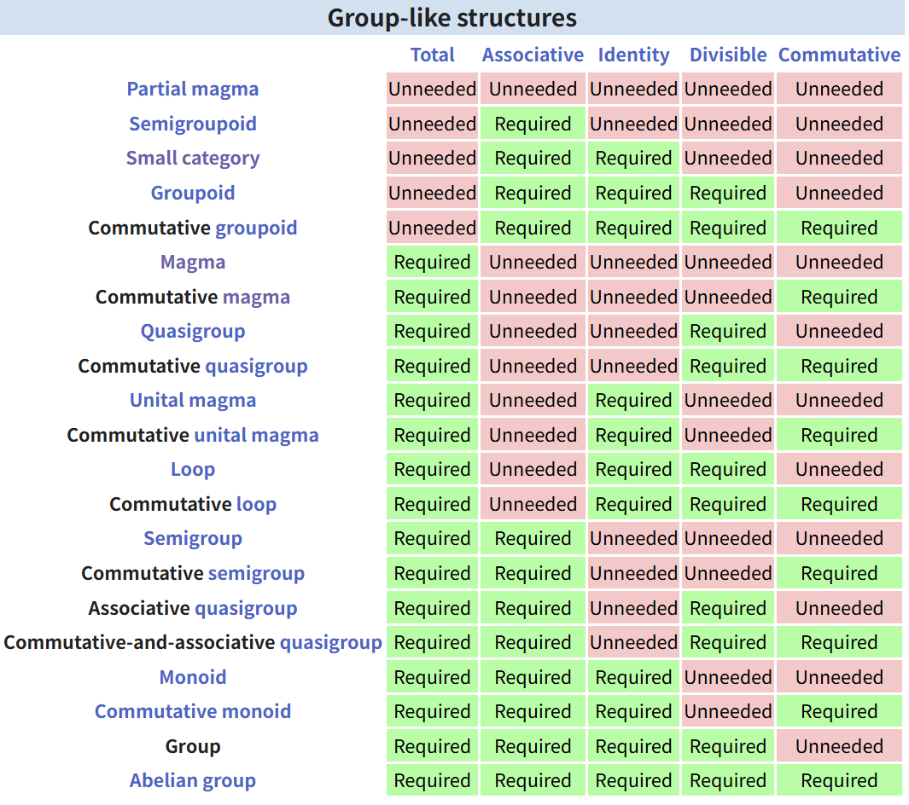
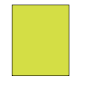
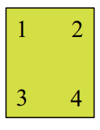
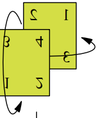
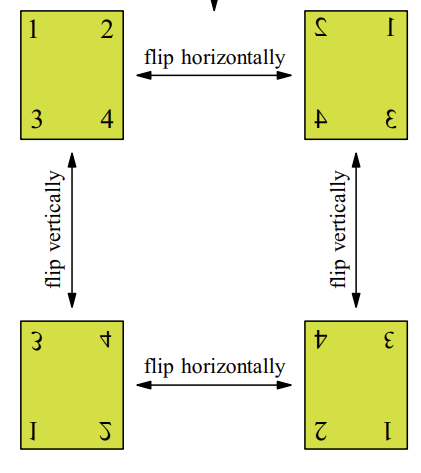
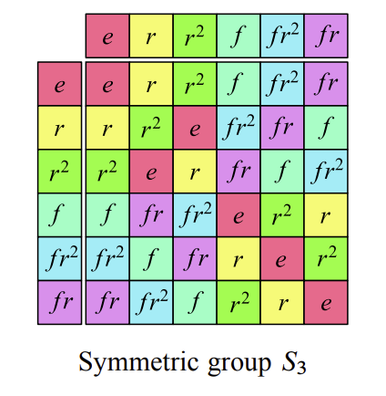

> $e$

## What are groups?

Recall our informal definition for what a group is, distilled and contextualized within the borders of a Rubik's Cube:

> Definition. A **group** is a set of **actions** (moves) $G$, a **binary operation** (a means of combining such actions) $*$, and an **identity** ("do-nothing" action) $e$ satisfying the following four rules:
1. A combination of two actions $a$ and $b$, denoted $a * b$, is still a valid action that is a member of $G$. (This is true for any sequence of consecutive actions.)
2. **Inverse.** Every action $a$ has its inverse $a^{-1}$, such that $a * a^{-1} = e$, the "do-nothing" action.
3. **Identity.** The "do-nothing" action $e$ does nothing: $a * e = a$.
4. **Associativity.** Actions are **associative**: $(a * b) * c = a* (b*c)$.

These are known as the **axioms** of a group; they encompass everything that's needed to define what a group is.

All that's left to define a group *properly* (to be pronounced in a proper Westminster accent, infused with the appropriate amount of humble snobbery and sounding for all the world like it'll colonize you and ransack you for spices then leave you with seven decades of crippling post-independence debt) is the following list of formalities:

> Definition. Formally denote a group as the triplet $(G, \cdot, e)$, where:
1. The elements of the set $G$ correspond to the actions above;
2. The element $e \in G$ is the **identity element**; and
3. $\cdot$ denotes the associative binary operation.

> (As an aside, why is associativity a fundamental requirement of groups and commutativity not so? Because groups are collections of actions, and actions - things that take something and modify that thing, also known as *functions* - are always associative:
$$
(f\circ g)\circ h(x) = f(g(h(x))) = f\circ (g\circ h(x))
$$
> by definition that $f \circ g(x) = f(g(x))$.)

As Smash Mouth famously opined in his hit single "All Star", when the definitions start coming, they don't stop coming. Digging deeper into the four given axioms reveals other intrinsic properties true for every group:

> Propositions. **Basic group properties**.

> Property 1. The identity element $e$ and the inverse $a^{-1}$ to any $a \in G$ are both unique.

> Proof.

Suppose there are two elements of the group $G$, denoted $e$ and $e'$, that both satisfy $e \cdot a = a$ and $e' \cdot a = a$ for every element $a \in G$. Then we have
$$
e \cdot e' = e
$$
and
$$
e \cdot e' = e'
$$
both by definition of the identity, and so $e = e'$.

***

Similarly, suppose that $g$ and $g'$ are both inverses of $a$, such that $ag = ag' = e$. Denote also an inverse of $a$ as $a^{-1}$ (any one of $g$ or $g'$). By the inverse axiom, we have
$$
ag = ag' = e \iff a^{-1}ag = a^{-1}ag' \iff g = g'.\ \square
$$

(We're making the business decision to drop the $\cdot$ symbol like sponsors around the world dropping Kanye West after his seventieth tweet about Jewish space lasers.)

> Property 2. Inverses and identities are both commutative: if $a^{-1} \in G$ is an inverse of $a$ in the group $(G, \cdot, e)$, then $a^{-1} a = a a^{-1} = e$. Simultaneously, $ae = e a = a$. 

> Proof.

First we prove that inverses are commutative: $aa^{-1} = a^{-1}a = e$. This is equivalent to proving that $a$ is the inverse of $a^{-1}$ if $a^{-1}$ is the inverse of $a$. We have, by the inverse axiom,
$$
e = a^{-1}(a^{-1})^{-1}
$$
where we do not yet know that $(a^{-1})^{-1} = a$ yet. Thus
$$
\begin{aligned}
e = a^{-1}(a^{-1})^{-1} &= (a^{-1}e)(a^{-1})^{-1} \\
&= (a^{-1}aa^{-1})(a^{-1})^{-1} \\
&= a^{-1}a(a^{-1}(a^{-1})^{-1}) \\
&= a^{-1}ae \\
&= a^{-1}a,
\end{aligned}
$$
relying simply on associativity. 

> A corollary of the uniqueness of inverses is that, as $a^{-1} a = e$, we have the inverse of $a^{-1}$, $(a^{-1})^{-1}$, equalling $a$.

Tihis allows us to prove also that the identity is commutative. By the identity axiom, we have
$$
\begin{aligned}
ae &= a \\
a(a^{-1} a) &= a \text{ using the above,} \\
(aa^{-1})a &= a \\
ea &= a
\end{aligned}
$$
for all $a \in G$.

## Abelian groups and subgroups

> Get me out of here.

Abelian groups are the squares in a world of rectangles. The circles in a world of ovals. The vanilla ice-cream in a world of wasabi soy-sauce split and garlic soft-serve. The Keir Starmer in a world of Boris "Long John" Johnsons. Vanilla is the best flavor of ice cream and I will die on that hill; and that's why we define

> Definition. An **abelian** group satisfies all of the above four group axioms - associativity, inverse, identity, and closure - alongside **commutativity**: for any two elements $a, b$ in an abelian group $G$ with binary operation $\cdot$, $a\cdot b = b \cdot a$.

You may have noticed that "abelian" is not capitalized, while things like "Gaussian" or "Euclidean"" frequently are. This is likely because Abel's head hasn't been commemorialized in print on a 20-euro-banknote yet, of which a possible contributing factor is his death at the ripe old age of 26. Galois, who followed him, cemented his position in the Pantheon of mathematics in a single stroke then proceeded to also keel over from some obscure duel at 21 years old. 

Are you sensing a pattern yet? Because I am, and if a tragic indoors car-crash dismembers every single participant of this Group Theory class sometime next year, I promise I'll pay for your funeral.

Abelian groups are the most familiar - and, for the most part - least traumatizing - sub-example of groups. To list just a few examples, all of $(\mathbb{R}, +)$, $(\mathbb{Q}, +)$, and $(\mathbb{N}, +)$ are abelian groups; as is $(\mathbb{R^*}, \times)$ where $\mathbb{R^*}$ is the reals excluding $0$; the group of octonions, quaternions, duonions (complex numbers), onions, etc., etc.

> Definition. Denote by $|G|$ the **order** of the group $(G, \cdot, e)$: the number of elements within the set $G$. If $|G|$ is finite, call its corresponding group a **finite group**; otherwise, call it an **infinite group**.

And that's a wrap!

## Visualizing groups

One last comment on our well-meaning but ultimately foolish and misguided attempts at visualizing groups. Earlier, we introduced what was called a **Cayley diagram** for the group of all actions on a physical object that preserves its symmetries, which looked a little something like this:

1. Begin with the object in front of you.

2. Draw numbers on the physical object. (If it's alive, please obtain its full consent beforehand.)

3. Think of every move that keeps the object occupying the same space while potentially shuffling the numbers.

4. Draw all $250! \approx 1.08 \times 10^{490}$ possible combinations of moves, preferably contained within one A4 sheet of paper or Word document for easier distribution.
   
5. ???

6. Profit!

This is all well and good, but what if we wanted to know not only how each individual action affects the object, but how two actions can combine together - and what patterns exist in such combinations, e.g. how four turns equals the identity for a Rubik's Cube? This necessitates the use of a **multiplication table**, also known as a **Cayley table**:

These tell us how two actions in the set $G$ combine together, color-coded such that identical outcomes are marked with the same color. We sometimes prefer them to Cayley diagrams because they have pretty colors annd make our brains squirt out all the feel-good chemicals.

