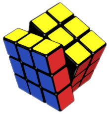
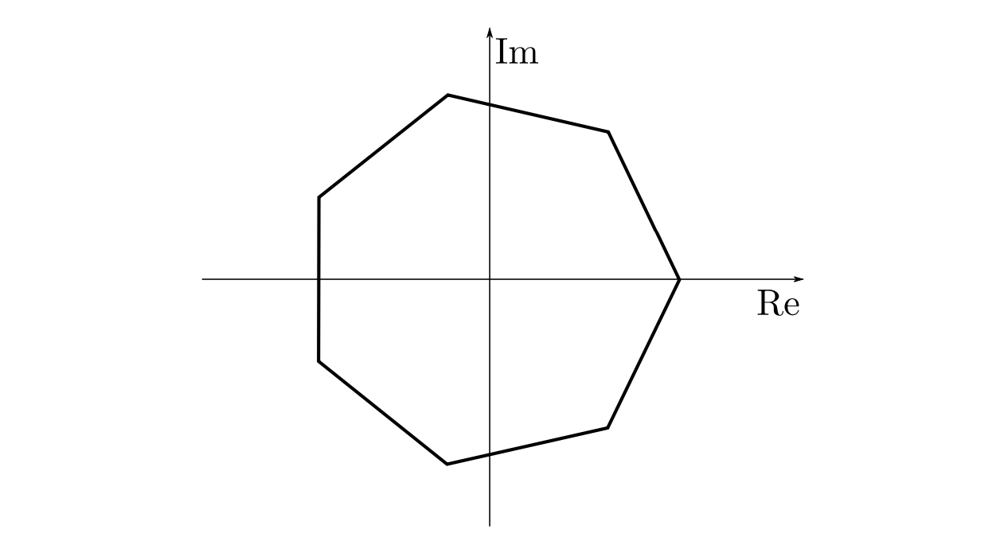
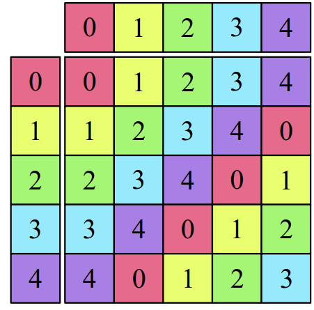

> Remember to smile and say "cheese."

There are many different types, or "families", or groups. Five simple ones - cyclic, symmetric, alternating, abelian and dihedral; and all the rest, from Lie groups to the Tits group to the simple "gentle giant" group which has order $808 017 424 794 512 875 886 459 904 961 710 757 005 754 368 000 000 000$; from the Cox ring to the Mordell-Weil group of elliptic surfaces, whose basis is provided by the Cox-Zucker machine. 

This chapter is not concerned with any of those special cases, all of which have names that sound like either a '90s emo-rock boy-band, a stage-name for a WWE wrestler, or the pseudonym of an adult-film actor. Instead, we're concerned with **symmetry groups**: groups that arise from all the ways you could spin, flip, and kick around a physical object and respect its symmetries by still keeping its shape the same. We start off with:

## Dihedral groups

> {width: 25px}: *"Say my name."* 
> "You're... you're ${\displaystyle (\mathbb {Z} _{3}^{7}\times \mathbb {Z} _{2}^{11})\rtimes \,((A_{8}\times A_{12})\rtimes \mathbb {Z} _{2}).}$"  
> *"You're **goddamn right.**"*

Dihedral groups describe the symmetries of a regular $n$-gon (in order: the pentagon, the hexagon, the heptagon, and the whyamIstillstudyingmathnowmylifeisgon.) To be exact, define such a shape geometrically as follows:

> Definition. Call a **regular $n$-gon** a collection of $n$ vertices in the complex plane, given in counterclockwise order starting from the real axis by
$$
1, e^{\frac{2\pi i}{n}}, e^{2\frac{2\pi i}{n}},..., e^{(n-1)\frac{2\pi i}{n}}\dots
$$

Thus define the dihedral group in terms of the *isometries* of the $n$-gon, as follows:

> Definition. An **isometry** of a physical object (e.g. a polygon) is any transformation upon it that maintains the distances between its vertices: something that preserves the exact shape of the object and does not deform, stretch, or compress it in any way. This could be a translation, a reflection, or a rotation, to name just a few examples.   
The **dihedral group** of an $n$-gon, denoted $D_{2n}$, is the group of all actions performable on the $n$-gon within the complex plane $\mathbb{C}$ that send the $n$-gon to itself; not only do these actions preserve distances, but they keep the $n$-gon in the exact same position.

For instance, notice that the polygon pictured above is symmetrical about the $\text{Re}$-axis; as such, a reflection about that axis will map the polygon to itself. A rotation about the origin by one of the interior angles - $900/7$ degrees for a septagon - also satisfies this requirement.

More formally, suppose that each of these isometries can be described as functions of complex numbers: $f, g: \mathbb{C \to C}$ that map one complex number to another, mapping all the points of the $n$-gon to the exact same points - though not necessarily in the same order. Thus we have

> Theorem. Let the dihedral group of a $n$-gon $D_{2n}$ - the $n$th dihedral group - be defined formally as $(D_{2n}, \circ, Id)$ where the binary operation $f \circ g$ for isometries $f, g \in D_{2n}$ entails "performing $g$ followed by $f$", or a composition of $f$ and $g$; and $Id$ is the identity isometry, given by the complex-valued function $Id(x) = x$.   We propose that the triple $(D_{2n}, \circ, Id)$ satisfies all of the group axioms and has order $2n$.

> Proof.

Let's verify the group axioms one by one.

1. **Closure.** Suppose that $f$ and $g$ are both elements of $D_{2n}$; by definition, they map the $n$ vertices of the $n$-gon - $d_1, d_2, ..., d_n$ - to $d_1, d_2, ..., d_n$, though not necessarily in that order. As such,
    $$
    (f \circ g)(d_1, ..., d_n) = f(g(d_1, ..., d_n)) = f(d_1, ..., d_n) = d_1, ..., d_n
    $$
    playing **extremely** fast and loose with notation ($f(d_1, ..., d_n)$ means not what you think it does, but instead the $n$ complex numbers $f(d_1), f(d_2), ..., f(d_n)$.) Therefore, $f \circ g$ is also an isometry and is an element of $D_{2n}$.

2. **Associativity.** $\circ$ is a composition of functions, and is thus associative.
3. **Identity.** The isometry $Id$ is an identity by definition.
4. **Inverse.** The two functions $f$ and $g$ that preserve the $n$-gon are:
- *Rotation by* $\frac{2k\pi}{n}$, given by $f(z) = z \cdot e^{\frac{2k\pi i}{n}}$ for integers $k = 0, 1, 2, ..., n-1$. For example, $f(z) = z \cdot e^{\frac{2\pi i}{n}}$ maps the point $1$ to $e^{\frac{2\pi i}{n}}$, $e^{\frac{2\pi i}{n}}$ to $e^{\frac{4\pi i}{n}}$, and so on; until evey point is mapped to the next point going counterclockwise. This is a distance-preserving isometry because
    $$
    |f(z_1) - f(z_2)| = |e^{\frac{2k\pi i}{n}}||z_1 - z_2| = |z_1 - z_2|
    $$
    and is thus a member of $D_{2n}$.
- *Reflection about the real axis*, given by $g(z) = \bar{z}$, the complex conjugate. This is also an isometry, as
    $$
    |g(z_1) - g(z_2)|^2 = (\bar{z_1} - \bar{z_2})\overline{(\bar{z_1} - \bar{z_2})} = (z_1 - z_2) \overline{(z_1 - z_2)} = |z_1 - z_2|^2
    $$
    and thus $|g(z_1) - g(z_2)| = |z_1 - z_2|$.

- Both the reflection and the rotation have well-defined inverses that are contained within $D_{2n}$: an arbitrary rotation has $f^{-1}(z) = z\cdot e^{-k\frac{2\pi i}{n}} = z \cdot e^{(n-k)\frac{2\pi i}{n}} \in D_{2n}$, and the reflection is its own inverse.

Now all that's left to prove is that the rotation and the reflection are the **only two possible elements of $D_{2n}$.**

> Lemma. $D_{2n}$ is entirely described by the set $\{Id, f, f^2, ..., f^{n-1}, g, fg, f^2 g, ..., f^{n-1} g\}$, where $f$ denotes rotation by $\frac{2\pi}{n}$ counterclockwise, $g$ denotes reflection across the real axis, and $Id$ is the identity isometry. 

> Proof. 

Suppose that $h \in D_{2n}$ is an isometry in $\mathbb{C}$. By the properties of $D_{2n}$, we know that as $1$ is a point on the $n$-gon, $h(1)$ must also be a point on the $n$-gon - $h(1) = e^{k\frac{2\pi i}{n}}$ for $k = 0, 1, ..., n-1$. Thus we have
$$
(f^{-k} \circ h)(1) = f^{-k}(h(1)) = e^{-k\frac{2\pi i}{n}}e^{k \frac{2\pi i}{n}} = 1
$$
where $f$ is rotation by $\frac{2\pi}{n}$; as such the transformation $r = f^{-k} \circ h \in D_{2n}$ keeps $1$ invariant. As $r$ is an element of $D_{2n}$, it is an isometry; and thus the distance between $r(1)$ and $r(e^{\frac{2\pi i}{n}})$, a vertex connected to $1$ by a single edge, must remain the same as the distance between $1$ and $e^{\frac{2\pi i}{n}}$ originally. $r(e^{\frac{2\pi i}{n}})$ thus shares an edge with $r(1) = 1$; therefore either 
$$
r(e^{\frac{2\pi i}{n}}) = e^{\frac{2\pi i}{n}}
$$
in whose case $r$ must be the identity isometry $Id$, via the argument that $r$ preserves distances and $r(e^{-\frac{2\pi i}{n}})$ must still share an edge with $1$ but cannot be $r(e^{\frac{2\pi i}{n}}) = e^{\frac{2\pi i}{n}}$, and thus $r(e^{-\frac{2\pi i}{n}}) = e^{-\frac{2\pi i}{n}}$; and so on and so forth with all other vertices; as such 
$$
r = f^{-k} \circ h = Id,\ h = f^k
$$
for $k = 0, 1, ..., n-1$; or, alternatively,
$$
r(e^{\frac{2\pi i}{n}}) = e^{-\frac{2\pi i}{n}}
$$
meaning that 
$$
s = (g\circ r)(e^{\frac{2\pi i}{n}}) = e^{\frac{2\pi i}{n}}
$$
where $g$ is a reflection about the real axis; as such $s$ keeps both $e^{\frac{2\pi i}{n}}$ and $1$ invariant, and so by the above argument with $r$, $s$ is also the identity. Therefore
$$
g \circ r = Id,\ r = f^{-k} \circ h = g^{-1} = g,\ h = f^k\circ g 
$$
proving the general result. Thus $D_{2n}$ is completely described by the set $\{Id, f, f^2, ..., f^{n-1}, g, fg, ..., f^{n-1}g\}$ with a total of $2n$ elements.

> It's worth noting that $D_{2d}$ is **not** abelian: for instance, a rotation followed by a reflection is not the same as a reflection followed by a rotation.

## Permutation groups

> How many ways can you arrange the letters of the word *KILL-ME-NOW*, ensuring that the dashes are not adjacent to each other and the knife is not adjacent to the student?

The puns strike again in [[Groups.Permutation Groups.Permutations and Cycles]]!

## Cyclic groups

> I knew a group theorist who once fought in World War II. Four sticks of C-4 were thrown at his feet and he literally just spun around in a circle without moving. Anyways, he's dead now.

*Cyclic groups* describe objects with rotational symmetry: triangles, benzene molecules, Shrek's head, and German windmills. Of course they can't call them rotational groups; that honor goes to $SO(2)$, which does a great job at describing how a circle rotates and a piss-poor job at anything else. Not "symmetric groups", either; that title is reserved solely for permutation groups, which contain all the seventy bazillion ways you could take a list of things and scramble them up to make them less symmetric. Who the hell came up with these names!?

That's right, Galois did. Of course it was him. Now if anyone ever asks me "if you could have dinner with any historical figure, alive or dead, who would it be?", I would tell them 1) Galois, and 2) pretty fricking dead. 

> Galois died at the age of 20 from a newly-acquired diet of a bullet to the stomach. Contrary to what historians have posited, his death in a duel was no accident; in fact, it was due to two tortured math undergrads from the far future who invented a time machine solely to convince Galois to fight and stop him from unleashing any further horrors upon our world.

Cyclic groups are differentiated from dihedral groups in that they do not contain reflections; more importantly, however, is a single property that lends them the name "cyclic".

> Definition. A **cyclic group** is a group with a **generator element** $\omega$ whose set contains only the powers of $\omega$:
$$
\{\omega^0 = Id, \omega^1, ..., \omega^{n}, ...\}
$$
> where $\omega^k$ for some $k \in \mathbb{Z}$ denotes repeating the binary operation of the group $k$ times with $\omega$ on itself.

A special case of cyclic groups is the group $C_n$ described by the set of $n$th roots of unity, under multiplication as its binary operation and $1$ as its identity:
$$
C_n = (\{z \in \mathbb{C}\ |\ z^n = 1\}, \times, 1)
$$
> More precisely, $C_n$ permits the elements $1, e^{\frac{2\pi i}{n}} , e^{2\frac{2\pi i}{n}}, ..., e^{(n-1)\frac{2\pi i}{n}}$, with the property that with $\omega = e^{\frac{2\pi i}{n}}$, we have
$$
C_n = \{\omega^0, \omega^1, ..., \omega^{n-1}\}.
$$
In this case, $\omega$ - the smallest non-identity rotation in the group, that by $\frac{2\pi}{n}$ radians counterclockwise - is the *generator* of $C_n$; by definition of $\omega$ as a root of unity, $n$ repeated actions of $\omega$ on an object cycles back to the identity - $\omega^n = 1$. Such a group represents the complete list of the rotational symmetries of an $n$-gon.

It's worth noting, though, that cyclic groups need not be related to rotations. Consider the set of all numbers that exist in $\text{mod }5$:
$$
C_5 = (\{0, 1, 2, 3, 4\}, +, 0)
$$
in which case each element is a "power" of the generator $1$ (with $a^k$ being defined as $a + ... + a$ $k$ times with addition being the binary operation to be repeated, and $a^0 = 0$). Under such a definition, we have $1^5 = 1 + 1 + 1 + 1 + 1 = 0 \text{ mod 5}$ - looping back to the identity. This is rather colorfully depicted by the multiplication table below:

In fact, $\mathbb{Z}$ itself - or any group of the form $n\mathbb{Z}$, for that matter - is a cyclic group; a set of (additive) powers of $n$ that go on to infinity instead of looping back to bite its own tail like a better-behaved cyclic group would.

It's very much worth noting here, as a preface to things to come, that cyclic groups form what could be considered the basic building blocks of group theory: they are themselves formed from a single element - its generator - and in any other group, where if $a$ is an element then $a^k$ is an element by definition, the set
$$
\{Id, a, ..., a^{n-1}\}
$$
where $a^n = Id$ is itself a cyclic group by definition. In fact, all abelian groups - themselves one of the simplest types of groups - can be constructed out of cyclic groups! To explore this concept more, we turn to one final idea to cap off the entire chapter.