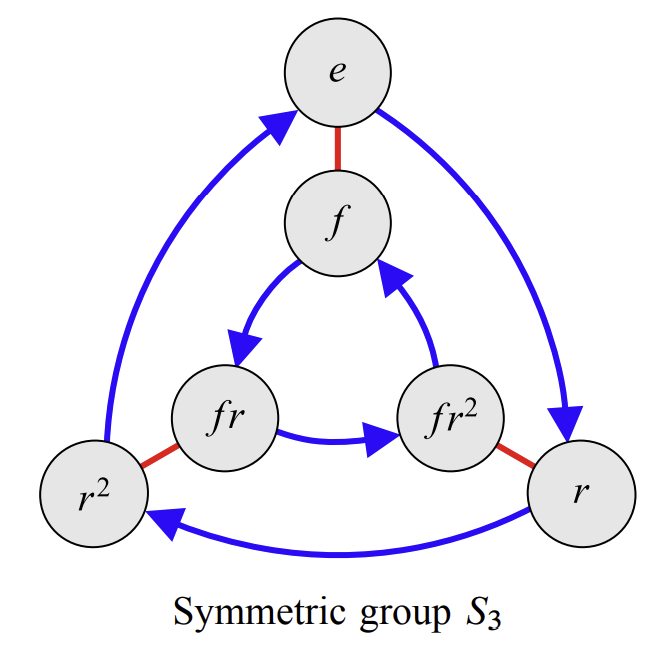
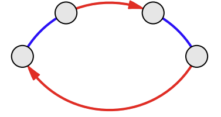
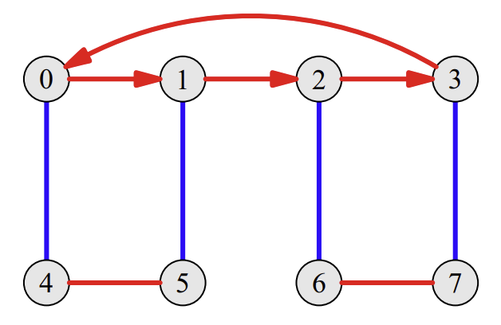
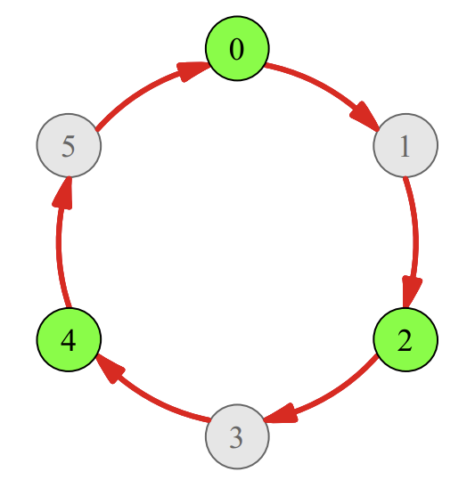
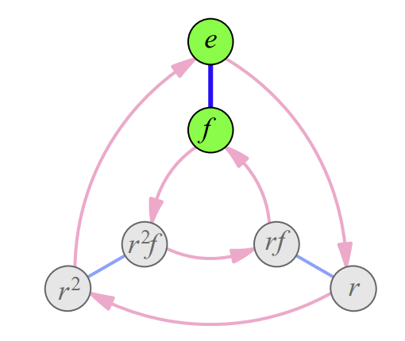

> My Discord group has the structure of a patriarchical cult-of-personality dictatorship brought to power by a nationalistic military junta.

## Visualizing group structures

Let's begin our discussion with the symmetric group $S_3$ (isomorphic to the dihedral group $D_6$), visualized here in all its Cayley diagram glory:

We will focus on $S_3$ since it is one of the very few groups whose Cayley diagram does not resemble either a four-dimensional icosahedron, a pentagram used in rituals to summon forth the bowels of hell, or a GPU overheating accident waiting to happen. 

What do we notice about $S_3$? First, its structure is (appropriately, given the name) symmetric; it's three mini-structures stitched together into one, each looking something like

this. Owing to the isomorphism $S_3 \cong D_6$, one way of thinking of this is that the blue lines above represent multiplication by the reflection element $f$ while the red lines represent multiplication by a rotation of $120$ degrees. 

What gives rise to a group structure of this shape? From what we know about $D_6$, we have
$$
frf = r^{-1} = r^2
$$
and indeed, this is the relation that *defines* the dihedral group just as $r^n = e$ defines the cyclic group. Starting from the identity (the leftmost bubble), we apply $f$, $r$ and $f$ in order (blue-red-blue), reaching the right-most bubble; this leads us to $r^2$, which can be taken back to the identity with another application of $r$ - hence forming the closed-loop structure above. 

Importantly, we know one thing: that it doesn't matter if we started with $e$ - indeed, if we had begun with $r$ or $r^2$, an application of $f$, then $r$, then $f$ in sequence would still take us to $r^{-1}$. This relationship defines $D_n$; it permeates $D_n$, and so the Cayley diagram above that represents that relationship also permeates the Cayley diagram of $D_n$.

> Sort-of-but-not-really a theorem: groups are often defined by a single equation or equations that capture the relationships between its elements, like $r^n = e$ ($C_n$) or $frf = r^{-1}$ ($D_{2n}$). The Cayley diagram that captures that relationship will be the fundamental component from which the entire Cayley diagram of the group is built, because the relationship is true for every element in the group; this is known as **regularity**.

For instance, we see that the following Cayley diagram

is not at all a *regular* one; the structure of the red arrows on the top differs from its structure on the bottom. Denoting the red action as $r$ and the blue action as $b$, we have
$$
0 \cdot r \cdot r \cdot r = 0 \cdot r^3 = 3
$$
from the top half, and also $3 \cdot r = 0$, yielding $r^4 = e$ and $r^2 \neq e$; however, from the bottom half we have
$$
4\cdot r = 5,\ 5 \cdot r =4
$$
yielding $r^2 = e$. THis is a direct result of the properties of the red action not being constant throughout the diagram.

From all of this, we conclude one fact: just as groups are constructed out of individual elements, the structure of a group - as represented by its Cayley diagram - are constructed out of sub-structures that capture some relationship intrinsic to the group. How do we locate these sub-structures, and are they uniquely defined?  Two main methods present themselves.

### Subgroups in group structures

One natural candidate for finding sub-structures in a group is looking towards the subgroups of that group; subgroups are groups entirely contained within another group, and their Cayley diagrams reflect that. For instance, we have

$C_3$ (drawn in green) a subgroup of $C_6$; and $C_6$ in turn a subgroup of $D_{12}$ or $C_{12}$, and so on. The above example shows subgroups to be exactly what we are looking for - sub-structures that repeat themselves over and over again to form the entire group: $0, 2, 4$ form a cyclic structure described by $C_3$, and so do $1$, $3$ and $5$ - the two combining together to form $C_6$. 

The only issue is that $1$, $3$ and $5$ share only the *structure* of $C_3$, not its status as a group; $1$, $3$ and $5$ do not form a group due to the lack of an identity element. How do we capture the substructures of a group that have relationships resembling a subgroup, but are not subgroups in truth?

### Cosets in group structures

> Definition. Let $H$ be a group, and $G$ its subgroup. A **left coset** of $G$, generated by the **representative** $a \in H$ and denoted $aG$, is the set of elements 
$$
\{ag \ |\ g \in G\}
$$
> with the **right coset** generated by $a$, denoted $Ga$, defined correspondingly as
$$
\{ga \ |\ g \in G\}
$$
> The necessity of defining both a right and left coset is that a left coset is not necessarily equal to a right coset, unless $H$

(Not to be confused with *corset*, which is what Victorian-era ladies wore when they wanted to give themselves stomach problems and an incurable hunchback before the age of 25.)

The *algebraic properties* of cosets are crucial towards the final aim of this chapter - a proof of Lagrange's theorem - but for now, all we want to talk about is what cosets *are*, and what they look like. 

The cosets of a subgroup copy that subgroup's structure. To best understand this, consider the example above: $C_3$ is a subgroup of $C_6$, and its structure is a loop of three elements positioned in a circle. The elements $\{1,3,5\}$ - or, when expressed as a coset, $1C_3 = \{0+1, 2+1, 4+1\} = \{1,3,5\}$ retain exactly that structure. 

As such, cosets give us the language to express what the basic underlying structure of a group is: as we will soon see, a group can be decomposed, or *partitioned*, into the cosets of its subgroups. Take $D_6$ as an example:

The smallest subgroup of $D_6$ (excepting the trivial subgroup $\{e\}$) is the group of two elements $D_2 = \{e,f\}$ outlined in green; $f$ satisfies $f^2 = e$, and so $\{e,f\}$ is closed. The basic structure given by $f^2 = e$ - two $f$-actions on an element, marked in blue, return us to the original element - is repeated for the elements $\{r, rf\}$ as well as $\{r^2, r^2f\}$; these two sets correspond exactly to $rD_2$ and $r^2D_2$!

But there's more; if we just look at the red arrows, we'll notice that **two** cyclic structures are embedded in $D_6$: one, the subgroup $C_3$, formed by $\{e, r, r^2\}$ - and the other, $\{f, rf, r^2f\}$, which is not a subgroup but retains the structure of $C_3$ by virtue of being its coset $fC_3$. 

This is exactly what the cosets of a subgroup tell us: a subgroup's structure serves as a basic building block for the entire group's structure, and all of its cosets reveal how that basic structure is omnipresent throughout the larger group - $D_6$ containing three copies of the structure of $C_2$, or two copies of the structure of $C_3$.

In the next section, we'll explore the algebraic properties of cosets - and through them, we'll formalize, codify and prove what all of this really means.