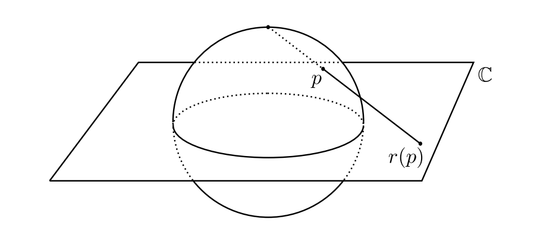

> M y favorite part of the entire course was when M$\ddot o$bius said "IT'S M$\ddot O$BIN' TIME" and m$\ddot o$bed all over the lecture notes.

## M$\ddot o$bius transformations

(The $o$ with an umlaut is not to be confused with the second derivative of $o$.)

> Definition. The **Möbius map** $f: \mathbb{C \to C}$ is defined as $f(z) = \frac{az+b}{cz+d}$ for $a, b, c, d\in \mathbb{C}$, $ad - bc \neq 0$. (If $ad-bc = 0$, then we would have

$$
\begin{aligned}
z,w \in \mathbb{C},\ f(z)-f(w) &= \frac{az+b}{cz+d}-\frac{aw+b}{cw+d} \\ 
&= \frac{(az+b)(cw+d)-(aw+b)(cz+d)}{(cz+d)(cw+d)} \\
&= \frac{adz + bcw - adw - bcz}{(cz+d)(cw+d)} \\
&= \frac{(ad-bc)(z-w)}{(cz+d)(cw+d)} \\
&= 0\text{ if }ad-bc=0
\end{aligned}
$$
> which is discarded for committing the cardinal sin of being too boring.)

> Definition. The **Riemann sphere.** (This sounds like a pokeball used to catch mathematicians or something.) The extension of the complex plane via the introduction of an "infinity element" - $\mathbb{C} \cup \{\infty\}$ - is known as the **Riemann sphere**, denoted by $\mathbb{\hat C}$.

The Möbius map defined above is only well-defined everywhere in the Riemann sphere and not in $\mathbb{C}$, as $f(-\frac{d}{c})$ would result in division by zero; we circumvent this by giving it the middle finger and saying "dividing by zero is okay as long as we assign a fancy symbol to it, cover it in white cloth and never attempt to make eye contact with what comes out the other end", i.e. $f(-\frac{d}{c}) = \infty$ where $\infty$ is *not* to be treated as some mystical, impenetrable monument of math, but a number we can do calculations with. Similarly, we **define** $f(\infty) = \lim_{z\to \infty} f(z) = \frac{a}{c}$. 

> Proposition. **Extension of the Möbius map to $\mathbb{\hat C}$.** (Guess how many times I've had to search up "copy o with an umlaut to clipboard" by now.) The Möbius map is well-defined everywhere in the Riemann sphere, with the following values being specially defined:
1. $f(\infty) = \lim_{z\to\infty}\frac{az+b}{cz+d} = \frac{a}{c}$.
2. $f(-\frac{d}{c}) = \infty$.
3. $f(\infty) = \infty$ when $c = 0$ (derived from the first two definitions).  
(Even though we have defined these special conventions, the notation $\frac{az+b}{cz+d}$ will still be used interchangeably with $f$ with the understanding that the above properties hold only for the Möbius map as we have defined it.)

One last point to wrangle with a little bit: why is the Riemann sphere called a sphere when, as far as we know, there are no spheres visible anywhere to the naked eye? First off, Riemann must have had some really small spheres when ~~viewed naked~~ viewed through the naked eye; but second of all, consider a unit sphere centered about the origin -
$$
S_2 = \{(x,y,z) \in \mathbb{R}: x^2 + y^2 + z^2 = 1\}
$$
Suppose you're standing at the very top of this sphere - the point $(0,0,1)$, the *north pole* of the sphere - and that the complex plane (which we will consider the $xy$-plane) is sitting at the equator of this sphere. If you angle your field of vision in a particular direction - for instance, through a point $p$ on the sphere - is it possible to see any possible point on the complex plane?

The answer is *yes*; for every point $r(p)$ on the complex plane, a line can be drawn through the north pole to a general point $p$ on the sphere, and this point $p$ is uniquely determined by $r(p)$, with there only being one possible line through
$$
(r(p)_x, r(p)_y, 0) \to (0,0,1)
$$
which will only intersect the sphere at one point, and vice versa, with $\infty$ being ampped to the point $(0,0,1)$. I suppose this explanation for why a sphere is actually a plane does motivate the study of Möbius maps a bit, but it only considers the top half of the sphere - it's a little one-sided. ~~*(Get it? Because the Möbius strip has only one side? HA HA HA HA HA HA HA - i'll see myself out bye*~~)

(This technique is called **stereographic projection**, and is used to convert a globe of the Earth into flat maps. This means that the Earth is actually neither flat nor round, but is instead a secret third thing that exists as a bijection between the flat earthers and the globalists.)

## Group properties of the Möbius map

>  As Möbius famously said when referring to himself, "persons who have a decided mathematical talent constitute a superior class to everyone else." Bold words for someone whose most lasting contribution to mankind is a strip of paper that looks like it was chewed on by a 5-year-old.

A brief TL;DR - why study Möbius maps? Because Möbius maps are bijections from the Riemann sphere to itself, and because of that, Möbius maps are invertible and form a group; and because of *that*, Möbius maps are a group action on the Riemann sphere (the extended complex plane) that turn out to be the only group actions that preserve properties like angles and structures like circles.

### The Möbius maps form a group

> Lemma. Möbius maps form a bijection from $\mathbb{\hat C}$ to $\mathbb{\hat C}$.

> Proof.

As previously defined, the Möbius map takes the entirety of $\mathbb{\hat C}$ as its domain; we need only prove that the map is invertible. Denote the inverse of the Möbius map as $y=f^{-1}(z)$; then we have
$$
\begin{aligned}
f(y) &= z \\
\frac{ay + b}{cy + d} &= z \\
ay + b &= czy + dz \\
(a-cz)y &= dz - b \\
y &= \frac{dz-b}{a-cz} 
\end{aligned}
$$
which is again a Möbius map and can be verified to be the inverse of $f$.

> Proposition. Let $M$ be the set of all Möbius maps (or, if you like, the set of matrices $M = \begin{bmatrix} a&b \\c&d\end{bmatrix}$ that map - not one-to-one! - onto $f(z) =\frac{az+b}{cz+d}$, with $ad-bc = \det M \neq 0$.) Then $M$ forms a group under function composition.

Side note: the group of all matrices with $\det M \neq 0$ is simply $GL_2$, so we are done! (Actually, we're not - we'll see later that these two groups aren't isomorphic.) But alas, the alluring sway of masochism compels us once again to deliver a

> Proof.

1. Closure. This one is a pain. Let $f(z) = \frac{a_1 z + b_1}{c_1 z + d_1}$ and $g(z) = \frac{a_2 z + b_2}{c_2 z + d_2}$ both be elements of $M$, with $a_1d_1 - b_1d_1 \neq 0$ and $a_2d_2 - b_2c_2 \neq 0$. Then we have
$$
\begin{aligned}
f(g(z)) &= \frac{a_1 (\frac{a_2 z + b_2}{c_2 z + d_2}) + b_1 }{c_1 (\frac{a_2 z + b_2}{c_2 z + d_2}) + d_1} \\
&= \frac{a_1a_2z + a_1b_2 + b_1c_2z + b_1d_2}{c_1a_2z + c_1b_2 + d_1c_2z + d_1d_2} \\
&= \frac{(a_1a_2 + b_1c_2)z + (a_1b_2+b_1d_2)}{(c_1a_2 + d_1c_2)z + (c_1b_2+d_1d_2)}
\end{aligned}
$$
which is again an element of $M$, as we have
$$
\begin{aligned}
(a_1a_2 + b_1c_2)(c_1b_2 + d_1d_2) - (a_1b_2 + b_1d_2)(c_1a_2 + d_1c_2) \\
=  a_1a_2d_1d_2 + b_1c_2c_1b_2 - a_1b_2d_1c_2 - b_1d_2c_1a_2 \\
= b_1c_1(c_2b_2 - d_2a_2) + a_1d_1(a_2d_2 - b_2c_2) \\
= (a_2 d_2 - b_2 c_2)(a_1 d_1 - b_1 c_1) \neq 0.
\end{aligned}
$$
1. Identity. We simply have $1(z) = z$ as the identity under function composition.
2. Inverse. The Möbius map is invertible, as shown above, and its inverse is another Möbius map.
3. Association is inherited from function composition.

> Lemma. We mentioned earlier that $GL_2$ has some relationship to $M$; and indeed, with every matrix $A = \begin{bmatrix} a&b \\c&d\end{bmatrix}$ we could define a function $\phi$ mapping from $A$ to a Möbius map in $M$, like so - 
$$
\phi(A) = \frac{az + b}{cz +d}.
$$
> However, such a function is **not** one-to-one: $\phi(\lambda A) = \phi(\lambda)$ for any constant $\lambda$. Thus, $\phi$ is a **homomorphism** rather than an isomorphism between $GL_2(\mathbb{C}) \to M$.

> Proof.

For two matrices $A = \begin{bmatrix} a_1&b_1 \\c_1&d_1\end{bmatrix}$ and $B = \begin{bmatrix} a_2&b_2 \\c_2&d_2\end{bmatrix}$ in $GL_2(\mathbb{C})$ (i.e. nonzero determinant), we have
$$
\phi(A) \circ_M \phi(B) = \frac{(a_1a_2 + b_1c_2)z + (a_1b_2+b_1d_2)}{(c_1a_2 + d_1c_2)z + (c_1b_2+d_1d_2)}
$$
as shown above, and
$$
AB = \begin{bmatrix}
a_1 a_2 + b_1 c_2 & a_1 b_2 + b_1 d_2 \\
c_1 a_2 + d_1 c_2 & c_1 b_2 + d_1 d_2
\end{bmatrix}
$$
corresponding to the above Möbius map, as desired. This homomorphism is surjective, because for any Möbius map a matrix formed out of its coefficients can be constructed (not necessarily uniquely); its kernel is the group of multiples of the identity matrix $Z= \{\lambda I: \lambda \in \mathbb{C}, \lambda \neq 0\}$, with the First Isomorphism Theorem giving $M \cong GL_2(\mathbb{C})/Z$.

> Lemma. All  Möbius maps can be writte as a finite composition of the following simple Möbius maps, in some order and potentially with repeats:
1. The enlargement/dilation/rotation map, $f(z) = az$ for some $a \in \mathbb{C}$.
2. The translation map, $f(z) = z + b$ for $b \in \mathbb{C}$.
3. The inversion map, $f(z) = \frac{1}{z}$.

> Proof.

The general form of a Möbius map is $f(z) = \frac{az+b}{cz+d}$. $f(\infty) = \infty$ if and only if $c = 0$; when $c=0$, we have
$$
f(z) = \frac{az+b}{d} = \frac{a}{d}z + \frac{b}{d}
$$
which is clearly a dilation by $\frac{a}{d}$ combined with a translation by $\frac{b}{d}$. If instead $c\neq 0$, let $f(\infty) = z_0$; then the following construction
$$
h(f(z)) = \frac{1}{f(z)-z_0},\ h(f(\infty))=\frac{1}{z_0-z_0} = \infty
$$
has $h(f(z)) \in M$ due to closure, and $h(f(z)) = g(z)$ being a Möbius map with $c=0$ due to the first statement. We know that a Möbius map $g(z)$ with $c=0$ is composed of (at most) two simple Möbius maps, a dilation and a translation; thus we have
$$
f(z) = h^{-1}(g(z))
$$
where $h^{-1}(z) = \frac{1}{z} + z_0$, and is thus composed of an inversion plus a translation. Therefore, any $f(z)$ is composed of the above three simple Möbius maps.

### Fixed points of Möbius maps

> Definition. A **fixed point** of a Möbius map $f$ is a complex number $z \in \mathbb{C}$ such that $f(z) = z$.

> Proposition. If a Möbius map has three or more fixed points, it is the identity $f(z) = z$.

> Proof.

A fixed point of a Möbius map is equivalent to a complex root of the quadratic equation
$$
f(z) = \frac{az + b}{cz + d} = z,\ cz^2 +(d-a)z -b =0
$$
which has at most two complex roots by the Fundamental Theorem of Algebra, unless the left-hand side is identically zero, in which case $c= 0$, $d=a$ and $b =0$ yielding $f(z) = \frac{az}{a} = z$. (This is what mathematicians call "nuking an anthill.") 

> Proposition. Any Möbius map is conjugate under function composition to either a dilation $f(z) = \nu z$ or the simple translation $f(z) = z +1$.

> Proof.

As shown above, the general linear group of $2\times 2$ complex matries $GL_2(\mathbb{C})$ is surjectively homomorphic to the group of Möbius maps $M$. For this surjective homomorphism $\phi$, we have
$$
A, B, P \in GL_2(\mathbb{C}),\ PAP^{-1} = B
$$
implying
$$
\phi(PAP^{-1}) = \phi(P)\circ \phi(A)\circ \phi(P^{-1}) = \phi(B)
$$
and as such $\phi(A)$ and $\phi(B)$ are conjugates in $M$. As the conjugacy classes partition $GL_2(\mathbb{C})$ and $GL_2(\mathbb{C})$ map surjectively onto $M$ via $\phi$, the conjugacy classes of $GL_2(\mathbb{C})$ completely describe the conjugacy classes of $M$.

From [[Linear Algebra.Eigenvalues and Eigenvectors.Canonical Forms]] we know that the conjugacy classes of $GL_2(\mathbb{C})$ are of the following three types: $\begin{bmatrix}\lambda & 0 \\ 0 &\lambda \end{bmatrix}$, $\begin{bmatrix}\lambda & 0 \\ 0 &\mu \end{bmatrix}$, and $\begin{bmatrix}\lambda & 1 \\ 0 &\lambda \end{bmatrix}$ for $\lambda, \mu \in \mathbb{C}$. Applying the homomorphism above gives us the Möbius maps 
$$
\begin{cases}
\frac{\lambda z + 0}{0 + \lambda} = z = 1z, \\
\frac{\lambda z + 0}{0 + \mu} = \frac{\lambda}{\mu} z,\\
\frac{\lambda z + 1}{\lambda} = z + \frac{1}{\lambda}
\end{cases}
$$
where the final matrix $\begin{bmatrix}\lambda & 1 \\ 0 &\lambda \end{bmatrix}$ can be rewritten $\begin{bmatrix}1 & \frac{1}{\lambda} \\ 0 &1 \end{bmatrix}$, giving us $f(z) = z+1$. $\square$

> Lemma. A Möbius map $f$ has a fixed point $z$ if and only if its conjugate $gfg^{-1}$ for some $g \in M$ has a fixed point $g(z)$; as such, all non-identity Möbius maps have either $1$ fixed point (if conjugate to $f(z) = z+1$) or $2$ fixed points (if conjugate to $f(z)=\nu z$).

> Proof.

The first statement can be demonstrated directly via
$$
f(z) = z \implies gfg^{-1}(g(z)) = gf(g^{-1}(g(z))) = gf(z) = g(z)
$$
and as such $g(z)$ is a fixed point of $gfg^{-1}$; conversely
$$
gfg^{-1}(g(z)) = g(z) \implies gf(z) = g(z) \implies f(z) = z.
$$
Thus, if a Möbius map $f \in M$ is conjugate to $f(z) = \nu z$; this fixes $0$ and $\infty$ only, and thus $f$ has two fixed points. Alternatively, if $f \in M$ is conjugate to $f(z) = z+1$, then this fixes $z= \infty$ only and thus $f$ has only one fixed point.

### Group actions of Möbius maps

> Proposition. The group of Möbius maps acts faithfully and transitively on the Riemann sphere $\mathbb{\hat C}$ through $f \in M, z\in \mathbb{\hat C}: \phi(f,z) = f(z)$.

> Proof.

Check the three properties of a group action:
1. Identity: we have $1(z) = z$ as the identity of $M$, and $\phi(1(z), z) = z$ for all $z \in \mathbb{\hat C}$.
2. Closure: all Möbius maps map from $\mathbb{\hat C}\to \mathbb{\hat C}$ bijectively, and thus for all $z_1, z_2 \in \mathbb{\hat C}$ we have
$$
f(z) = z + z_2 - z_1,\ f(z_1) = z_2 
$$
demonstrating transitivity, as well as
$$
\forall z,\ f(z) = z
$$
implying that $f$ is the identity by default.

3. Associativity: true by definition of function composition.

In fact, it is not only true that for any *pair* of points $z_1$ and $z_2$ we can find (often an infinite number) of Möbius maps that send $z_1$ to $z_2$; we have a far stronger result as follows.

> Definition. Call a group action $\phi$ of $G$ on $X$ ***three-transitive*** if for any two triples $(x_1, x_2, x_3)$ and $(y_1, y_2, y_3)$, all in $X$, we have some $g\in G$ such that $g(x_1)=y_1$, $g(x_2)=y_2$ and $g(x_3) = y_3$ - that is to say, an element exists that sends any triplet to another arbitrary triplet under this group action. If this $g\in G$ is unique, call the group action **sharply three-transitive**.

> Proposition. $M$ acts sharply three-transitively on $\mathbb{\hat C}$.

> Proof.

The statement is true as long as we can show that there exists a Möbius map which maps any three points $(x_1, x_2, x_3)$ in $\mathbb{\hat C}$ to $(0, 1, \infty)$ - the special points of the Möbius map - and that there exists a Möbius map which maps these three points to any $(y_1, y_2, y_3)$.

For the first such Möbius map, consider
$$
f(z) = \frac{(z-x_1)(x_2-x_3)}{(z-x_3)(x_2-x_1)}
$$
which maps $x_1 \to 0$, $x_2 \to 1$, $x_3 \to \infty$. For the second, the Möbius map 
$$
g(z) = \frac{(z-y_1)(y_2-y_3)}{(z-y_3)(y_2-y_1)}
$$
maps $y_1 \to 0$, $y_2 \to 1$ and $y_3 \to \infty$ instead; as such, $g^{-1}(z)$ will map $0 \to y_1$, $1 \to y_2$, and $\infty \to y_3$, and so $g^{-1}f(z)$ satisfies our condition. We know that this function is unique because

> Lemma. Any Möbius map $f \in M$ is uniquely determined by three points; if $f(z_i)=g(z_i)$ for $i = 1, 2, 3$, then $f = g$. This can be directly shown via $fg^{-1}(z_i) = z_i$, leading to three fixed points for the Möbius map $fg^{-1}$ and thus leading to $fg^{-1}$ being the identity.

This verifies that $M$ acts sharply three-transitively on $\mathbb{C}$. $\square$

### Möbius maps preserve geometric structures

> Lemma. Both circles and lines in the complex plane can be generally represented by the locus of complex numbers $z$ such that
$$
Az\bar z + \bar B z + B \bar z + C = 0
$$
> where $A, C \in \mathbb{R}$, $B \in \mathbb{C}$, and $|B|^2 > AC$; $A=0$ gives a straight line, while $A \neq 0$ gives a circle.

> Proof.

We know that the complex-number representation of a circle centered at a point $B$ with radius $r$ is
$$
|z-B| = r
$$
which can be equivalently written as
$$
|z-B|^2 = (z-B)\overline{(z-B)} = r^2
$$
as $|z-B|$ is always non-negative. This yields
$$
\begin{aligned}
(z-B)(\bar z - \bar B) &= r^2 \\
z\bar z - z \bar B - B \bar z - B \bar B &= r^2 \\
z\bar z - \bar B z - B\bar z - (B\bar B + r^2) &= 0
\end{aligned}
$$
which corresponds to the given form, as $B\bar B$ and $r^2$ are both real. 

On the other hand, the locus of all complex numbers that form a line which perpendicularly bisects the line segment between $a$ and $b$ can be written
$$
|z-a| = |z-b|
$$
or 
$$
(z-a)(\bar z - \bar a) = (z-b)(\bar z - \bar a)
$$
which reduces to the form above, with the $z\bar z$ term cancelling out.

> Theorem. A Möbius map maps any circle or line in the complex plane to another circle or line in the complex plane (not necessarily respectively, i.e. circles can be mapped to lines, and vice versa).

> Proof.

Any Möbius map is a composition of the three elementary Möbius maps: a dilation $f(z) = \nu z$, a translation $f(z) = z + a$, and an inversion $f(z) = \frac{1}{z}$. As such, we only need to show that all three maps preserve the equation
$$
Az\bar z + \bar B z + B \bar z + C = 0.
$$
For a dilation: $z \to \nu z$ gives
$$
A\nu\bar z + \bar B \nu z + B\bar \nu \bar z + C = 0
$$
which is still in the required form, as $\overline{(\bar B \nu)} = B \bar \nu$. 

For a translation: $z \to z + a$ gives
$$
\begin{aligned}
A(z+a)(\bar z + \bar a) + \bar B (z+a) + B (\bar z + \bar a) + C \\
= A(z\bar z + \bar a z + a \bar z + a \bar a) + \bar Bz + \bar Ba + B\bar z + B \bar a + C \\
= Az \bar z + (A\bar a + \bar B)z + (Aa + B)\bar z + (Aa\bar a + \bar B a + B \bar a + C)
\end{aligned}
$$
which corresponds to the form above because $\overline{(A\bar a + \bar B)} = Aa + B$, from $A$ being real and thus $\bar A = A$.

Finally, for an inversion $z \to \frac{1}{z}$ we have
$$
\begin{aligned}
A\frac{1}{z\bar z} + \bar B \frac{1}{z} + B \frac{1}{\bar z} + C = 0 \\
A + \bar B \bar z + B z + C \bar z z = 0
\end{aligned}
$$
where the coefficients have swapped places, but the equation remains the same. $\square$

### Möbius maps preserve the cross-ratio

> Definition. Define the **cross-ratio** between four distinct complex numbers $z_1, z_2, z_3, z \in \mathbb{\hat C}$ as the unique Möbius map that maps $z_1 \to \infty$, $z_2 \to 0$ and $z_3 \to 1$ as a function of $z$:
$$
[z_1, z_2, z_3, z] = f(z) = \frac{z - z_2}{z - z_1} \cdot \frac{z_3 - z_1}{z_3 - z_2}
$$
> which exists uniquely as a result of $M$ acting sharply three-transitively on $\mathbb{\hat C}$.

> Theorem. The cross-ratio $[z_1, z_2, z_3, z]$ is preserved by a Möbius map: $[f(z_1), f(z_2), f(z_3), f(z)] = [z_1, z_2, z_3, z]$.

> Proof.

Let $\lambda = g(z)$ be the unique Möbius map that maps $z_1 \to \infty$, $z_2 \to 0$, and $z_3 \to 1$, such that $z$ is mapped to $\lambda$ under the operation $[z_1,z_2,z_3,z]$. Consider the Möbius map formed by $gf^{-1}$, which has
$$
\begin{cases}
gf^{-1}(f(z_1)) = g(z_1) = \infty \\
gf^{-1}(f(z_2)) = g(z_2) = 0 \\
gf^{-1}(f(z_3)) = g(z_3) = 1 \\
gf^{-1}(f(z)) = g(z) = \lambda
\end{cases}
$$
By definition $gf^{-1}$ is the Möbius map formed from the cross-ratio $[f(z_1), f(z_2), f(z_3), f(z)]$, which means that the cross-ratio evaluates to $gf^{-1}(f(z)) = g(z)$. 

> Corollary. There exists a Möbius map that maps from four complex numbers $(x_1, x_2, x_3, x_4)$ to $(y_1, y_2, y_3, y_4)$ if and only if their cross-ratios are equal.

> Proof.

First suppose that some $f \in M$ satisfies $f(x_1) = y_1, f(x_2) = y_2, f(x_3) = y_3$, and $f(x_4) = y_4$. Then we have
$$
[y_1, y_2, y_3, y_4] = [f(x_1),f(x_2),f(x_3),f(x_4)] =[x_1,x_2,x_3,x_4]
$$
as cross-ratios are preserved by Möbius maps; and conversely, if 
$$
[y_1, y_2, y_3, y_4] =[x_1,x_2,x_3,x_4]
$$
then suppose that $f \in M$ maps $x_1 \to \infty$, $x_2 \to 0$, $x_3 \to 1$, and $x_4 \to \lambda = f(x_4)$; and $g \in M$ maps $y_1 \to \infty$, $y_2 \to 0$, $y_3 \to 1$, and $y_4 \to g(y_4) = f(x_4)$ because the cross-ratios are equal. Thus the function $g^{-1}f$ sends $x_1 \to y_1$, $x_2 \to y_2$, and $x_3 \to y_3$; finally, it sends $x_4 \to y_4$ because 
$$
g^{-1}(f(x_4)) = g^{-1}(g(y_4)) = y_4.
$$ 
$\square$

And finally, all the players take a bow and scurry off the stage as the curtains fall for our closing act!

> Corollary. The four points $z_1, z_2, z_3, z_4$ lie on the same circle or line if and only if their cross-ratio is real.

> Proof.

In $\mathbb{\hat C}$ - as we alluded to - lines are circles that pass through $\infty$, which is represented by the point $(0,0,1)$. We know that any three points lie on the same circle, so without loss of generality, suppose that $z_1, z_2$ and $z_3$ are on the same circle; further suppose that $f$ is the unique Möbius map that maps $z_1 \to \infty$, $z_2 \to 0$ and $z_3 \to 1$. 

By definition, $f(z_4)$ is the cross-ratio $[z_1,z_2,z_3,z_4]$. If $z_4$ lies in the same circle as $z_1$, $z_2$ and $z_3$ in $\mathbb{\hat C}$, then $f(z)$ will lie on the same circle as $f(z_1), f(z_2)$ and $f(z_3)$ (as Möbius maps map circles to circles on the Riemann sphere). As $f(z_1), f(z_2)$ and $f(z_3)$ are $\infty, 0$ and $1$ by construction, and the circle uniquely determined by $\infty, 0$ and $1$ in $\mathbb{\hat C}$ is the real axis, $f(z_4)$ lies an the real axis and is therefore real.

Conversely, if $f(z_4)$ is real, then it lies on the same circle as $f(z_1)$, $f(z_2)$ and $f(z_3)$ - the real axis; the inverse Möbius map $f^{-1}$, which always exists, also maps a circle to a circle and thus bring $z_1, z_2, z_3$ and $z_4$ to the same circle. $\square$

> FIN!
