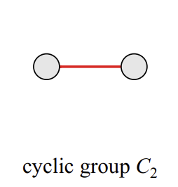
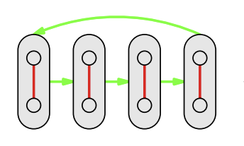
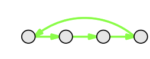
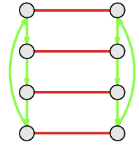
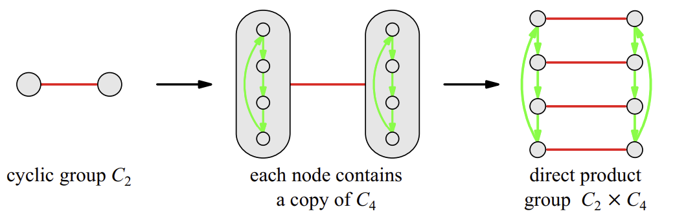
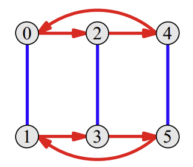
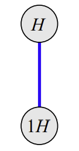
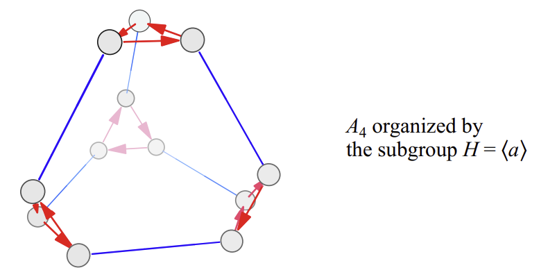
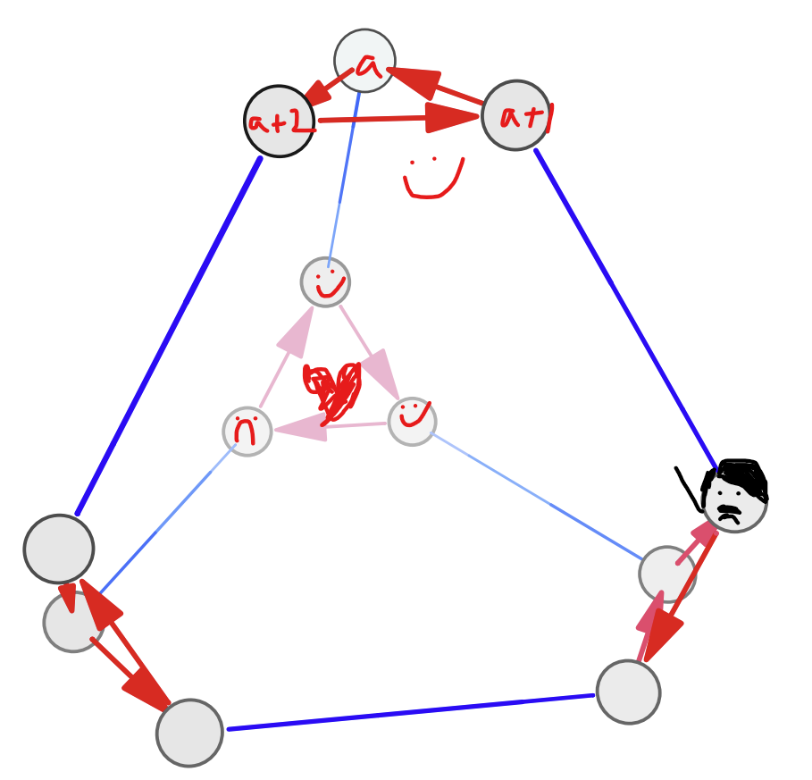
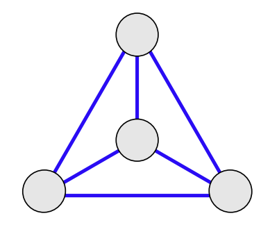

## What are normal subgroups?

> Definition. A subgroup $H$ of some group $G$ is said to be a **normal subgroup** of $G$ if every left coset of $H$ is also a right coset of $H$ (and vice versa). In other words, for every $g_1 \in G$, an equality exists between the left and right cosets $g_1 H = H g_1$.

This is equivalent to saying that for every $g_1 h_1 \in g_1 H$, we have $g_1 h_1 = h_2 g_1$ leading to $g_1 h_1 g_1^{-1} = h_2 \in H$; as a result, an equivalent condition for a normal subgroup $H$ is
$$
ghg^{-1} \in H,\text{ $\forall h \in H,\ \forall g \in G$.}
$$
Denote the normal subgroup $H$ by $H \triangleleft G$, which looks like a really fancypants symbol until you realize it's literally just $<$ with a line added to it. (By the way, $\triangleleft$ takes 13 more key-presses to type than $<$. If every scientist since the dawn of time wasted their time by writing $\triangleleft$ every time they wanted to use $<$, we would probably still be using kerosene lamps and tottering out of the Dark Ages on horseback.)

Why this seemingly-arbitrary condition for determining normalcy? As always with group theory, we have roughly seven thousand words of exposition plus thirty-three different lemmas to get through before we can get to anything resembling an understanding.

## What are group products?

Ever wondered how you could fuse two groups into a single unearthly abomination horrifying enough to make the heavens quake and God himself shudder? (For the record, the answer is no. You're supposed to wonder when the McRib is cominng back to McDonalds or whether you can UberEats a lava lamp, like a normal person.) Well, here's how:

> Definition. A **direct product** between two groups $G$ and $H$, denoted $G \times H$ (and pronounced "$G$ cross $H$") is defined as the following group of ordered pairs: 
$$
G \times H = \{(g,h)\ |\ g \in G,\ h \in H\}.
$$
> Now you could ask  a kindergartener, a high-school student, and a math undergrad what $A \times B$ means and none of them would give you the same answer. 

> Suppose also that $G$ has binary operation $\cdot_G$ and $H$ has binary operation $\cdot_H$. Then the binary operation over the group $G\times H$ is defined 
$$
(g_1, h_1)\cdot_{G\times H}(g_2, h_2) = (g_1\cdot_G g_2, h_1\cdot_H g_2).
$$
> (Proving that this obeys all the axioms of a group is left as an exercise to the reader. ~~Do all the dirty work for me, my minions~~)

The direct product is a relatively intuitive way of combining two groups: it takes all elements in one group, then all the elements of the other group, and squishes them together into an ordered pair like some bizarre failed fusion experiment to produce the ugliest Pokemon. (Are there other types of products? There are, but like a North Korean import customs officer, we're not going to look at any of those.) 

Thankfully, it also has a very direct meaning (ba-dum tss) when it comes to group structures. For instance, consider the direct product

$$
C_2 \times C_4 = \{(a, b)\ |\ a = e^{k\pi i}, k = 0, 1,\ b = e^{\frac{k\pi i}{2}}, k = 0, 1, 2, 3\}
$$
Of all groups, $C_2$ is the second-simplest (just behind the trivial group): it's just two things bonded to one another for all eternity. (I'd make a joke about how that's something you'll never experience in your life, but unfortunately that's hitting too close to home right now.)

So what happens when we cross this with $C_4$? Let's consider the ordered pair $(a,1)$, where $a$ can be any element of $C_2$ - say $-1$ and $1$. The elements $(1,1)$ and $(-1,1)$ are still elements of $C_2$; as such, they still obey the above structure. So do $(1, -1)$ and $(-1, -1)$; so do $(1, i)$ and $(-1, i)$; and last and certainly least, so do $(1, -i)$ and $(-1, -i)$. 

We've exhaustively listed all the elements in $C_2\times C_4$; as there are $2$ elements in $C_2$ and $4$ in $C_4$, the direct product has eight elements total. What our listing has shown is that the direct product has given us four pairs - one for each element in $C_4$ - each of which forms their own little $C_2$. 

Alternatively, though, we could also consider our elements to come in two groups of four; $(1,i), (1,-i), (1,1), (1,-1)$ is one, with the $C_2$ element fixed. 

Putting everything together, we have something that looks like this:

When keeping the $C_4$ element fixed, what we have is every element in $C_4$ producing a $C_2$-structure; when keeping the $C_2$ element fixed, what we have is every element in $C_2$ producing a $C_4$-structure. As a result, every element $(a,b) \in C_2 \times C_4$ is part of two different structures at the same time: one $C_2$ structure, which it forms with elements of the form $(...,b)$, and one $C_4$ structure, which it forms with elements of the form $(a,...)$. 

A direct product can thus be understood as joining the structures of two groups together: each element in one group now finds itself as part of the structure formed by the other group.

## What are group quotients?

If direct products give us a way to join the structures of two groups together, is there a way to break the structure of a group apart? (*...and other questions my date asked me over dinner at Burger King.*)

It turns out there are, and it depends on us understanding what the "internal structure" of a group actually means. Recall from earlier that a subgroup represents some sort of repeating sub-structure within the structure of group; that sub-structure repeats again and again to make up the entire group, and the places where it repeats are determined by the cosets of a subgroup, which partition the group. 

As such, a group can be understood as the collection of cosets of a subgroup, each of which have the same mini-structure hidden within them - this is what Lagrange's Theorem told us. For instance, this is $C_6$ (or something isomorphic to it, the 5 positive integers modulo 6) partitioned into the two cosets of $C_3$, $C_3$ and $1C_3$:

But clearly $C_3$ and $1C_3$ themselves are related to each other, by means of the blue action (addition by $1$); as such we simply have

with $H$ being $C_3$ and $1H$ being $1C_3$. 

In some sense, this process is a reversal of what a direct product does to two groups; whereas a direct product copies the structure of a group and links the copies together through the structure of another group, what we just did took the structure of a group - copies of the structure of some subgroup - and abstracted the connections between these copies of the subgroup from it. 

Call this - the deconstruction of $C_6$ into the connections between the cosets of its subgroup $C_3$ - as the *quotient* between $C_6$ and $C_3$, denoted $C_6 / C_3$; its result is $C_2$ - and indeed, just as $C_6 / C_3 = C_2$, we also have $C_6 \cong C_3 \times C_2$. This is enough to give us our first tentative definition of a group quotient.

> Definition. Let $G$ be a group and $H$ its subgroup. The **quotient** $G/H$ is the set of all left cosets of $H$; this may or may not actually form a group, depending on certain mysterious conditions.

Here's another question worth considering: what does it mean for two cosets (or more) to form a group? Let's formalize this by confirming that the set formed by the cosets can have a binary operation defined on them that satisfy all the group axioms. If we had a set of cosets that related to one another as straightforwardly as $C_3$ in $C_6$

then we could define a binary operation as follows:

> Definition. Let $G/H$, the quotient of $G$ by subgroup $H$, be the set of left cosets of $H$ as before. Define the binary operation $\cdot_{G/H}$ between any two such cosets, $g_1 H$ and $g_2 H$ with $g_1, g_2 \in G$, as 
$$
(g_1 H) \cdot_{G/H} (g_2 H) = (g_1 \cdot_G g_2) H.
$$

When does this operation go wrong? Consider the following example of a subgroup of $A_4$:

The subgroup itself is a triangular cycle of three elements, and is thus isomorphic to $C_3 = \{0, 1, 2\}\ \text{mod 3}$; as such, all four cosets are in the form $aC_3$. Let's consider one of these cosets. The representative element of the coset $aC_3$ can be any of the three elements in the coset: either $a = a +0$ itself, or $a+1$, or $a+2$. 

Suppose that the coset $aC_3$ is the coset on the very top, and $a, a+1, a+2$ be the elements of that coset in clockwise order:

Let the coset at the very back of the image (the one involving a polyamorous relationship) be $(a\cdot k)C_3$, where $k \in A_4$ is the action given by the blue lines. If the cosets form a group, then $aC_3 \cdot kC_3 = (a\cdot k)C_3$ should be the same as $(a+1)C_3 \cdot kC_3$, as $(a+1)C_3$ is the same coset as $kC_3$, just under a different representative. However, the diagram itself shows that this is untrue; $(a+1)\cdot k$ results in the small-mustached man with the horrible haircut, which is not part of the coset $(a\cdot k)C_3$. 

Thus, 
$$
aC_3 \cdot kC_3
$$
contains the element $a\cdot k$, which is in a different coset as $(a+1) \cdot k$. This tells us one very important fact: 

> If the elements of a coset are taken to different cosets under some action, then the set of cosets does not have a well-defined binary operation: $a$ and $a+1$ may be two representatives for the same coset $aH$, but if under multiplication by $b$ they go to different cosets, then $aH \cdot bH \neq (a+1)H \cdot bH$ because $(a+1)\cdot b \notin (ab)H$.

This can directly be visualized through the would-be group structure of the quotient group

collapsed from the above, which is not a group at all, as taking the blue action (e.g. multiplication by some $g$) can take you to three different places - essentially, $a \cdot b$ will give you three results. 

Therefore, our rule is that

> For any coset $g_1H$ and some action defined by multiplication by $g_2$, in order for the quotient $G/H$ to be a group, the elements mapped to by that action on $g_1$ must all be part of the same coset.

In other words, the set of elements $g_1 H g_2$ (in coset notation, equalling the set $\{g_1 h g_2\}$ with $h \in H$) must be the same coset. As $e \in H$, there is only a single coset this can possibly be: the coset $g_1 g_2 H$. This gives us
$$
g_1 H g_2 = g_1 g_2 H
$$
or, at long last,
$$
g_2 H = H g_2
$$
for all $g_2 \in G$. This is exactly the definition of a normal subgroup! 

Therefore, we finally arrive at what normal subgroups truly are:

> Theorem. The set of left cosets $G/H$ for a subgroup $H$ of a group $G$ is only a group when $H$ is a normal subgroup: for all $g \in G$, $ghg^{-1} \in H$. 

> Proof. The above offers a justification for why quotients do not make sense unless the left cosets of a subgroup equal the right cosets. However, we can prove this even more formally. The operation
$$
g_1H \cdot_{G/H} g_2H = (g_1g_2)H
$$
> is well-defined only if, under an alternative representative $g_1'$ where $g_1 H = g_1' H$, we still have
$$
g_1' H \cdot_{G/H} g_2 H = (g_1 g_2)H. 
$$
> Let $g_1' = g_1 h_1$ for some $h_1 \in H$, true under the condition $g_1' \in g_1 H$. If $g_1' g_2$ is part of the coset $(g_1g_2)H$, then $(g_1' g_2)H = (g_1 g_2)H$, as cosets with common elements are the exact same coset. As such, our condition is
$$
g_1' g_2 = g_1 h_1 g_2 = g_1 g_2 h
$$
> for some $h \in H$; rewriting the above as
$$
g_1 h_1 g_2 = g_1 g_2 g_2^{-1} h_1 g_2 = g_1 g_2 (g_2^{-1} h_1 g_2)
$$
> we see that the only way the equation holds is if $h = g_2^{-1} h_1 g_2$, or, in other words, if $g_2^{-1} h_1 g_2 \in H$ for all $h_1 \in H$ and $g_2 \in G$. This is the definition of a normal subgroup. $\square$