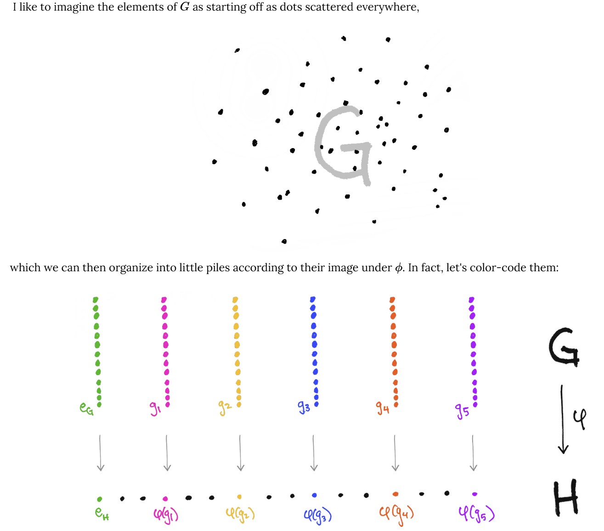

The existence of this section is regrettable, but unfortunately necessary.

## Theorems of normal subgroups

The last section tried its best to plagiarize every reasonably relevant diagram it could off the internet just to build up a visual understanding of what normal subgroups really were. This section will completely destroy any and all traces of that visual understanding and restore our belief that maybe Galois lived a little too long after all.

> Lemma. $H$ is a normal subgroup of $G$ if and only if $gH = Hg$ for all $g\in G$.

But wait, you say, weren't we using this as the *definition* of normal subgroups all this time? Yes we were. This is because I'm a rebel at heart who refuses to abide by the demands of everything right and true about mathematics.

> Proof. 

As it turns out, $gH = Hg$ does *not* define a normal subgroup; $ghg^{-1} \in H$ does. From that, we have
$$
ghg^{-1} = h_1 \iff gh = h_1 g \iff gH = Hg
$$
as every $gh$ can be mapped via a bijection to some $h_1 g\in Hg$. (We know already that right and left cosets have the same size, and if we didn't know that, we do now. It is impossible for two different left-coset elements to be equal the same right-coset element. As the sizes of the two sets are the same, and every element in $gH$ has a unique match in $Hg$, the two sets are the same.)

Conversely, if $gH = Hg$, then $gh = h_1g$ for some $h, h_1 \in H$, not necessarily equal. This yields $gh g^{-1} = h_1 \in H$, satisfying normality.

> Lemma. The following subgroups of $G$ are normal: $\{e\}$, $G$, and every subgroup of $G$ (if $G$ is abelian). 

> Proof. 

For $\{e\}$, we have $geg^{-1} = (ge)g^{-1} = gg^{-1} = e \in \{e\}$.

For $G$ itself, we have $gg_1 g^{-1} \in G$ by closure.

For abelian groups $G$, any subgroups $H$ must also be abelian. Thus for $h \in H$, we have $ghg^{-1} = gg^{-1} h = eh = h \in H$.

> Lemma. If $H \leq G$ has index $2$ (is half the size of $G$), then $H \triangleleft G$. (Translator's note: $\triangleleft$ means "is a normal subgroup of")

This is my first time using the fancy symbol. It feels like some sort of milestone.

> Proof.

If $H$ is index $2$, there are only two left cosets of $H$: one equal to $H$ itself, one equal to all elements in $G$ not in $H$. Of the right cosets of $H$, one is also $H$ itself. As the right cosets also partition $G$, the other right coset must be all the elements in $G$ but not in $H$ - i.e. equal to the remaining left coset. Thus, the right cosets and left cosets of $H$ are equal; and by the above lemma, this implies $H \triangleleft G$.

## The big one

This title exudes an uncomfortably intimidating aura that I just can't handle properly right now.

Before we get to *the big one* (note: it's the big one), we batter our hearts with an uncomfortable truth:

> Proposition. Let $\phi: G \to H$ be a group homomorphism between $G$ and its subgroup $H$. Then the kernel of $\phi$ is a normal subgroup of $G$: $\text{Ker}(\phi) \triangleleft G$.

> Proof.

By definition, we know that $\text{Ker}(\phi)$ is the set of every $g\in G$ that maps to $e_G$, the identity of $G$ (which is also the identity of $H$). We also know from previous theorems that $\text{Ker}(\phi)$ forms a group. In order for it to be a normal subgroup, we must have
$$
g k g^{-1} \in \text{Ker}(\phi)
$$
for all $g \in G$ and $k \in \text{Ker}(\phi)$. This is true by
$$
\phi(gkg^{-1}) = \phi(g)\phi(k)\phi(g^{-1}) = \phi(g)e_G \phi(g)^{-1} = \phi(g)\phi(g)^{-1} = e_G
$$
as $\phi(k) = e_G$ by $k \in \text{Ker}(\phi)$, and $H$ and $G$ share a binary operation. Thus $gkg^{-1} \in \text{Ker}(\phi)$, satisfying the condition for $\text{Ker}(\phi) \triangleleft G$.

Every trombone from the deepest pits of hell and every choir of angels from the highest gardens of heaven all sing the Song of Revelation in unison as they strip away the last veil concealing the ultimate truth:

> Theorem. **THE (first) ISOMORPHISM THEOREM.** Let $\phi$ be a homomorphism from a group $G$ to its subgroup $H$. Then the function
$$
\begin{aligned}
\bar\phi: G/\text{Ker}(\phi) \to \text{Im}(\phi) \\
\end{aligned}
$$
> defined as
$$
\bar\phi(g\text{Ker}(\phi)) = \phi(g)
$$
> is well-defined and is a group isomorphism.

### What the hell does this mean??

$\phi$ is a homomorphism from $G$ to $H$; $\text{Ker}(\phi)$ is all the elements in $G$ that get mapped to the identity $e_G$. Things in $G$ are either in $\text{Ker}(\phi)$ or they're not. (Well spotted.) If they are, then that means
$$
\phi(g_1) = e_G,\ g_1 \in \text{Ker}(\phi)
$$
If they're not, then that means
$$
\phi(g_2) \neq e_G,\ g_2 \notin \text{Ker}(\phi)
$$
But at the same time, we also have
$$
\phi(g_1 g_2) = \phi(g_1) \phi(g_2) = \phi(g_2) \phi(g_1) = e_G \phi(g_2) = \phi(g_2)
$$
as $\phi(g_1) = e_G$ and any operation with the identity is commutative; the above also arises from $\text{Ker}(\phi)$ being a normal subgroup. If we really take an uncomfortably close look at the expression
$$
g_1g_2
$$
with $g_2$ encompassing all elements in $\text{Ker}(\phi)$, we'll see that it's just a way of saying
$$
g_1 \text{Ker}(\phi)
$$
the coset of $\text{Ker}(\phi)$ under $g_1$; all elements $k$ in this coset satisfy
$$
\phi(k) = \phi(g_1).
$$
Therefore, the cosets of $\text{Ker}(\phi)$ split the group $G$ into different cosets based on where $\phi$ takes each one of these cosets. In other words, the cosets of the normal subgroup $\text{Ker}(\phi)$ splits $G$ into different sets based on the *image* of $\phi$:

(Wonderful illustration over at https://www.math3ma.com/blog/the-first-isomorphism-theorem-intuitively)!

All the **FIRST ISOMORPHISM THEOREM!!!!** says, then, is this: not only do the cosets of $\text{Ker}(\phi)$ split $G$ according to the image of $\phi$, each unique coset has a one-to-one bijection to an element in the image, establishing the isomorphism
$$
G/\text{Ker}(\phi) \cong \text{Im}(\phi)
$$
via the function
$$
\bar\phi(g\text{Ker}(\phi)) = \phi(g)
$$
or, mapping the coset to its image under $\phi$.

Having said that, we're now ready to give a proper

> Proof.

First of all, the quotient group $G/\text{Ker}(\phi)$ 1) exists, and 2) is just the group of cosets $g\text{Ker}(\phi)$ for all $g \in G$. If the function $\bar \phi$ defined above is well-defined, then for the same coset $g\text{Ker}(\phi)$ written using an alternate representative as $g'\text{Ker}(\phi),\ g' \in g\text{Ker}(\phi)$, we should have
$$
\bar \phi(g'\text{Ker}(\phi)) = \phi(g') \text{ by definition}
$$
and also
$$
\bar \phi(g'\text{Ker}(\phi)) = \bar \phi(g\text{Ker}(\phi)) = \phi(g)
$$
as a function shouldn't give something different when you plug in two things that are the same. Thus we need to prove that 
$$
\phi(g') = \phi(g)
$$
which is true by virtue of $g' \in g\text{Ker}(\phi)$, implying that $g' = gg_1$ for some $g_1 \in \text{Ker}(\phi)$ and 
$$
\phi(g') = \phi(gg_1) = \phi(g)\phi(g_1) = \phi(g) e_G = \phi(g).
$$
(This is essentially the same discussion as the intuitive explanation above: every coset of the kernel has the same image under $\phi$.)

As such, $\bar \phi$ is well-defined. As previously mentioned, $\bar \phi$ is an isomorphism if and only if we have $\text{Ker}(\bar \phi) = \{e_{G/\text{Ker}(\phi)}\} = \{e\text{Ker}(\phi\}$, $\text{Im}(\bar \phi) = \text{Im}(\phi)$, and $\bar\phi$ is a homomorphism.

For the kernel property, suppose that $\bar\phi(a\text{Ker}(\phi)) = e_G$. Then $\phi(a) = e_G$, but then $a \in \text{Ker}(\phi)$, making $a\text{Ker}(\phi)$ identical to the identity coset $\text{Ker}(\phi)$. Thus, the kernel of $\bar \phi$ is the identity coset only.

For the image property, note that $\bar\phi(g \text{Ker}(\phi)) = \phi(g)$ by definition for all $g \in G$; $\text{Im}(g)$ is the set of all $\phi(g)$, so $\text{Im}(\bar\phi)$ and $\text{Im}(\phi)$ are indentical.

Finally, $\bar\phi$ satisfies the definition of a homomorphism as we have
$$
\bar\phi(a \text{Ker}(\phi) \cdot b\text{Ker}(\phi)) = \bar{\phi}(ab\text{Ker}(\phi)) = \phi(ab) = \phi(a) \phi(b) = \bar\phi(a \text{Ker}(\phi)) \bar\phi(b \text{Ker}(\phi))
$$
where $\cdot$ denotes the binary operation under a set of cosets. Therefore, $\bar\phi$ is an isomorphism from $G/\text{Ker}(\phi)$ to $\text{Im}(\phi)$. $\square$

### Simple groups

Let's end things with a simple definition:

> Definition. A **simple group** is a group with no normal subgroups aside from the trivial subgroup $\{e\}$ and itself.

Simple subgroups are like the prime numbers of group theory, and I mean it in every way: they're the building blocks of all non-simple groups, some of them are so complex we still have a gazillion unresolved open problems about them, and mathematicians get divorced over obsessing over them to this day.
