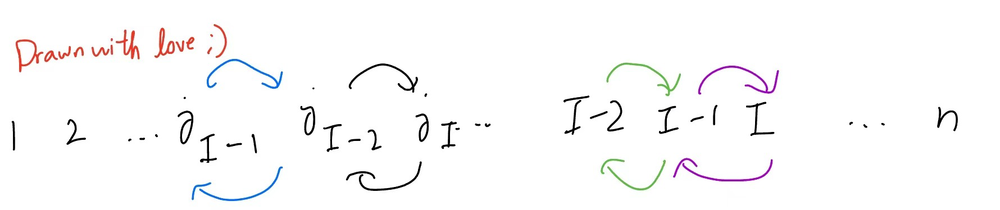

## Determinant of a product

> Lemma. **Switching subscripts of a sum of permutations.** The determinant, expressed as the sum
$$
\sum_{\sigma \in S}\epsilon(\sigma)A_{\sigma(i) i}
$$
> is equivalent to
$$
\sum_{\sigma \in S}\epsilon(\sigma)A_{\sigma(\rho(i)) \rho(i)}
$$
> where $\rho$ is another permutation. This is because the two sums are simply a reordering of one another ($\sigma(\rho(i))\rho(i)$ encompasses the same numbers $1,2,3,...,n$ as $\sigma(i)i$)

(Note: $A_{\sigma(i)i}$ is shorthand for the product of all $A_{\sigma(i) i}$s. This is a horrific abuse of notation and probably a war crime cf. Geneva Convention Clause 48 Article 9.2, but do I look like someone who cares?)

> Lemma. For a square matrix $A$ and a permutation $\rho$, $\epsilon(\rho)\det A = \sum_{\sigma \in S}\epsilon(\sigma)A_{\sigma(i) \rho(i)}$.

> Proof. To get from the first sequence to the second sequence, we want
$$
\begin{aligned}
\epsilon(\rho)\det A &= \epsilon(\rho)\sum_{\sigma \in S}\epsilon(\sigma)A_{\sigma(i)i} \\
&=\sum_{\sigma \in S}\epsilon(\sigma (\rho))A_{\sigma(i)i} \\
&= \sum_{\sigma \in S}\epsilon(\sigma (\rho))A_{\sigma(\rho(i))\rho(i)} \text{ by the above lemma} \\
&= \sum_{\tau \in S}\epsilon(\tau)A_{\tau(i)\rho(i)}
\end{aligned}
$$
> where $\tau(i) = \sigma(\rho(i))$. We can also write in subscript notation

$$
\epsilon_{j_1 j_2 ... j_n} \det A = \sum_{i_1, i_2,...,i_n}\epsilon_{i_1 i_2 ... i_n}A_{i_kj_k}.
$$

This gives us enough firepower to prove:

> Theorem. For any two matrices $A$ and $B$, $\det (AB) = \det A \det B$.

> Proof.

$$
\begin{aligned}
\det (AB) &= \sum_{\sigma \in S}\epsilon(\sigma) (AB)_{\sigma(i) i} \\
&= \sum_{\sigma \in S}\epsilon(\sigma) (A_{\sigma(i)j_i)}B_{j_i i}) \\
&= \sum_{\sigma \in S}\epsilon(\sigma) A_{\sigma(1)j_1}B_{j_1 1}A_{\sigma(2)j_2}B_{j_2 2}...A_{\sigma(n)j_n}B_{j_n n} \\
&= \sum_{i_1, i_2, ..., i_n}\epsilon_{i_1 i_2 ... i_n}A_{\sigma(1)j_1}A_{\sigma(2)j_2}...A_{\sigma(n)j_n}B_{j_1 1}B_{j_2 2}...B_{j_n n} \\
&= \sum_{i_1, i_2, ..., i_n}\epsilon_{j_1 j_2 ... j_n}(\det A)B_{j_1 1}B_{j_2 2}...B_{j_n n} \text{ by the above lemma}\\
&= \det A \det B.

\end{aligned}

$$

> Corollary. If $A$ is orthogonal, then $\det(A) = \pm 1$. 

> Proof. By definition, $AA^T = I$; as such $\det (AA^T) = \det A \det(A^T) = \det I = 1$. as $\det A^T = \det A$, we have $(\det A)^2 = 1$ and $\det A = \pm 1$.

## Minors and cofactors

> Definition. A minor is a minor scale based  on the notes A, B, C, D, E, F, and G. Its key signature has no flats or sharps; it is often regarded as the simplest minor key, and as such many cornerstones of Western classical music [1] have been composed in this key, such as Dr. Dre's "Still D.R.E." and so on 

Sorry, my hand slipped. Let's try that again:

> Definition. Define a **minor matrix** $A^{ij}$ of a square matrix $A$ to be the matrix composed of every element except those in the $i$th row and $j$th column. Accordingly, define the **minor** $M_{ij}$ as the determinant of the matrix: $M_{ij} = \det A^{ij}$.

Essentially, to get the minor of an element in the matrix, drive a lawnmower armed with a bazooka straight through it and fire the bazooka upwards. 

> Definition. Define the **cofactor** of element $A_{ij}$, denoted $\Delta_{ij}$, as $(-1)^{i-j}M_{ij} = (-1)^{i-j}\det A^{ij}$.

The introduction of minors and cofactors allows us to obtain a far more articulate expression for the determinant. 

> Notation. If we ever need to emphasize that a number is missing from a sequence of numbers - e.g. $j$ is missing from $1, ..., n$, or $a_i$ is missing from $a_1, ..., a_n$ - we write these sequences as $1, ..., \bar{j}, ..., n$ and $a_1, ..., \bar{a_i}, ..., a_n$ respectively. In general, a bar over something, e.g. $\bar{A}_{ij}$, indicates that it is missing rather than present within a sequence.

> Lemma. $\epsilon_{j_1 j_2 ... j_I ... j_n} = (-1)^{I - j_I} \epsilon_{j_1 j_2 ... \bar{j_I} ... j_n}$. In accordance with the above notation, the second sequence is the first sequence with the term $j_I \in \{1,2,...,n\}$ removed.

> Proof. To get from $\{1,2,...,n\}$ to $\{j_1,...,j_I,...j_n\}$ (with $j_I$ included), we need to do two things:
1. Get $j_I$ to the $I$th position, with the order of all other elements $\{1,2,...,\bar{j_I},...,n\}$ unchanged. Let this permutation be represented by $\sigma$.
2. With $j_I$ fixed, reorder the other $n-1$ elements $\{1,2,...,\bar{j_I},...,n\}$ (without $j_I$, this time) to correspond with $\{j_1,...,\bar{j_I}...,j_n\}$. Let this permutation be represented by $\rho$.  
Let's deal with $\sigma$ first. To get $j_I$ to the $I$th position without disturbing the order of the other elements, we will need to a series of swaps.   
If $j_I > I$ - i.e. $j_I$ needs to reach a lower position, we first swap $j_I$ with $j_I - 1$, then $j_I$ (now in the position of $j_I - 1$) with $j_I - 2$, ..., until $j_I$ and $I$ swap places:  
  
If $j_I < I$, we will need to swap upwards instead in the same way:  
  
As such, $\sigma$ requires a total of $I - j_I$ swaps and has sign $(-)^{I-j_I}$.   
$\rho$ is the permutation that reorders the other $n-1$ elements (without $j_I$) to $j_1, ..., \bar{j_I}, ..., j_n$. As such, its sign is $\epsilon_{j_1j_2...\bar{j_I}...j_n}$. Thus, the sign of $\sigma \rho$, which permutes $\{1,2,...,n\}$ to $\{j_1,...,j_n\}$ is $\epsilon_{j_1j_2...j_n}=\epsilon(\sigma)\epsilon(\rho)=(-1)^{I-j_{I}}\epsilon_{j_1j_2...\bar{j_I}...j_n}$.

This lemma allows us to show the following:

> Theorem.. **Laplace expansion formulae**. $\det A = \sum_{k=1}^{n}A_{1k}\Delta_{1k}$ for a $n\times n$ square matrix $A$, where $\Delta$ denotes the cofactor. This is also valid for $A_{2k}\Delta_{2k}$, ..., $A_{nk}\Delta_{nk}$.

> Proof. 
$$
\begin{aligned}
\det A &= \sum_{j_1,j_2,...,j_n}\epsilon_{j_1j_2...j_n}A_{1j_1}A_{2j_2}...A_{nj_n} \\
&=\sum_{j_I = 1}^{n} A_{I j_I} \sum_{j_1, j_2, ..., \bar{j_I}, ..., j_n} (-1)^{I-j_I}\epsilon_{j_1j_2...\bar{j_I}...j_n}A_{1j_1}A_{2j_2}...\bar{A}_{I j_I}A_{nj_n} \\
&\text{using the above lemma} \\
&=  \sum_{j_I = 1}^{n} A_{I j_I} (-1)^{I-j_I} M_{Ij_I}
\end{aligned}
$$

> as the second sum represents a determinant of the matrix with row $I$ and column $j_I$ removed. Note that the proof is equivalent for columns, and leads to the conclusion that you can use any column's cofactors to find the determinant, not just any row.

This is usually the method to use for calculating determinants in practice, not summing over every possible permutation of $\{1,...,n\}$; it helps to choose a row or column with as many zeros as possible to simplify calculations. Ideally, the row or column we choose has only one non-zero entry. Indeed, we can manipulate affairs to achieve that goal, using the following properties demonstrated previously:
1. If you add a scalar multiple of one row to another row, the determinant is unchanged.
2. If you swap two rows, the determinant is multiplied by a negative sign.

As such, we want to leave one row or column to have only one nonzero entry using the above two operations. You can pick any row or column you want; pick the 86th column or the 20th row for all I care, but honestly, the only row you'll be headed towards is death row if you commit such an irredeemably felony. We will pick the first column and nothing else; our goal is to leave the very first entry $A_{11}$ nonzero and all other entries $A_{j1}$ zero. To make $A_{21}$ zero, subtract $\frac{A_{21}}{A_{11}}$ times the first row from the second; to make $A_{31}$ zero, do the same for $A_{31}$; and so on, until all other first entries of each row are zero. The determinant is simply the minor of $A_{11}$; repeat this entire process until a single number is left behind.

