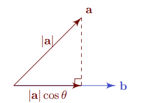

In *addition* (ba dum-tss) to addition and multiplication, we define a third operation in a vector space $V$ - the scalar product - that takes two vectors $\mathbf{a, b}$ as inputs and returns a scalar.

Thus far, the one instance of a scalar product we are familiar with is the dot product; but the dot product is not the only scalar product that can be defined. We know that the dot product in $\mathbb{R^2}$ and $\mathbb{R^3}$ between vectors $\mathbf{a}$ and $\mathbf{b}$ is defined $\mathbf{a\dot b = |a||b|}\cos\theta$ where $\theta$ is the angle between the two, and satisfies:

1. $\mathbf{a\cdot b = b \cdot a}$
2. $\mathbf{a \cdot a} = |\mathbf{a}| \geq 0$
3. $\mathbf{a\cdot a} = 0$ $\iff$ $\mathbf{a} = 0$
4. If $\mathbf{a \cdot b}$ = 0, then $\mathbf{a, b}$ are perpendicular.

From the definition $\mathbf{a\dot b = |a||b|}\cos\theta$, we know that the dot product gives us information on the angle between two vectors; indeed, from the definition of cosine in a triangle, we know that this expression represents the component of $\mathbf{a}$ parallel to $\mathbf{b}$, also known as the *projection*:

However, this is only one of many possible scalar products, or *inner products*, $\langle\mathbf{x|y}\rangle$, that can be defined. Similar to a dot product, they are defined by the following properties:

1. Commutativity: $\mathbf{\langle x|y\rangle=\langle y|x\rangle}$
2. Distributive and associative properties: $\langle\mathbf{x}|(\lambda\mathbf{y}+\mu\mathbf{z})\rangle=\lambda\langle\mathbf{x|y}\rangle+ \mu\langle\mathbf{x|z}\rangle$
3. Identity: if $\mathbf{\langle x|x\rangle=0}$, then $\mathbf{x}=0$; $\mathbf{\langle x|x\rangle}\geq 0$.

These are the same properties as the ones satisfied by the dot product above.

Accordingly, we define the *norm* of a vector $\mathbf{x}$ as follows:

> Definition (Norm). The *norm* of a vector $\mathbf{x}$ is defined as 
$$
        |\mathbf{x}|=\sqrt{\langle\mathbf{x}|\mathbf{x}\rangle}
$$
The above definitions encompasse far more than the dot product; for instance, if we define the vector space $V$ as the set of all real integrable functions $f(x)$, then we can verify that the operation 
$$
    \langle f(x)|g(x) \rangle = \int_{0}^{1} f(x)g(x)\ dx
$$
is a valid inner product. This generality will be useful in establishing the power of the following result.

> Theorem (Cauchy-Schwarz inequality). For all vectors $\mathbf{x,y}\in\mathbb{R^n}$, we have 
$$
        |\langle \mathbf{x | y}\rangle| \leq |\mathbf{x}||\mathbf{y}|.
$$
> In other words, the norm of the inner product is greater than or equal to the product of the norms. This applies to any inner product on any real vector space, as the proof below will demonstrate.

> Proof. Consider the norm $|(\mathbf{x}-\lambda\mathbf{y})|$, which is non-negative by definition. Thus its square
$$
        (\mathbf{x}-\lambda\mathbf{y})\cdot (\mathbf{x}-\lambda\mathbf{y})
$$
> is also non-negative, leading to 
$$
        |\mathbf{x}| - 2\lambda \mathbf{x\cdot y} +\lambda^2 |\mathbf{y}| \geq 0
$$
> where $\cdot$ denotes any inner product. Reorganizing this as a quadratic equation in $\lambda$ and recognizing that it has at least one real solution, we have its discriminant
$$
        \Delta = b^2-4ac=(4\mathbf{(x\cdot y)}^2) - 4|\mathbf{x||y|}\geq 0
$$
> leading to the desired result.

We derived this proof entirely based on the axiomatic properties of inner products instead of a specific inner product (e.g. the dot product), so this inequality is applicable across any inner product in any real vector space - like the integral-based one defined above.
