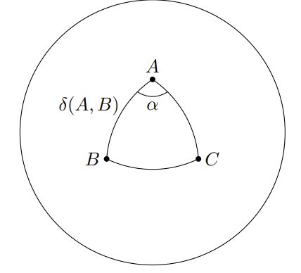

## Spherical trigonometry
Picking up where we left off:
> Proposition. $\mathbf{(a\times b)\cdot (a\times c)= (a\cdot a)(b\cdot c)-(a\cdot b)(a\cdot c)}$.

Consider points $A$, $B$, $C$ on the surface of a unit sphere with radius 1 and origin $O$. Let $\mathbf{a,b,c}$ denote the position vectors of $A$, $B$ and $C$ relative to the origin $O$ respectively. 

> Definition. Let $\delta(A,B)$ denote the angle $\angle AOB$, in radians; $\delta(A,B)$ is also the arc length $\widehat{AB}$. We also have $\mathbf{a\cdot b} = |\mathbf{a||b|}\cos \delta(A,B)=\cos \delta(A,B)$ as $\mathbf{a,b}$ are unit vectors and have $|\mathbf{a|=|b|=1}$.

> Theorem (Spherical cosine rule). For points $A$, $B$, $C$ on this sphere, we have $\cos \alpha \sin\delta(A,B) \sin\delta(A,C)=\cos\delta(B,C)-\cos\delta(A,B)\cos\delta(A,C)$.

> Proof. Notice that the dot product
$$
(a\times b)\cdot (a\times c)
$$
> represents the angle $\alpha$ by means of
$$
\cos \alpha = \frac{(a\times b)\cdot (a\times c)}{|a\times b||a\times c|}
$$
> as $\alpha$ is the angle between the vectors outputted by the two cross products. Using the proposition above, we have
$$
\cos \alpha = \frac{(a\cdot a)(b\cdot c)-(a\cdot b)(a\cdot c)}{|a\times b||a\times c|}
$$
> with $a\cdot a = 1$ due to $a$ being a unit vector. This expression can be rewritten as
$$
\cos \alpha = \frac{\cos\delta(B,C)-\cos\delta(A,B)\cos\delta(A,C)}{\sin\delta(A,B)\sin\delta(A,C)}
$$
> resulting in the desired cosine rule.

This is the fundamental rule governing trigonometry on the surface of a sphere, and it has interesting implications for what triangles would look like in such a circumstance. For instance, say that the triangle is equilateral: $\cos\delta(A,B)=\cos\delta(B,C)=\cos\delta(A,C)=\delta$. We thus have
$$
\cos \alpha =\frac{\delta - \delta^2}{1-\delta^2}=1-\frac{1}{1+\delta}
$$
which is smaller than $\frac{1}{2}$, with $\alpha$ thus being greater than $60^{o}$ - except if $\delta = 1$, where $\delta(A,B)$ and every other angle would be 0 degrees (degenerating the triangle into a point). This also implies that the sum of angles in a spherical triangle exceeds 180 degrees.

## Lines
