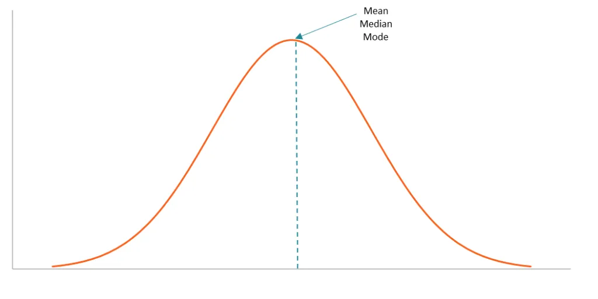
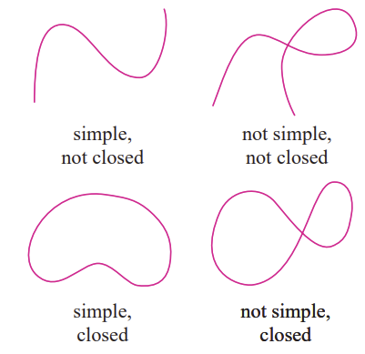
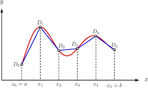
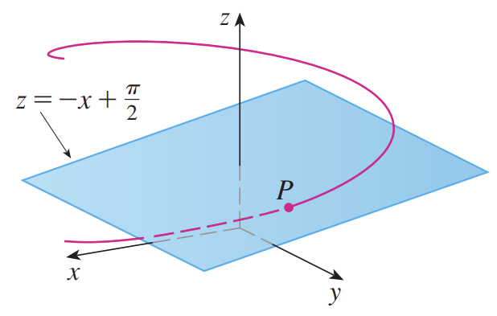

> The world has a lot of curves: algebraic curves, rational curves, curved toenails, and Curves Women's Health and Fitness Club. Curves are occasionally useful: for example, the bell curve measures the distribution of human intelligence, and I flatter myself to say that my well-developed mind lies atop its very peak. 

## What are curves?

So anyways, what are curves?

> Definition. Different people will tell you different things about curves: pure mathematicians, applied mathematicians, that one gym dude whose vocabulary consists of the word "gains" and nothing else, and spacetime-studying physicists when in the presence of your mom. But for the purpose of this course, a curve is the parametric equation
$$
\mathbf{x} = \psi(t)
$$
> where $\mathbf{x}$ is a vector representing a point on the curve, and $t$ is a parameter that varies along the curve.

> Remarks.
1. Intuitively, this definition tells us that a curve is **one-dimensional** - it has only length but no width or depth. Of course, the curve may exist in multi-dimensional space, but it only has one parameter $t$ that varies as you ride along its valleys and peaks.
2. Pure mathematicians define a curve to be a mapping from a parameter $t$ to a set of points on the curve. Corrupt mathematicians take their paychecks at the end of every month and don't ask questions. (Applied mathematicians define a curve to be the **set of points** itself rather than the mapping that maps to that set of points).
3. A curve can be parametrized in more than one way. For example, $x^2 + y^2 = 1$ can be parametrized as $(\cos t, \sin t)$ or as the slightly more unhinged
$$
(x,y)= (\frac{1-t^2}{1+t^2}, \frac{2t}{1+t^2})
$$

(why would you do this?)

## Classification of curves

> Definition. A **simple curve** is a curve that does not intersect or touch itself (except at the endpoints, in which case it is simple and closed). A **closed curve** is a curve whose initial point corresponds with its endpoint, i.e. if the curve $\mathbf{x = \psi}(t)$ is defined over the range $a < b < t$ only, then $\psi(a) = \psi(b)$. A **preda-curve** is a curve which touches other curves without their consent.

> Definition. A curve is **smooth** if its derivative exists at every point; a curve is **piecewise smooth** if it can be divided into a finite number of smooth curves; and a curve is **awkward** if it struggles to strike up conversations with other curves.

## Length of a simple curve

Suppose that $\mathbf{x}$ is a simple curve defined by $\mathbf{x} = \psi(t)$ within the range $t_a < t < t_b$. A rigorous definition of the **length of the curve** is given as follows:

> Definition. **Length of a simple curve**.

Let a **partition** of the interval $t_a < t < t_b$ into $N$ smaller intervals be given by $(t_0, t_1), (t_1, t_2), ..., (t_{N-1}, t_N)$, in which $t_a = t_0 < t_1 < t_2 < ... < t_N = t_b$. This partition also partitions the curve itself into $N$ smaller intervals
$$
(\psi(t_0), \psi(t_1)), (\psi(t_1), \psi(t_2)), ..., (\psi(t_{N-1}, \psi(t_N)))
$$
where joining the endpoints of each intervals yields $N$ lines inscribed within the curve:

The combined length of the lines provide a **discrete approximation** for the actual length of the curve, the accuracy of which improves as the number of partitions $N$ is increased. Denote the total length of the $N$ lines over a partition $D$ as
$$
l_D = \sum_{i=1}^N |\psi(t_i) - \psi(t_{i-1})|
$$
indicating the Euclidean distance, and thus define the **length of the curve** $\mathbf{x} = \psi(t)$ as
$$
\sup_{D} l_D,
$$
where $\sup$, pronounced 'sup (as in, "**'sup**, homeslice?"), denotes the maximum value $l_D$ can attain over all possible $D$. In essence, if $D$ partitions the curve into infinitely small pieces, then the discrete approximation becomes continuous reality and $l_D$ as defined equals the actual length of the curve; this can be better represented by

> Theorem. **Integral representation of the arc length of a curve**. Let $\mathbf{x} = \psi(t),\ t_a < t < t_b$ be the curve above. Then the **arc length** of the curve from $t_1$ to $t_2$, with $t_a < t_1 < t_2 < t_b$, is given by the integral
$$
\int_{t_1}^{t_2} |\psi'(t)|\ dt
$$
> where $|\psi'(t)|$ denotes the norm. Further denote the length of the curve from its starting point $t_a$ to some $t$ as
$$
s(t) = \int_{t_a}^{t} |\psi'(t)|\ dt
$$
> as above.

> Proof. 

Proceed from the discrete approximation of the curve length given above. Suppose that the curve lies in $n$-dimensional space, represented by the point
$$
(x_1(t), x_2(t), ..., x_n(t))
$$
when its parameter equals $t$.
The length of any subsection $(\psi(t_{i-1}), \psi(t_{i}))$ is given by $|\psi(t_i) - \psi(t_{i-1})|$; if $\psi(t) \in \mathbb{R^n}$ for some $n$, it is also given by the expression
$$
|\Delta \psi| = \sqrt{\Delta x_1^2 + \Delta x_2^2 + ... + \Delta x_n^2}
$$
for changes in $x_1, x_2, ..., x_n$ from $\psi(t_{i-1})$ to $\psi(t_i)$, representing the Euclidean distance between the start and end points of the interval. When the interval becomes infinitesimal, we have
$$
|d\psi| = \sqrt{dx_1^2 + dx_2^2 + ... + dx_n^2}
$$
or, dividing by $dt$,
$$
|\frac{d\psi}{dt}| dt = \sqrt{(\frac{dx_1}{dt})^2 + (\frac{dx_2}{dt})^2 + ... + (\frac{dx_n}{dt})^2}\ dt
$$
where the sum of all such expressions from infinitesimal divisions of the curve over some range $t_1$ to $t_2$ yields the length of the curve along that range. Such a sum is given by an integral over that range, as defined by the Riemann sum (*more later*):
$$
s(t) = \int_{t_a}^{t} |\frac{d\psi}{dt}|\ dt = s(t) = \int_{t_a}^{t} |\psi'(t)|\ dt
$$
as desired. Note the fact that 
$$
\frac{ds}{dt} = |\psi'(t)|
$$
regardless of the parameterization $\psi$ and $t$ used.

> Remarks.
1. Call a curve with finite arc length **rectifiable**.
2. If $\psi$ is **not** a simple curve but can be sub-divided into a finite number of simple curves, then the length of $\psi$ is the sum of the lengths of the simple curves.
3. The arc length function $s(t)$ as defined above is an increasing function; $\frac{ds}{dt} \geq 0$.
4. An **arc-length** parametrization of the curve $\mathbf{x} = \psi(t)$, denoted $\mathbf{x = r}(s)$, maps the arc length of the curve to a point on the curve which has the corresponding arc length. For instance, while $\mathbf{x} = \psi(t)$ gives the position of a point on the curve with respect to time, e.g. "I am five minutes down the road", $\mathbf{x} = r(s)$ gives the position with respect to distance travelled, e.g. "I am five meters inside your house".   
The arc length parameterization can be obtained through the inverse function of $s(t)$, denoted $\lambda$:
$$
t = \lambda(s(t))
$$
...which always exists as $s(t)$ is increasing with respect to $t$ (and is thus one-to-one). This yields $\mathbf{x} = \psi(\lambda(s)) = \mathbf{r}(s)$; such a parameterization is beneficial because it is an **intrinsic quality** of the curve independent on the path taken. 

> Proposition. The arc length parameterization satisfies
$$
|\frac{d\mathbf{r}}{ds}| = 1
$$
> which seems like a baffling result, but in reality just says "the rate of change of the arc length with respect to the arc length is 1", as $|\frac{dr}{ds}|$ is the **magnitude** of the rate of change of position (and thus the distance travelled along the curve, and thus the arc length). 

> Proof via the chain rule.

First, we have
$$
\mathbf{r}(s) = \psi(t) = \psi(\lambda(s))
$$
for some parameterization of the curve $\psi(t)$, with $\lambda(s) = t$. Thus
$$
\frac{d\lambda}{ds} = \frac{dt}{ds} = \frac{1}{(\frac{ds}{dt})} = \frac{1}{|\psi'(t)|}
$$
from above; as such
$$
\frac{d\mathbf{r}}{ds} = \frac{(\frac{d\mathbf{r}}{dt})}{(\frac{ds}{dt})} = \frac{\psi'(t)}{|\psi'(t)|}
$$
as $\mathbf{r}(s) = \psi(t)$ and so $\frac{d\mathbf{r}}{dt} = \frac{d\psi}{dt}$. Thus $\frac{d\mathbf{r}}{ds}$ has unit length. 

## Tangents to curves

> Definition. The **tangent** to a curve $\mathbf{x} = \psi(t)$ at the point with parameter $t$ is given by the line joining the points $\psi(t)$ and $\psi(t+h)$ as $h \to 0$.

> Remark. The line joining $\psi(t)$ and $\psi(t+h)$ has direction vector
$$
\frac{\psi(t+h) - \psi(t)}{h}
$$
> the limit of which as $h \to 0$ equals $\psi'(t)$ if it exists and is nonzero.

This implies that 

> Theorem. The tangent vector to $\psi(t)$ at point $t$ is given by $\psi'(t)$; the tangent vector of unit magnitude is given by $\frac{\psi'(t)}{|\psi'(t)|}$.

If the arc length parameterization of the curve is used, its derivative with respect to its parameter always has magnitude one, and thus

> Theorem. If the arc length parameterization of the curve is used, the rate of change of the position of the curve with respect to arc length
$$
\mathbf{r}'(s) = \mathbf{r}'(s(t)) = \frac{d\mathbf{r}}{ds}
$$
> is the **unit tangent vector** to the curve at all points.

## Curvature, Normal, and Bi-normal

### Curvature

> Definition. A parameterization of the curve $\mathbf{x} = r(t)$ is considered **smooth** if $r'(t)$ is continuous and nonzero at every point on the curve. If the curve $\mathbf{x}$ has a smooth parameterization, then it is a **smooth curve**.

If $r'(t)$ is indeed zero at some point, the position of the curve does not change even if we travel along the path of the curve; as such the path is not smooth, and the curve will have sharp corners, cusps or discontinuities. For smooth curves without discontinuities, we define

> Definition. The **curvature** of a smooth curve $\mathbf{x} = r(t)$ is defined as the magnitude of the rate of change of its **unit tangent vector** with respect to arc length:

$$
\kappa = |\frac{d\mathbf{T}}{ds}|
$$

> where $\mathbf{T}$ is the unit tangent vector to the curve at $t$, given above by the derivative of the arc length parameterization with respect to arc length.

Curvature can be understood as how sharp a curve changes direction at a given point; if it heads in roughly the same direction in a region its unit tangent vector will change very little, corresponding with low curvature, and if it suddenly changes direction at a point the magnitude of the rate of change of the unit tangent vector will be significant, corresponding to a high curvature.

Note that we can rewrite the above with respect to $t$ via the chain rule, for a curve parameterized by $\phi(t)$:

$$
\kappa = |\frac{(\frac{d\mathbf{T}}{dt})}{(\frac{ds}{dt})}| = |\frac{\mathbf{T}'(t)}{\mathbf{\phi}'(t)}|
$$
as $\mathbf{\phi}(t)$ is the position of a point on the curve with respect to $t$, and so $\mathbf{\phi}'(t)$ is the rate of change of that position (and thus the magnitude of the rate of change of the arc length).

> Example. Find the curvature of a circle with radius $a$.

> Solution. 

Parameterize the circle as the curve $\mathbf{x} = \mathbf{r}(t) = (a \cos t, a \sin t)$, yielding 
$$
\mathbf{r}'(t) = (-a\sin t, a \cos t),\ |\mathbf{r}'(t)| = a.
$$
The unit vector to $r(t)$ is given by
$$
T(t) = \frac{r'(t)}{|r'(t)|} = \frac{(-a\sin t, a\cos t)}{a} = (-\sin t, \cos t)
$$
with
$$
T'(t) = (-\cos t, -\sin t)
$$
and thus
$$
\kappa = |\frac{(-\cos t, -\sin t)}{a}| = \frac{1}{a}
$$
at all points $t$.

**** 

### Normal and bi-normal

> Definition. A **normal vector** $N(t)$ to the curve $\mathbf{x} = r(t)$ at point $t$ is such that $N(t)$ is perpendicular to the unit tangent $T(t)$ at $t$.

Many normal vectors exist at any given point, but in particular

> Theorem. For a curve $r(t)$ and its **unit** tangent vector $T(t)$, a normal vector at $t$ is given by $T'(t)$ (and its corresponding unit normal vector $\hat{N}$ by $\frac{T'(t)}{|T'(t)|})$.

> Proof. 

By virtue of $T(t)$ being a unit vector, we have $T(t) \cdot T(t) = 1$. Suppose that the components of $T$ are denoted $T_i$; using summation convention results in
$$
(T(t) \cdot T(t))' = (T_i^2)' =2T_iT_i' = (1)' = 0 
$$
and thus $T_i T_i' = T(t) \cdot T'(t) = 0$, implying orthogonality. 

Correspondingly define 

> Definition. The **binormal vector** to $r(t)$ at $t$, denoted $B(t)$, is also a normal vector to $r(t)$, but is normal to both the normal and tangent vectors:
$$
B(t) = T(t) \times N(t).
$$

Thus the binormal, normal, and tangent vectors form a

> Definition. **Moving trihedral**: a right-handed coordinate system of three unit vectors, all mutually orthogonal, formed around a point $t$ on curve $r(t)$.

Later on these vectors will be used to define an **osculating plane**; "osculating" is derived from the Latin root "osculatus", meaning "to kiss". This is drawn from the fact that the bi-normal vector is "kissing" the normal vector, and reminds me of how I am still bi-myself.

All of this allows us to define a much more efficient formula for curvature:

> Theorem. The curvature of a curve parameterized by $\mathbf{x = r}(t)$ at a point $t$ is given by
$$
\kappa = \frac{|\mathbf{r}'(t) \times \mathbf{r}''(t)|}{|\mathbf{r}'(t)|^3}
$$

> Proof.

From 
$$
\kappa = \frac{|\mathbf{T}'(t)|}{|\mathbf{r}'(t)|}
$$
and (being careful to note that $|r'(t)|$ is not a constant!)
$$
\begin{aligned}
\mathbf{T}'(t) = (\frac{r'(t)}{|r'(t)|})' &= (\frac{r'(t)}{s'(t)})' \\
&= \frac{r''(t)s'(t) - r'(t)s''(t)}{s'(t)^2} \\
&= \frac{r''(t) - T(t)s''(t)}{s'(t)} \\
&= \frac{r''(t) - \frac{r'(t)}{|r'(t)|}s''(t)}{|r'(t)|} \\
&= \frac{r''(t)r'(t) - r'(t) s''(t)}{|r'(t)|^2}
\end{aligned}
$$
using $T(t) = \frac{r'}{|r'|}$. This also gives (from the second line)
$$
r''(t) = T'(t)s'(t) + T(t)s''(t)
$$
and (from $T(t) = \frac{r'}{s'}$)
$$
r'(t) = T(t)s'(t)
$$
yielding
$$
|r'(t) \times r''(t)| = |s'(t)|^2 |(T\times T')| = |r'(t)|^2|(T\times T')|
$$
as $T \times T = 0$ by property of the cross product. As shown above, $T$ and $T'$ are orthogonal, so their cross product has magnitude
$$
\begin{aligned}
|T \times T'| &= |T||T'|\sin \theta \\
&= |T'| \\
&= \frac{|r'(t) \times r''(t)|}{|r'(t)|^2}
\end{aligned}
$$
as $T$ is a unit vector, and the last line originates from above. Recall that curvature is defined
$$
\frac{|T'(t)|}{|r'(t)|}
$$
which finally equals
$$
\frac{|r'(t) \times r''(t)|}{|r'(t)|^3}
$$
as desired.

## Osculating planes

Not to be confused with *oscillating plane*, which was New York's local weather forecast on the morning of 9/11/2001, or *ovulating crane*, which is what I affectionately refer to my mother-in-law as, the **osculating plane** of a curve is defined as

> Definition. The **osculating plane** of a curve $r(t)$ at point $t$ is the plane (uniquely) determined by the tangent and normal vectors $T(t)$ and $N(t)$ defined above.

Alternatively, the osculating plane results from the following limiting definition:

> Proposition. Suppose that $t-h, t, t+h$ represent three points on a curve $r(t)$; a plane is uniquely determined obtained by the two vectors joining the points $(r(t-h),r(t))$ and $r(t), r(t+h)$. The osculating curve to $r(t)$ at $t$ is thus given when $h \to 0$.

> Proof (or at least a desperate justification). 

From the above definition we know that the osculating curve contains the tangent and normal vectors, which are in the directions $r'(t)$ and $r''(t)$ respectively. 

When $h \to 0$ as above, the vector joining $r(t)$ and $r(t+h)$ has direction
$$
\lim_{h\to 0}\frac{r(t+h)-r(t)}{h} = r'(t)
$$
which is the tangent to $r(t)$ at $t$; furthermore the plane also contains the vector in the direction
$$
\lim_{h \to 0}\frac{r(t)-r(t-h)}{h}
$$
which is also $r'(t)$. If the plane contains both vectors, however, it must contain the difference of the two vectors; which is
$$
\lim_{h \to 0}\frac{r(t+h)-2r(t)+r(t-h)}{h}
$$
which, by definition, equals $r''(t)$ and is thus in the direction of $N(t)$.

****

As the tangent vector to a curve indicates its direction and the normal vector indicates the direction it bends/curves in (as it is in the direction $T'(t)$), the osculating plane is the plane that **most closely touches the curve**:

As previously stated, the binormal vector is simultaneously perpendicular to the unit normal and unit tangent vectors; and thus it is the normal vector to the osculating plane.

> Theorem. The normal vector to the osculating plane at $t$ for a curve $r(t)$ is given by
$$
\frac{r'(t) \times r''(t)}{|r'(t)\times r''(t)|}
$$

Note that $r'(t)\times r''(t)$ is never zero because the two are perpendicular, aside from when $r''(t)$ is itself zero.

> Proof. The normal vector arises from $N(t) \times B(t)$, which are in the direction of $r''(t)$ and $r'(t)$ respectively. Normalizing the vector leads to the above result.

Further define
> Definition. The **normal plane** to the curve, uniquely defined by the normal and binormal vectors $B(t)$ and $N(t)$ at a point $t$; it contains all vectors normal to the curve at $t$.

## Serret-Frenet equations

The Serret-Frenet equations concisely restate our above conclusions about curves. They are chiefly concerned with the **arc length parameterization** $r(s)$ of a curve, and provide relationships between tangent, normal, and binormal vectors. 

The arc length parameterization make these expressions more natural given that the tangent vector $r'(s)$ is a unit vector. Denote this unit vector by $\mathbf{u}$; as proven previously, the curvature
$$
\kappa = \frac{|r'(t)\times r''(t)|}{|r'(t)|^3} = |r''(s)| \geq 0
$$
when $|r'(s)| = 1$. This yields the first Serret-Frenet equation:

> Theorem. **First Serret-Frenet equation: tangent and normal**. 
$$
\frac{d^2\mathbf{r}}{ds^2} = \frac{d\mathbf{u}}{ds} = \kappa\mathbf{p}
$$
> Where $\mathbf{u}$ is the unit tangent vector and $\mathbf{p}$ is the **principal normal vector** at $s$, which exists if $|r''(s)|>0$. It is a unit vector due to the above definition of curvature.

This is the same result as the one proven above. As before, define the **binormal vector** as the vector perpendicular to both the unit normal and tangent vectors; for the arc length parameterization it conveniently equals
$$
\mathbf{b} = \frac{\mathbf{u \times p}}{|\mathbf{u\times p}|} = \frac{\mathbf{r'(s) \times r''(s)}}{|\mathbf{r}''(s)|} = \frac{\mathbf{r'(s)\times r''(s)}}{\kappa}
$$
as above. Curvature is useful especally in physical scenarios, such as calculating forces, moments, or the total testicular torsion resulting from a spicy kick to the crotch. This leads us to

> Theorem. **Second Serret-Frenet equation: torsion**. For unit binormal vector $\mathbf{b}$ and principal normal vector $\mathbf{p}$, both functions of $s$, we have

$$
\frac{d\mathbf{b}}{ds} = -\tau \mathbf{p}
$$

> where $\tau$ denotes the **torsion**.

> Proof As $\mathbf{b}$ is a unit vector, we have 
$$
\mathbf{b} \cdot \mathbf{b}' = 0
$$
> which was previously proven with the derivative of the unit tangent vector. However, as $\mathbf{p} \cdot \mathbf{b}$ is also zero due to the binormal vector being perpendicular to the normal vector, $\mathbf{p}$ and $\mathbf{b}'$ are in the same direction excepting a sign; this results in
$$
\frac{d\mathbf{b}}{ds} = -\tau \mathbf{p}.
$$

The intuition behind torsion originates from the fact that the binormal vector represents the unit normal vector to the osculating plane; thus, the rate at which the osculating plane "twists" and changes is given by $\frac{d\mathbf{b}}{ds}$ - and measured by the parameter $\tau$.

Finally, we have

> Theorem. The **Third Serret-Frenet equation** describes the vanishing magnitude of my will to live. It represents the derivative of the principal normal vector as a linear combination of curvature, torsion, tangent, and binormal:
$$
\frac{d\mathbf{p}}{ds} = \tau\mathbf{b} - \kappa \mathbf{u} 
$$
> Proof. By definition of the unit binormal we have $\mathbf{b \times u} = |\mathbf{b}||\mathbf{u}|\mathbf{p} = \mathbf{p}$ because both $|\mathbf{b}|$ and $|\mathbf{u}|$ are $1$, and $\mathbf{p}$ is orthogonal to both vectors. Thus
$$
\begin{aligned}
\frac{d\mathbf{p}}{ds} &= \frac{d}{ds}(\mathbf{b \times u}) \\
&= \frac{d\mathbf{b}}{ds}\times \mathbf{u} + \mathbf{b}\frac{d\mathbf{u}}{ds} \\
&= -\tau(\mathbf{p} \times \mathbf{u}) + \kappa (\mathbf{b} \times \mathbf{p}) \\
&= \tau \mathbf{b} - \kappa \mathbf{u}
\end{aligned}
$$
> making use of the cross-product derivative rule and the properties of the moving trihedral.

Alternative forms of writing the Serret-Frenet equation involve either the cross-product properties of the three vectors (e.g. $\frac{d\mathbf{b}}{ds} = -\tau(\mathbf{b \times u})$) or the following matrix representation:
$$
\begin{bmatrix}
\mathbf{u}' \\
\mathbf{b}' \\
\mathbf{p}'
\end{bmatrix} = 
\begin{bmatrix}
0 & 0 & \kappa \\
0 & 0 & -\tau \\
-\kappa & \tau & 0
\end{bmatrix}
\begin{bmatrix}
\mathbf{u} \\
\mathbf{b} \\
\mathbf{p}
\end{bmatrix}
$$
which is skew-symmetric. The values for curvature and torsion $\kappa$ and $\tau$ contain the full scope of information for the geometry of a curve, excepting its position in space and its rotational angle; simultaneously, the moving trihedral of vectors $\mathbf{b, u}$ and $\mathbf{p}$ have important physical significance in various system modelled by curves, e.g. velocity, acceleration and speed.
