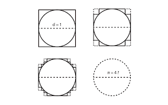
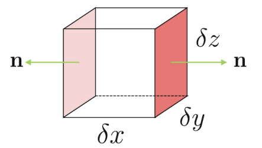
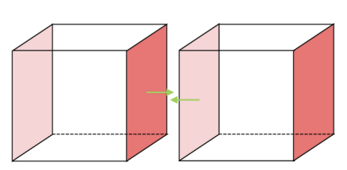
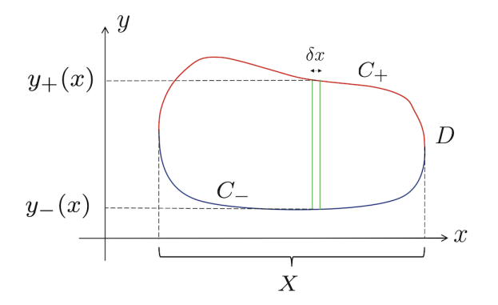
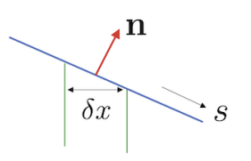

> The Divergence Theorem comes full circle.

## A new understanding of divergence

> Profile: **Carl Freidrich Johann Heinrich Kaiser Wilheim Ludwig Beethoven von Gauss**.  
  
Gauss calculated the precise value of $\sum_{i=1}^{100} i$ in three picoseconds while still an unborn fetus. He is best known for being the namesake to 100 concepts, 7 billion theorems, and my firstborn child, and for since ascending to divinity as eternal patron saint of all mathematicians worldwide.

The Divergence Theorem, also known as Gauss' Theorem, is stated as follows:

> Theorem. **The Divergence Theorem**. For a smooth vector field $\mathbf{F(x)}$ defined over $\mathbb{R^3}$, as well as a bounded region $V$ and its associated piecewise-smooth boundary $\partial V = S$, we have
$$
\int_{V}\nabla \cdot \mathbf{F}\ dV = \int_{S} \mathbf{F \cdot dS}.
$$
> (where the direction of $\mathbf{dS}$ is out of the boundary.)

### Building intuition for the Divergence Theorem

> Why I ~~season~~ integrate over my ~~cutting board~~ surface, NOT my ~~steak~~ volume

Our rudimentary understanding of divergence is that of a measure of flow. (This is admittedly putting Descartes before the horse, because this rudimentary understanding exists only because of the Divergence Theorem.) A positive divergence at a point indicates that the vector field has a net-flow **into** the point; a negative divergence indicates a net flow **out of** the point.

If divergence quantifies flow at very point, then what does the left-hand side of the Divergence Theorem
$$
\int_V \nabla\cdot \mathbf{F}\ dV,
$$
a volume integral of the divergence of $\mathbf{F}$ over the entire region $V$, mean? Intuitively, this is the sum of the net flow of $\mathbf{F}$ at every point in $V$ - the **total net flow** of the field **inside** the region. Meanwhile, the surface integral on the right-hand side
$$
\int_S \mathbf{F \cdot dS}
$$
measures something very particular: the **flux** of the vector field out of the surface $S$ which bounds the region $V$ - in essence, the net flow of $\mathbf{F}$ on the **outside**/exterior of $V$.

Taken together, the Divergence Theorem states simply thus: the net amount of $\mathbf{F}$ flowing outward from the **inside** of a region $V$ equals the amount of $\mathbf{F}$ that **actually** flows outward through its surface. Or, better yet:

> If you got gas in your belly, you better believe you're gonna pass that gas out the other side, yo.

### Re-defining divergence

Divergence measures the net flow of a vector field into or out of a given point - but why? The divergence theorem itself provides us with the essential clues.

Consider an infinitesimal region $V$ that encloses exactly a single point $\mathbf{x}$ in space - a region approaching zero volume. The boundary surface $S$ enclosing that region is the point itself; the volume integral of the divergence of a vector field $\mathbf{F}$ throughout that region
$$
\int_V \nabla \cdot \mathbf{F}\ dV
$$
is no more than the divergence $\nabla\cdot\mathbf{F}$ at $\mathbf{x}$, multiplied by the volume $V$ of the region:

$$
\int_V \nabla \cdot \mathbf{F}\ dV
 = V(\nabla \cdot \mathbf{F})(\mathbf{x})
$$

as, at infinitesimal scales, the divergence $\nabla \cdot \mathbf{F}$ is roughly constant.

 On the other hand, the Divergence Theorem gives us
$$
\int_S \mathbf{F \cdot dS}
$$
leading to 

> Definition. **Coordinate-free** definition of divergence. For a vector field $\mathbf{F}: \mathbb{R^3 \to R^3}$, the Divergence Theorem about an infinitesimal region $V$ enclosing some point $\mathbf{x} \in \mathbb{R^3}$ gives
$$
\nabla \cdot \mathbf{F} = \lim_{V\to 0}\frac{\int_S \mathbf{F\cdot dS}}{V}.
$$

At such infinitesimal scales, $\int_S \mathbf{F\cdot dS}$ is not only the flux of $\mathbf{F}$ out of the surface $S$, but - as $S$ is the point $\mathbf{x}$ itself - also just the flow of $\mathbf{F}$ out of the point $\mathbf{x}$. This ultimately gives rise to our interpretation of divergence as flow: for instance, Maxwell's equations state that
$$
\nabla \cdot \mathbf{B} = 0
$$

indicating a magnetic field that does not contain any sources or sinks and flows in and out of every point at equal measure, and 
$$
\nabla \cdot \mathbf{E} = \frac{\rho}{\epsilon_0}
$$
with $\rho$ being charge density, indicating that electric field gathers/flows out of points where charge is densely collected.

### The Divergence Theroem in scalar fields

> Theorem. (Divergence theorem in scalar fields). For a region $V$ in $\mathbb{R^3}$ and its boundary surface $S = \partial V$, along with a smooth scalar field $\phi$ in $\mathbb{R^3}$, we have
$$
\int_V \nabla \phi\ dV = \int_S \phi\ d\mathbf{S}. 
$$

> Proof.

This arises from a special case of the (general) Divergence Theorem: take $\mathbf{F} = \mathbf{a}\phi$ for a constant vector $\mathbf{a}$, with

$$
\int_V \nabla \cdot \mathbf{F}\ dV = \int_V \nabla \cdot (\mathbf{a}\phi)\ dV = \int_V \mathbf{a}\nabla\phi\ dV = \int_S\phi (\mathbf{a}\cdot \mathbf{dS})
$$
by the Divergence Theorem, leading to
$$
\int_V \nabla \phi\ dV = \int_S \phi\ d\mathbf{S}. 
$$

## Sketching the proof

### Attempt 1

> Picasso would be spinning in his grave.

Suppose that we divide a region $V$ in 3D space into an infinite number of infinitesimal cubes, denoted $V_{\mathbf{x}}$; we want to claim that these cubes added together will exactly equal $V$. Sadly, this is extremely suspect; no matter how small the cubes become, there will always be "gaps" between the cube and the actual region that remain nonzero even when the cubes have zero volume. This is called the **staircase paradox**, e.g.

whose natural conclusion would suggest $\pi = 4$. In engineering, this statement is known as "the Engineer's Approximation"; in math, it's known as "a really bad idea."

So with the foreknowledge that **this does not work**, and in the parallel universe where it did work, $\pi$ also equals $4$ and $\sqrt{2}$ equals $1$ and I still managed to "befriend" your mom last night, let us sally forth.

Pictured above is one of the infinitesimal cubes $V_x$, along with a vector field $\mathbf{F}$. Consider the Divergence Theorem for this miniature example: does
$$
\int_{V_x} \nabla\cdot \mathbf{F}\ dV = \int_{S_x} \mathbf{F\cdot dS}
$$
hold, with the flux being evaluated along the six sides of the cube?

Let's consider flux first. The cube has three pairs of opposite sides, which, in turn, have opposite normal vectors; consider, for example, the two sides placed in the $(y,z)$ plane, with $e_x = \pm(1,0,0)$ as their normal vector(s). On the side to the left (light-red color above), suppose that $\mathbf{F} = \mathbf{F}(x,y,z)$ (held constant as the cube is infinitesimally small); as such, on the side to the right, we have $\mathbf{F} = \mathbf{F}(x+\delta x, y, z)$. This results in
$$
\text{Flux} = [(\mathbf{F}(x+\delta x, y, z) - \mathbf{F}(x,y,z))\cdot (1,0,0)](\text{Area of face})
$$
which is 
$$
[\mathbf{F}_x(x+\delta x, y, z) - \mathbf{F}_x(x,y,z)]\ \delta y\ \delta z
$$
rewritable in terms of partial derivatives and linear approximations as 
$$
\frac{\partial \mathbf{F}_x}{\partial x} \ \delta x\ \delta y\ \delta z.
$$
Similarly, out of the pair of faces in the $xz$-plane, we have
$$
\frac{\partial \mathbf{F}_y}{\partial y} \ \delta x\ \delta y\ \delta z;
$$
and in the $xy$-plane,
$$
\frac{\partial \mathbf{F}_z}{\partial z} \ \delta x\ \delta y\ \delta z.
$$
In total, therefore, the flux through the surface of the cube is
$$
\int_{S_x} \mathbf{F}\cdot d\mathbf{S} = (\frac{\partial F_x}{\partial x} + \frac{\partial F_y}{\partial y} + \frac{\partial F_z}{\partial z})\ \delta x\ \delta y\ \delta z = (\nabla \cdot \mathbf{F})\ \delta V
$$
which is **by definition** equal to
$$
\int_{V_x} \nabla \cdot \mathbf{F}\ dV
$$
as $\nabla \cdot \mathbf{F}$ is constant over an infinitesimal range and the volume integral is thus a constant multiplied by the volume $dV = dx\ dy\ dz$.

If the divergence theorem holds for an infinitesimal cube, does it hold for the entire region $V$? Let's now consider
$$
\int_{V} \nabla\cdot \mathbf{F}\ dV
$$
over the entire volume $V$, which - by our assumption that all the little cubes add up to $V$ - is equal to the volume integral for each little cube $V_x$ added together:
$$
\int_{V} \nabla\cdot \mathbf{F}\ dV = \sum_x \int_{V_x} \nabla\cdot \mathbf{F}\ dV
$$
But as the divergence theorem holds for these little cubes, the above is equivalent to
$$
\sum_x \int_{S_x} \mathbf{F\cdot dS}
$$
also. Our last task is to prove that this sum of infinitesimal surface integrals is equal to the bigger surface integral over the entire boundary surface $S$,
$$
\int_S \mathbf{F \cdot dS}.
$$
To accomplish this, consider the following picture.

Any two faces that do not lie directly on the boundary $S$ of $V$ will touch. Along these touching faces, the value of $\mathbf{F}$ is identical - but the normal vector $\mathbf{dS}$ is equal and opposite in direction. The surface integrals along these two faces thus cancel out; and along the next pair of touching faces, it, too, cancels out; until all that is left is the surface integral along the faces that form the boundary $S$, i.e.
$$
\sum_x \int_{S_x} \mathbf{F\cdot dS} = \int_S \mathbf{F \cdot dS}.
$$

### Attempt 2-D

> A lot of things in life would be easier if we could reduce them to two dimensions. Like proving the divergence theorem. Or relationships.

The glaring issue we want to amend in our previous proof is the way in which we sub-divided the region: dividing a region into infinitesimal cubes does not yield a "smooth" approximation whose difference with the actual region vanishes as the subdivision gets finer. Instead of parameterizing a 3D region into cubes - or a 2D region into squares - we want to work with parallelograms and angled lines. 

To make this concept a bit clearer, we consider

> Theorem. **The Divergence Theorem, 2D**. The anime adaptation of the  famed Hollywood live-action blockbuster. For a two-dimensional region $D$ and its bounding curve $C$, as well as a vector field in $\mathbb{R^2}$ denoted $\mathbf{F}$, we have

$$
\int_D \nabla \cdot \mathbf{F}\ dA = \int_C \mathbf{F\cdot n}\ ds.
$$

> Note that the right-hand side is **not** the usual line integral defined for vector fields; the dot product is with the normal vector to the curve, and not the tangent vector.

> Proof.

**The big idea**: consider the $x$-component and $y$-component of $\mathbf{F}$ separately. Divergence of a single component is a single partial derivative. Area integral of the partial derivative is a line integral along the boundary. 

**** 
We begin with
$$
\mathbf{F} = \mathbf{F}_x(x,y)\mathbf{e_1} + \mathbf{F}_y(x,y)\mathbf{e_2}.
$$
If the above statement is valid for the $x$- and $y$-components separately, then it is valid for the general vector field $\mathbf{F}$ due to the linearity of integration.

First consider the $y$-component of the vector field **in vector form**, $\mathbf{\vec{F}}_y(x,y) = (0, F_y)$. Beginning with the left-hand side:
$$
\begin{aligned}
\int_D \nabla \cdot \mathbf{F}_y\ dA &= \int_D (\partial_x, \partial_y) \cdot (0, F_y)\ dy\ dx \\
&= \int_{X}\int_{y_-(x)}^{y_+(x)}\partial_y F_y\ dy\ dx \\
&= \int_X F_y(x, y_+(x)) - F_y(x, y_-(x))\ dx

\end{aligned}
$$
by the Fundamental Theorem of Calculus.

To convert this to the line integral we desire, we ponder on the relationship between $dx$ and $ds$. Suppose that the unit normal to the curve $C$ is denoted $\mathbf{n}$; then the angle $\theta$ formed by $\mathbf{n}$ and the $y$-axis is given by
$$
\cos \theta = \mathbf{n} \cdot \hat{y}
$$
for the upward-pointing portion of the curve $C_+$, and 
$$
\cos \theta = -\mathbf{n} \cdot \hat{y}
$$
for the downward-pointing portion $C_-$, where $\hat{y}$ is the unit vector in the $y$-direction. $\theta$ is also the angle formed by the $x$-axis and the tangent to the curve $ds$:

where we now have

$$
\delta x = \delta s \cos \theta = \pm \delta s (\mathbf{n\cdot\hat{y}})
$$

depending on if we are on $C_+$ or $C_-$. In any case, we have
$$
\vec{F}_y(x,y) \cdot \mathbf{n} = (0, F_y)\cdot \mathbf{n} = F_y(x,y) (\mathbf{n} \cdot \hat{y})
$$
as $\hat{y} = (0,1)$ and the vector $\vec{F}_y(x,y) = F_y(x,y)\hat{y}$.

Substituting back into the area integral, we have

$$
\begin{aligned}
\int_X \vec{F_y}(x, y_+(x)) - \vec{F_y}(x, y_-(x))\ dx &= \int_X F_y(x, y_+(x)) - F_y(x, y_-(x))\ (\mathbf{n \cdot \hat{y}})\ ds \\
&= \int_X (\vec{F_y}(x, y_+ (x))\cdot \mathbf{n})\ ds + (\vec{F}_y(x, y_- (x))\cdot\mathbf{n})\ ds \\
&\text{(as $y_+$ lies on $C_+$ and $y_-$ lies on $C_-$)} \\
&= \int_{C_-}\vec{F}_y\ ds + \int_{C_+} \vec{F}_y\ ds \\
&= \int_C \vec{F_y}\cdot \mathbf{n}\ ds 

\end{aligned}
$$
as desired. 

The same procedure can be carried out for the $x$-component in vector form, $\vec{F}_x$; combining the two statements together yields
$$
\int_D \nabla \cdot \mathbf{F}\ dA = \int_{\partial D}\mathbf{F \cdot n}\ ds
$$
for general $\mathbf{F}$.

(And for the caveat of more complicated regions that have complicated orientations: just cut them into small pieces that are convex.)

### Attempt 3

> ~~Proving the Divergence Theorem is like losing your virginity: the third time's the charm.~~

**The big idea**: consider the $x$-, $y$-, and $z$-components separately. Divergence of a single component is a partial derivative. Volume integral of partial derivative is surface integral along boundary. 

> Proof.

Suppose, as above, that we may write
$$
\mathbf{F} = \vec{F_x} + \vec{F_y} + \vec{F_z}
$$
with each vector in the above expression representing the $x$-, $y$-, and $z$-components of a general vector field $\mathbf{F} \in \mathbb{R^3}$, **as vectors** (e.g. $(0,0,F_x)$). 

We thus proceed as above. The Divergence Theorem in three dimensions states that for a region $V$ in $\mathbb{R^3}$ and its bounding surface $\partial V$, we have

$$
\int_V \nabla \cdot \mathbf{F}\ dV = \int_{\partial V} \mathbf{F \cdot dS}. 
$$

Consider the left-hand side of this expression on a component-wise basis. For instance, for $\vec{F_x}$ we have

$$
\begin{aligned}
\int_V \nabla \cdot \vec{F_x}\ dV &= \int_V (\partial_x, \partial_y, \partial_z) \cdot (F_x, 0, 0)\ dV \\

&= \int_{Z} \int_{Y} \int_{x(y_-, z_-)}^{x(y_+, z_+)} \partial_x F_x\ dx\ dy\ dz \\
&= \int_Z \int_Y (F(x^+(y, z),y,z) - F(x^-(y,z), y, z))\ dA
\end{aligned}
$$
where $dA$ is the area component in the $yz$-plane, $dy\ dz$, and $x^+$ and $x^-$ are on the positively-oriented and negatively-oriented portions of the surface respectively when parameterized by $y$ and $z$. $dA$ differs from our desired surface-area component $\mathbf{dS}$ by only the angle between them, $\theta$, given by
$$
\cos \theta = \pm \mathbf{n} \cdot \hat{x}\ dA = \pm \frac{\mathbf{n}\cdot\vec{F_x}}{F_x}\ dA
$$
depending on orientation, with $\hat{x}$ the unit vector in the $x$-direction and $\mathbf{n}$ the unit normal vector to the surface. This leads to
$$
\begin{aligned}
\int_Z \int_Y (F(x^+(y, z),y,z) - F(x^-(y,z), y, z))\ dA \\
= \int_{\partial V_+} \mathbf{F \cdot dS} + \int_{\partial V_-} \mathbf{F \cdot dS} \\
= \int_{\partial V} \mathbf{F\cdot dS}
\end{aligned}
$$
as desired.

> Alternative proof. The vector representation of a point $(x,y,z)$ on $\partial V = z(x,y)$ (parameterized by $y$ and $z$) is given by
$$
\mathbf{x} = \begin{bmatrix}
x(y,z) \\
y \\
z
\end{bmatrix}
$$

> As previously mentioned, the surface area component $\mathbf{dS}$ of this surface is given by
$$
\begin{aligned}
\mathbf{dS} &= (\frac{\partial \mathbf{x}}{\partial y}\times \frac{\partial \mathbf{x}}{\partial z})\ dA  \\

&= (\begin{bmatrix}
x_y \\ 1 \\ 0
\end{bmatrix} \times
\begin{bmatrix}
x_z \\ 0 \\ 1
\end{bmatrix}
)\ dA \\

&= \begin{bmatrix}
1 \\
-x_y \\
-x_z
\end{bmatrix}
\ dA
\end{aligned}
$$
> for the top surface, and
$$
\begin{bmatrix}
-1 \\
x_y \\
x_z
\end{bmatrix}
\ dA
$$
> for the bottom surface, leading to

$$
\begin{aligned}
\int_{\partial V}\mathbf{F_x \cdot dS} &= \int_{Z} \int_{Y} P(x^+(y,z),y,z) - P(x^-(y,z),y,z)\ dA  \\
\end{aligned}
$$
> which is exactly the double integral from above. A similar derivation follows for the $y$- and $z$-components, albeit with parameterizations in $x, z$ and $x,y$ respectively.

****

