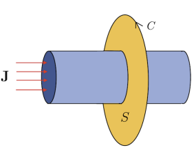

> There are three important types of applications in our modern world: LaTeX-typesetting applications, job applications, and real-world applications of pure math. A good mathematician should hate all three with a burning passion.

## Basic examples

### Divergence theorem

> Example. Evaluate the surface integral $\int_S \mathbf{F\cdot dS}$ over the surface $S$ of the region $E$ bounded by the parabolic cylinder $z = 1-x^2$ and the planes $z = 0, y = 0$ and $y+z=2$, and the vector field $\mathbf{F} = (xy, y^2+e^{xz^2}, \sin(xy))$.

> Solution.

Trying to evaluate this as a surface integral would be what the kids call "an epic fail". (Math has many of those.) Using the Divergence Theorem gives us 
$$
\nabla \cdot \mathbf{F} = (xy)_x + (y^2+e^{xz^2})_y + (\sin(xy))_z = y + 2y + 0 = 3y
$$
which pleases us greatly. As such we have
$$
\int_S \mathbf{F\cdot dS} = \int_{0}^1 \int_{0}^{2-z} \int_{-\sqrt{1-z}}^{\sqrt{1-z}}3y\ dx\ dy\ dz.
$$
where the range of $x$ is derived from $z = 1-x^2$, $y$ from $y+z=2$, and $z$ from spiritual guidance. As such, we have
$$
\begin{aligned}
\int_S \mathbf{F \cdot dS} &= \int_{0}^1\int_0^{2-z}3y(2\sqrt{1-z})\ dy\ dz \\
&= 3\int_0^1 \sqrt{1-z}(2-z)^2\ dz
\end{aligned}
$$
which is legitimately solvable by 39 nested applications of integration by parts, but that would be another "epic fail", so we're not doing that. Maybe a different order of integration is **in order**? 

If instead we integrate over $dx\ dz\ dy$ in that order, we have $0 \leq y \leq 2-z$, $0 \leq z \leq 1 - x^2$, and $-1 \leq x \leq 1$.  Thus
$$
\begin{aligned}
\int_S \mathbf{F \cdot dS} &= \int_{-1}^1 \int_0^{1-x^2} \int_{0}^{2-z} 3y\ dy\ dz\ dx \\
&= \int_{-1}^1 \int_0^{1-x^2}[\frac{3}{2}y^2]^{2-z}_0 \ dz \ dx \\
&= -\frac{3}{2}\int_{-1}^1[\frac{(2-z)^3}{3}]^{1-x^2}_0 \ dx \\
&= -\frac{1}{2}\int_{-1}^1 (1+x^2)^3-8\ dx \\
&= -\frac{1}{2}[x + x^3 + \frac{3}{5}x^5 + \frac{1}{7}x^7 - 8x]^1_{-1} \\
&= \frac{184}{35}.
\end{aligned}
$$

### Green's theorem

> Example. Evaluate the line integral of the vector field $\mathbf{F}(x,y) = (x^2y, xy^2)$ over the curve $C$ encompassing the region bounded by the parabola $y^2 = 4ax$ and the line $x = a$. 

Green's theorem tells us that, with $P = x^2y$ and $Q = xy^2$, we have
$$
\int_A Q_x - P_y\ dA = \oint_C P\ dx + Q\ dy,
$$
with the integrand of the area integral evaluating to $(xy^2)_x - (x^2y)_y = y^2 - x^2$. This actually doesn't look that bad! The parabola $y^2 = 4ax$ intersects $x=a$ at points $(a,-2a)$ and $(a,2a)$, so $y$ ranges from $-2a$ to $2a$ while $x$ ranges from $a$ to $\frac{y^2}{4a}$; we thus have
$$
\begin{aligned}
\int_{-2a}^{2a} \int_{a}^{y^2/4a} y^2 - x^2\ dx\ dy \\
= \int_{-2a}^{2a} [y^2x - \frac{x^3}{3}]^{y^2/4a}_a\ dy \\
= \int_{-2a}^{2a} [(\frac{y^4}{4a} - \frac{y^6}{192a^3}) - (ay^2 - \frac{a^3}{3})]\ dy \\
= [\frac{y^5}{20a} - \frac{y^7}{(3 \cdot 64 \cdot 7)a^3} - \frac{ay^3}{3} + \frac{a^3y}{3}]^{2a}_{-2a} \\
= 2[\frac{8a^4}{5} - \frac{2a^4}{21} - \frac{8a^4}{3} + \frac{2a^4}{3}] \\
= 2(\frac{(168-10-210)}{105})a^4 \\
= -\frac{104}{105} a^4.
\end{aligned}
$$

That really sucked. Clearly, trying to evaluate this as an area integral would be what the kids call "a bruh moment". (Math has many of those.) Instead, evaluating the line integral gives the exact same result (e.g. via the parameterization $y = 2at, x = at^2, -1 \leq t \leq 1$ for the parabola and $x = a, y = t, -2a \leq t \leq 2a$ for the line):
$$
\begin{aligned}
\oint_C P\ dx + Q\ dy &= \oint_C x^2y\ dx + xy^2\ dy \\
&= \int_{-1}^1 2a^3t^5(2at\ dt) + 4a^3 t^4(2a\ dt) + \int_{-2a}^{2a} a^2 t(0\ dt) + (a t^2)(dt) \\
&= [4a^4\frac{t^7}{7} + 8a^4\frac{t^5}{5}]^{1}_{-1}+[\frac{at^3}{3}]^{2a}_{-2a} = -\frac{104}{105}a^4
\end{aligned}
$$
agreeing with the above result.

### Stokes' theorem

> Example. Verify Stokes' Theorem for the hemispherical surface $r=1$, $z\geq 0$, and the vector field $\mathbf{F(r)} = (y,-x,z)$.

> Solution.

Stokes' Theorem states that for a surface in $\mathbb{R^3}$ and its boundary curve $C$, we have
$$
\int_S (\nabla \times \mathbf{F}) \cdot \mathbf{dS} = \oint_C \mathbf{F \cdot dx}. 
$$
In this case, the boundary curve of the hemisphere is the intersection between the plane $z=0$ and the sphere, i.e. the circle with radius 1 centered about the origin $x^2+y^2=1$. A full sphere has no boundary - it does not begin or end anywhere; however, a hemisphere

is "bounded" by the circle at its bottom.  

Thus, we have
$$
\nabla \times \mathbf{F} = \begin{vmatrix}
\mathbf{i} & \mathbf{j} & \mathbf{k} \\
\partial_x & \partial_y & \partial_z \\
y & -x & z
\end{vmatrix} = 0\mathbf{i} - 0\mathbf{j} + (-1-1)\mathbf{k} = -2\mathbf{k}
$$
The surface integral can thus be calculated via the spherical-coordinate parameterization $(x,y,z)\to(r,\phi,\theta)$ where $r=1$, yielding
$$
S = (x,y,z),\begin{cases}
x = \sin \phi \cos \theta \\
y = \sin \phi \sin \theta \\
z = \cos \phi
\end{cases}
$$
at every point on the surface of the hemisphere $S$; thus we have tangent vectors
$$
\frac{\partial S}{\partial \phi} = \begin{bmatrix}
\cos\phi \cos \theta\\
\cos\phi\sin\theta \\
-\sin\phi
\end{bmatrix},\ \frac{\partial S}{\partial \theta} = \begin{bmatrix}
-\sin\theta \sin \phi  \\
\cos\theta \sin \phi \\
0
\end{bmatrix}
$$
with normal vector equal to
$$
\begin{aligned}
\mathbf{dS} &= \frac{\partial S}{\partial \phi} \times \frac{\partial S}{\partial \theta} \\ 
&= \begin{vmatrix}
\mathbf{i} & \mathbf{j} & \mathbf{k} \\
\cos\phi\cos\theta & \cos \phi \sin \theta & -\sin \phi \\
-\sin \theta \sin \phi & \cos\theta \sin \phi & 0
\end{vmatrix} \\
&= (\sin^2\phi\cos\theta) \mathbf{i} + (\sin^2 \phi \sin \theta)\mathbf{j} + (\sin \phi \cos\phi)\mathbf{k}
\end{aligned}
$$
taking the positive cross product to preserve orientation (normal vector pointing out of the hemisphere; boundary curve oriented counterclockwise). This leads to
$$
\begin{aligned}
\int_S (\nabla \times \mathbf{F}) \cdot \mathbf{dS} &= \int_0^{2\pi} \int_0^{\pi/2} \begin{bmatrix}
0 \\
0 \\
-2
\end{bmatrix}
\cdot\begin{bmatrix}
\sin^2\phi\cos\theta \\ 
\sin^2 \phi \sin \theta \\ 
\sin \phi \cos\phi
\end{bmatrix}\ d\phi\ d\theta \\
&= \int_{0}^{2\pi} \int_0^{\pi/2}-\sin 2\phi\ d\phi\ d\theta \\
&= \int_0^{2\pi}[\frac{\cos 2\phi}{2}]^{\pi/2}_0\ d\theta \\
&= \int_0^{2\pi} -d\theta \\
&= -2\pi.
\end{aligned}
$$
On the other side of Stokes' Theorem, we take the boundary curve $C$ as the circle $x^2 + y^2 = 1$ parameterized by $(x,y,z) = (\cos\theta, \sin \theta,0)$ and with tangent vector $(x',y') = (-\sin\theta, \cos\theta,0)$  in the counterclockwise direction. On the curve, we have
$$
\begin{aligned}
\int_C \mathbf{F \cdot dx} &= \int_0^{2\pi} (-\sin \theta, \cos \theta, 0)\cdot (\sin \theta, -\cos \theta, 0)\ d\theta \\
&= \int_0^{2\pi} -\sin^2 \theta - \cos^2\theta\ d\theta \\
&= \int_0^{2\pi} -1\ d\theta \\
&= -2\pi
\end{aligned}
$$
as desired.

## Applications

### Conservation laws

If in the middle of a Vector Calculus lecture an idiot gets up from their seat, and ten minutes later someone spots the same idiot drunkenly pissing themselves seven liters deep into the beer barrel at the Cambridge Blues, then the **conservation law of idiocy** states simply thus:

> The amount of idiocy existing within Cambridge has not changed; rather, it has simply moved from a region of space to another **nearby** region of space.

(It's me. I'm the idiot.)

In essence, a conservation law for a quantity in a system states two things:
1. The total amount of that quantity (e.g. energy, momentum, etc.) in that system remains constant;
2. The quantity is conserved *locally*, i.e. a cookie disappearing from my jar is less likely to now be swimming within the rocky wastelands of Saturn's rings than it is to be swimming within the rocky wastelands of my roommate's stomach linings.

The only way for the amount of a locally conserved quantity to change at a point in a system is if that quantity moves into that point from a nearby point in the system, or moves out from that point to other local points; i.e. teleportation doesn't exist.

In other words, the **density** of the quantity at a certain point in space and time - denoted $\rho(x,t)$ - must change over time in a way that can be explained by a continuous function at every point:
$$
\frac{\partial \rho}{\partial t} = -\nabla\cdot \mathbf{J}
$$
where $\mathbf{J}(x,t)$ is a continuous vector field with continuous partial derivatives, and $\nabla \cdot \mathbf{J}$, its divergence, captures its inflow or outflow at every point $\mathbf{x}$ in space. Intuitively, this tells us all we need to know: the change over time of the quantity in the system at a point must be 1) continuous, and 2) describable as the divergence of a continuous vector field - i.e. $\nabla\cdot \mathbf{J}$. 

Armed with the divergence theorem, however, we can say a little more. Suppose for example's sake that the quantity being conserved is electric charge, denoted $Q$; the rate of change of electric charge over an entire region $V$ in space is thus given by the volume integral
$$
\frac{dQ}{dt} = \int_V \frac{\partial \rho}{\partial t}\ dV
$$
i.e. the changes of its density at every point in the region added together. By the Divergence Theorem, this equals
$$
\frac{dQ}{dt} = \int_V \frac{\partial \rho}{\partial t}\ dV  =  -\int_V \nabla \cdot \mathbf{J}\ dV = -\int_S \mathbf{J\cdot dS}
$$
or, in other words:

> The rate of change of a quantity over a region is equal to its flux over the surface boundary of the region; a quantity only changes inside a region if that quantity flows out of the surface of the region.

Certain quantities in the physical world have weird and interesting conservation laws. Case in point: fluids. Fluids are generally assumed to be **incompressible**, meaning that their density $\rho$ must be constant at every point; this is all fine and dandy until everyone's had one too many beers and we end up having to model a human body as an incompressible cylindrical tube with negligible mass, and as someone who's watched sumo wrestling way too much I can say none of these three words are true in any way. 

In addition to incompressibility, we also assume that for a fluid its **velocity field** - the vector field indicating its magnitude and direction of flow at every point - is proportional to its density at that point: $\mathbf{J} = \rho \mathbf{u}.$ This gives us
$$
\frac{\partial \rho}{\partial t} = 0 = -\nabla\cdot (\rho \mathbf{u}) = -\rho(\nabla \cdot \mathbf{u})
$$
meaning that the velocity field $\mathbf{u}$ is solenoidal - it has no net flow in and out of any point in space.

### Heat diffusion
This is less of an application of vector calculus and more of an application of an application of vector calculus. We will also soon witness an application of heat diffusion, which would naturally be an application of an application of an application of vector calculus; this is truly the sequel to *Inception* nobody asked for.

Suppose that energy, with its density denoted $E$, is conserved locally in some system; by the statement of the conservation law above we have
$$
\frac{\partial E}{\partial t} + \nabla \cdot \mathbf{J} = 0
$$
for some vector field $\mathbf{J}$ - call this the *heat current*. The principles of thermodynamics tell us that 

1. Energy in a gas at a point is proportional to the temperature at that point;
and
2. Systems will tend towards thermal equilibrium, meaning that heat flows from points of high temperature towards points of low temperature.

These principles can be summarized mathematically as 
$$
E = cT
$$
leading to the fact that they share an underlying vector field $\mathbf{J}$ save for a constant, and 
$$
\mathbf{J} = -\kappa \nabla T
$$
where $\kappa$ is a constant called *thermal diffusivity*, and $-\nabla T$ is the direction of greatest descent of the temperature - where high temperature flows to low temperature most efficiently. Combining the two gives us the *heat diffusion equation*:
$$
\frac{\partial T}{\partial t} = \kappa\nabla^2T
$$
where $\nabla^2$ denotes the Laplacian. (Compare and contrast this derivation to the similar derivation found in [[Differential Equations.Partial Differential Equations.Heat Equation]], in the Differential Equations course).

### Magnetism

Recall Maxwell's equations concerning electric and magnetic fields:
$$
\begin{cases}
\nabla \cdot \mathbf{E} = \frac{\rho}{\epsilon_0} \\
\nabla \times \mathbf{E} = -\frac{\partial \mathbf{B}}{\partial t}\\
\nabla \cdot \mathbf{B} = 0 \\
\nabla \times \mathbf{B} = \mu_0(\mathbf{J} + \epsilon_0\frac{\partial\mathbf{E}}{\partial t})
\end{cases}
$$
In particular, the final two equations - which concern the magnetic field $\mathbf{B}$ - are of interest. Suppose that we have a time-invariant electric field $\mathbf{E}$, e.g. a constant current through a circular wire: $\frac{\partial \mathbf{E}}{\partial t} = 0$. This yields two equations
$$
\nabla \cdot \mathbf{B} = 0,\ \nabla \times \mathbf{B} = \mu_0\mathbf{J}
$$
for some vector field $\mathbf{J}$ describing electric current density and a constant $\mu_0$ that (and I quote my textbook) "has some pretentious name that I can never remember"; they describe the magnetic field around a **current in an infinitely long wire.**

The presence of $\nabla \times \mathbf{B}$ lends these equations nicely towards Stokes' Theorem. Consider a cross-section of the wire that represents a surface $S$ in space, and its boundary curve $C$:

Stokes' theorem tells us that the microscopic circulation of the magnetic field $\mathbf{B}$ within the area of $S$ is equivalent to the macroscopic circulation around the boundary $C$, i.e.
$$
\int_S (\nabla \times \mathbf{B})\cdot \mathbf{dS} = \int_C \mathbf{B \cdot dx}
$$
leading to
$$
\int_S \mu_0 \mathbf{J} \cdot \mathbf{dS} = \int_C \mathbf{B\cdot dx}.
$$
The left-hand side surface integral represents electric flow through a cross-section of the wire at a given unit of time - better known as *current* $I$. Thus we simply have
$$
\mu_0 I = \int_C\mathbf{B\cdot dx},
$$
i.e. the circulation of the magnetic field around a wire is proportional to the current within the wire. If we actually calculate this circulation, we can go one step further and obtain an expression for $\mathbf{B}$; for instance, suppose that the wire is centered about the origin and lies on the $z$-axis with radius $\rho$. Then the curve $C$ bounding the surface $S$ is parameterized by 
$$
(x,y,z) = (\rho \cos \theta, \rho \sin \theta, 0),\ \mathbf{t} = (- \sin \theta, \cos\theta, 0)
$$
with $\mathbf{t}$ denoting the unit tangent vector. As $\mathbf{B}$ circulates around the wire, suppose that it is parallel to the tangent vector to $C$:

$$
\mathbf{B} = f(\rho)(- \sin \theta, \cos\theta, 0),\ \mathbf{B\cdot\mathbf{t}}=f(\rho)\rho
$$
for some function of $\rho$, $f(\rho)$. This leads to
$$
\int_C \mathbf{B \cdot dx} = \int_0^{2\pi}f(\rho)\rho\ d\theta = 2\pi f(\rho)\rho = \mu_0 I
$$
finally giving
$$
f(\rho) = \frac{\mu_0 I}{2\pi \rho},\ \mathbf{B} = \frac{\mu_0 I}{2\pi \rho} (-\sin \theta, \cos \theta, 0)
$$
at every point in the plane, with field strength inversely proportional to radius $\rho$ and proportional to current in the wire.
