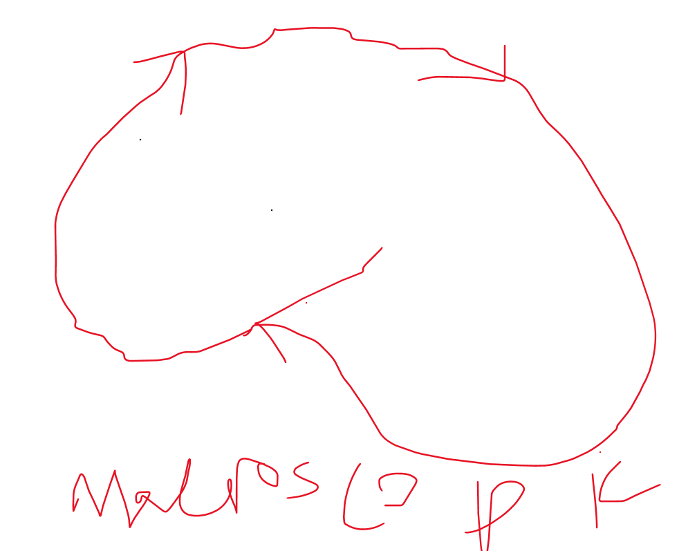
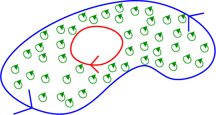
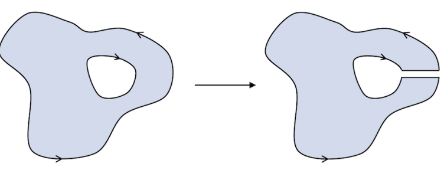
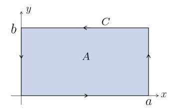

> Theorem. **Green's Theorem**. Suppose that $\mathbf{F} = (P(x,y),Q(x,y))$ is a vector field in $\mathbb{R^2}$ where both $P(x,y)$ and $Q(x,y)$ are smooth functions of $x$ and $y$. Then for a region $A$ in $\mathbb{R^2}$ and its (closed) boundary curve $C$, we have

$$
\int_A (\frac{\partial Q}{\partial x} - \frac{\partial P}{\partial y})\ dA = \oint_C P\ dx + Q\ dy
$$
> where the right-hand side can also be rewritten $\oint_C \mathbf{F\cdot ds}.$

### The big idea

The idea behind Green's theorem is not at all obvious from the equation given: in reality, it relates *microscopic circulation* (the little swirlies) to *macroscopic circulation* (the big swirly).

The right-hand side of the given statement is perhaps easier explained: $\oint_C \mathbf{F \cdot ds}$ is an integral over the *projection* of the vector field $\mathbf{F}$ in the direction of the curve $C$, resulting in the total magnitude of $\mathbf{F}$ that aligns with the direction of $C$ - the *circulation* of $\mathbf{F}$ about $C$. Call this the **macroscopic** circulation, so named because it represents the circulation over the entire boundary of the curve (helpful graphic below).

On the other hand, what do we make of $\int_A (\frac{\partial Q}{\partial x} - \frac{\partial P}{\partial y})\ dA$? Clearly this is a sum of some quantity within the region bounded by the curve, but what exactly does 
$$
\frac{\partial Q}{\partial x} - \frac{\partial P}{\partial y}
$$
represent?

We will soon see that this quantity is, in reality, a representation of curl - and thus rotation - in two dimensions; but as that fact is far from immediately clear, we argue from another perspective. At every point, the vector field represented by 
$$
\mathbf{N} = (Q, -P) 
$$
is normal to $\mathbf{F} = (P,Q)$; the expression $\frac{\partial Q}{\partial x} - \frac{\partial P}{\partial y}$ can thus be interpreted as the divergence $\nabla \cdot \mathbf{N}$ of the normal vector field to $\mathbf{F}$. Tangents to a curve measure rates of change; normals to a curve measure torsion (and thus rotation). 

For a vector field, it helps us sleep at night to think much the same; and so it shall be, for the time being, that the divergence of the normal vector field - the flow of $\mathbf{F}$ in the normal direction - represents the rotation of the curve. Call these infinitesimally little rotations - the amount to which the curve rotates, or *circulates*, at each point in the region $A$ - the *microscopic circulation*:

 

Green's theorem thus tells us that the *microscopic circulation* of a vector field $\mathbf{F}$ in a region $A$ - the circulation at every point - is equal to the *macroscopic rotation* of $\mathbf{F}$ around the boundary curve $C$ of $A$. Or, in much more eloquent terms:

> The sum of all of the little swirlies on the inside is equal to the big swirly on the outside.

This statement is remarkable not only because of its concision, but also - much like the Fundamental Theorem of Calculus, and the Divergence Theorem after it - because it states that to understand what happens *inside* a region (or straight line on an axis, or some vaguely humanoid 3D solid), we need only to look at what happens on its boundary. This is true for many things, like the head of cabbage I've kept on my shelf for seven months straight. Or Lord Voldemort. Or the US, if you're a Fox News reporter. 

### Sketching a proof

> The highlighting is entirely necessary to ensure finer absorption of knowledge.

In the case where we're gallivanting about a **simply-connected region** (i.e. a McMuffin instead of a bagel), Green's Theorem is rather convenient to prove with the Divergence Theorem in our arsenal. In the two-dimensional case of the Divergence Theorem, we have
$$
\int_A \mathbf{\nabla \cdot F}\ dA = \int_C \mathbf{F \cdot n}\ ds;
$$
Supposing that $\mathbf{N} = (Q, -P)$, the normal vector field to $\mathbf{F} = (P,Q)$ as before, yields
$$
\int_A \nabla \cdot \mathbf{N}\ dA = \int_A Q_x - P_y\ dA\\ (=\int_C \mathbf{N \cdot n}\ ds)
$$
which is the left-hand side of the desired statement. All that's left is to prove that 
$$
\int_C \mathbf{N\cdot n}\ ds = \int_C \mathbf{F\cdot ds};
$$
Supposing that $\mathbf{ds}$ is in the direction of the tangent vector to $C$, $(x'(s), y'(s))$, we have $\mathbf{n} = (y'(s), -x'(s))$ as a viable value of the normal vector (with magnitude $1$, as the tangent vector when $C$ is parameterized by its arc length is a unit vector), leading to 
$$
\int_C \mathbf{N\cdot n}\ ds = \int_C \mathbf{F\cdot ds}.
$$

If instead the region is not simply connected, a nifty infinitesimal cut does the trick:

i.e. Green's theorem can be applied counterclockwise on the exterior boundary and clockwise on the interior boundary, because slicing the region reveals that the clockwise interior boundary is a part of the counterclockwise exterior boundary.

### Corollaries of Green's theorem: The Fundamental Theorem of Calculus

Consider Green's theorem along a simple rectangle $R$ bounded by $\{(x,y): 0 \leq x \leq a,\ 0 \leq y \leq b\}$, and for the simple vector field $\mathbf{F} = (P, 0)$. 

Thus we have 
$$
\int_R -\frac{\partial P}{\partial y} \ dA = \int_{\partial R} P\ dx
$$
where the right-hand side devolves into only the $x$-component because the $y$-component is zero. Thus we have
$$
\int_0^a \int_0^b -\frac{\partial P}{\partial y}\ dy\ dx
$$
on the left-hand side, and
$$
\int_{\partial R}P\ dx = \int_0^a P(x,0)\ dx - \int_0^a P(x,b)\ dx
$$
as for the two paths along the boundary of $R$ where this line integral is nonzero, one is the straight line from $(0,0)$ to $(a,0)$ (and thus positive), and the other is the straight line from $(a,b)$ to $(0,b)$ (and thus negative). Equality between the two sides leads us to
$$
\int_0^b \frac{\partial P}{\partial y}\ dy = P(x,b) - P(x,0)
$$
equivalent with the Fundamental Theorem of Calculus.

