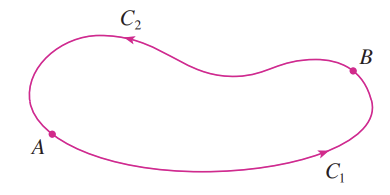

### Basic concepts

Recall the **Fundamental Theorem of Calculus** as stating that, for a function $f(x)$ and its derivative $f'(x)$ which exists over an interval $a < x < b$, we have
$$
\int_{a}^{b} f'(x)\ dx = f(b) - f(a)
$$
which, in perhaps much more meaningful terms, speaks simply thus: *the total change of a function $f(b)-f(a)$ over the interval $(a,b)$ is the sum of the infinitesimal changes of the function $f'(x)$ over that interval*.

The question is, can the same statement - that the big swirly is the sum of all the little swirlies - be generalized, and how?

With the **Fundamental Theorem of Line Integrals**, we confirm that:
1. The big swirly is **still** the sum of the little swirlies,
2. The big swirly equals the sum of the little swirlies along **any** interval, from circles to smiley faces to the contours of Marie Antoinette's severed head (wig not included) - not just the same-old boring straight line from $a$ to $b$.
3. The big swirly equals the sum of the little swirlies of **any** function in **any** number of variables, not just single-variable functions - that is, as long as the (partial) derivatives of the function exist.

The mathematical statement that encapsulates all the above is as follows.

> Theorem. **Fundamental Theorem of Line Integrals**. For a smooth curve $C$ parameterized by $\psi(t)$ for $a < t < b$ and a function in any number of variables $f(\mathbf{x})$ whose gradient vector $\nabla f$ is continuous on $C$, we have

$$
\int_C \nabla f\cdot d\mathbf{s} = f(\psi(b)) - f(\psi(a))
$$

> where $\int_C \nabla f \cdot d\mathbf{s}$ denotes the vector-valued line integral.

Despite integrating far more bells and whistles into its ensemble, this says exactly the same thing as the Fundamental Theorem of Calculus: 

> *The total change of a function from the starting point to the endpoint of a curve ($f(\psi(b)) - f(\psi(a))$) is equal to the sum of the infinitesimal changes of that function along the direction of the curve ($\nabla f \cdot d\mathbf{s}$, where the dot product gives the magnitude **in the direction of the curve**)*.

The intuition behind this statement is as clear as any mathematical theorem can hope to be (which to some people is "very", and to others like me, is "not at all"):
1. $\nabla f$ gives the multi-dimensional analogue to the "rate of change" of the function $f$ (that is, it is the vector which contains the rate of change in every direction, represented by the partial derivatives of $f$)
2. The dot product $\nabla f \cdot d\mathbf{s}$ gives the magnitude of the rate of change of $f$, represented by $\nabla f$, in the direction of the curve $C$.
3. The sum of the infinitesimal rates of change along the curve $C$ is the total change from the starting point to the end point of $C$.

But enough intuition - let's give a proof!

> Proof. 

Let $f$ be a vector field in $\mathbb{R}^n$. Then
$$
\begin{aligned}
\int_C \nabla f \cdot d\mathbf{s} \\
= \int_C \nabla f(\psi(t)) \cdot \psi'(t) \ dt \\
= \int_{a}^{b} \sum_{i=1}^n f_{x_i}(\psi(t))\psi'(t)_i\ dt \\ 
= \int_{a}^b \sum_{i=1}^n \frac{\partial f}{\partial x_i}\frac{\partial x_i}{\partial t} \ dt
\end{aligned}
$$
as the parameterization of $C = \psi(t)$ gives
$$
\psi(t) = \begin{bmatrix}
x_1 \\
x_2 \\
\vdots \\
x_n
\end{bmatrix}
$$
along $C$, and thus
$$
\psi'(t) = \begin{bmatrix}
\frac{dx_1}{dt} \\
\frac{dx_2}{dt} \\
\vdots \\
\frac{dx_n}{dt}
\end{bmatrix}
$$
leading to the above. As
$$
\sum_{i=1}^n \frac{\partial f}{\partial x_i}\frac{\partial x_i}{\partial t} = \frac{\partial f}{\partial t}
$$
by the multivariate chain rule, we thus have
$$
\int_{a}^b \sum_{i=1}^n \frac{\partial f}{\partial x_i}\frac{\partial x_i}{\partial t} \ dt = \int_{a}^{b} \frac{\partial f}{\partial t}\ dt = f(\psi(b)) - f(\psi(a))
$$
by the Fundamental Theorem of Calculus. This proof is also valid for piecewise smooth curves via finite subdivision to smooth curves.

By the above, we define

> Definition. What do you call the farm where Margaret Thatcher, Ronald Reagan, and Donald Trump are buried together? ~~A gender-neutral public toilet~~ A conservative field.

(Please clap.)

Wait, no, let's try again:

> Definition. If the vector field $\mathbf{F}$ can be written as the continuous gradient $\nabla f$ of some other function $f$, then $\mathbf{F}$ is a **conservative field**.

The precise reasoning behind this rather interesting turn of phrase will be revealed in due time.

### Path independence

The crucial consequence of the Fundamental Theorem of Line Integrals is the genuinely astonishing result that for certain functions - in particular, functions that are conservative fields - the line integral from point $A$ to point $B$ **does not depend on the path chosen between those two points**:

> As long as path $A$ and path $B$ are the same points, you could take any path - from a straight line to a circle to the labyrinthine tunnels across Shrek's vomit-colored earholes - and end up with the same result. 

Such a property is called 

> Definition. **Path independence**. If for a vector field $\mathbf{F}$ and any two piecewise-smooth curves $C_1$ and $C_2$ with the same start and end points, we have
$$
\int_{C_1} \mathbf{F \cdot ds} = \int_{C_2} \mathbf{F \cdot ds},
$$
> call $\mathbf{F}$ **path independent** over these start and end points.

As stated by the above, conservative fields are path independent over any start and end point; thus we have

> Theorem. The vector field $\mathbf{F}$, continuous over a domain $D$, is path independent in $D$ if and only if it is a conservative field in $D$; that is, there exists some function $f$ such that $\mathbf{F} = \nabla f$.

> Proof.  

By the Fundamental Theorem of Line Integrals, if $\mathbf{F} = \nabla f$, then for any set of two points $\mathbf{a, b}\in D$ and any two different piecewise-smooth curves $C_1, C_2$ connecting the two points, we have
$$
\int_{C_1}\mathbf{F}\cdot \mathbf{ds} = \int_{C_1}\nabla f \cdot \mathbf{ds} = \mathbf{F(a)-F(b)} = \int_{C_2}\mathbf{F\cdot ds},
$$
and thus a conservative field $\mathbf{F}$ is path independent in $D$. Conversely, if for any vector field $\mathbf{F}$ we have
$$
\int_{C_1}\mathbf{F}\cdot \mathbf{ds} = \int_{C_2}\mathbf{F\cdot ds}
$$
for any two piecewise-smooth curves $C_1$ and $C_2$ joining the same two points in $D$, suppose that
$$
\phi(\mathbf{y}) = \int_{\mathbf{x\to y}}\mathbf{F \cdot ds}
$$
where $\mathbf{x}$ is some fixed point and $\mathbf{y}$ is a variable point in $D$. Our goal is to show that $\nabla \phi = \mathbf{F}$ and thus that $\mathbf{F}$ is path independent by definition; taking the partial derivative with respect to variables $x_1, x_2, ..., x_n$ of $\mathbf{F}$ yields
$$
\begin{aligned}
\frac{\partial \phi}{\partial x_i} = \lim_{\epsilon \to \mathbf{0}}\frac{\phi(\mathbf{y} + \epsilon_i) - \phi(\mathbf{y})}{\epsilon_i} \\
\end{aligned}
$$
where $\epsilon_i$ is the $i$th component of a vector $\epsilon \to \mathbf{0}$, and thus
$$
\begin{aligned}
\frac{\partial \phi}{\partial x_i} = \lim_{\epsilon \to \mathbf{0}}\frac{1}{\epsilon_i}(\int_{\mathbf{x \to (y +\epsilon_i)}}\mathbf{F \cdot ds} - \int_{\mathbf{x \to y}}\mathbf{F\cdot ds}) \\
\end{aligned}
$$
and as the former line integral encompasses the same path as the latter line integral excepting the infinitesimal line from $\mathbf{y}$ to $\mathbf{y+\epsilon_i}$, we have
$$
\begin{aligned}
\frac{\partial \phi}{\partial x_i} = \lim_{\epsilon \to \mathbf{0}}\frac{1}{\epsilon_i}\int_{\mathbf{y \to y + \epsilon_i}}\mathbf{F \cdot ds} \\
\end{aligned}
$$
and as $\epsilon_i$ is in the direction of $x_i$, $\mathbf{ds}$ for the infinitesimal path from $\mathbf{y \to y+\epsilon_i}$ is in the direction of the $x_i$-axis and $\mathbf{F\cdot ds}$ is simply the $i$th component of $\mathbf{F}$ times the magnitude of $\epsilon_i$:
$$
\begin{aligned}
\frac{\partial \phi}{\partial x_i} = \lim_{\epsilon \to \mathbf{0}}\frac{1}{\epsilon_i}\mathbf{F}_i \epsilon_i = \mathbf{F}_i
\end{aligned}
$$
as desired.

****

### Closed paths

All of the above naturally leads us to a corresponding result that is just as consequential. First define

> Definition. The piecewise-smooth curve $C$ is a **closed path** in a domain $D$ if its starting and ending points are the same point. Denote a line integral over a closed path $C$ by the symbol
$$
\oint_{C}
$$
> with the funny little swirly thing in the middle, which looks sufficiently like a treble clef to remind me of how I maybe should've just gone to music college and run away from all this Greek black magic instead.

For conservative fields, closed-path line integrals aren't all that bad.

> Theorem. $\mathbf{F}$ is a conservative field over a domain $D$ if and only if, for **any** closed path $C$ within that domain, we have
$$
\oint_C \mathbf{F\cdot ds} = 0.
$$

Finally, something that lets us take a bit of a breather!

> Proof. 

First suppose that $\mathbf{F}$ is a conservative field equalling the gradient vector $\nabla f$ for some function $f$. By the Fundamental Theorem of Line Integrals, we have
$$
\int_{C}\mathbf{F\cdot ds} = f(\mathbf{b}) - f(\mathbf{a})
$$
where $\mathbf{b}$ and $\mathbf{a}$ are the ending and starting points of curve $C$ respectively. If instead $\mathbf{b = a}$, meaning that the curve is a closed path, we simply have
$$
\int_{C}\mathbf{F\cdot ds} = f(\mathbf{b}) - f(\mathbf{b}) = 0
$$
as desired.

Conversely, suppose that
$$
\oint_C \mathbf{F\cdot ds} = 0
$$
for any closed path in $D$. Suppose that $C_1$ and $C_2$ are two distinct piecewise-smooth curves that join the same points $\mathbf{a}$ and $\mathbf{b}$ in $D$. Then the piecewise smooth curve, formed by joining $C_1$ and $-C_2$ ($C_2$ with direction reversed), is a closed path as its starting point matches its ending point:

Denote this path $C$. By our assumption, we have
$$
\oint_C \mathbf{F\cdot ds} = \int_{C_1} \mathbf{F \cdot ds} - \int_{C_2} \mathbf{F\cdot ds} = 0
$$
thus implying that
$$
\int_{C_1} \mathbf{F \cdot ds} = \int_{C_2} \mathbf{F \cdot ds}
$$
for any two curves $C_1$ and $C_2$ joining the same starting and ending points in $D$. It follows that $\mathbf{F}$ is path independent in $D$, and, by the above theorem linking path independence to conservatism, that $\mathbf{F}$ is a conservative field.

### Putting the "conservative" in "conservative field"

Here's a fun one for all you physics enjoyers out there! (read: LITERALLY NO ONE, and if you happen to be one, then if we were ever friends, I hang my head in shame over my dreadfully poor judgment and hereby renounce our friendship. )

In Newtonian mechanics, an obscure but important fact is that the **force** acting upon a particle is related to the second-order derivative of its position - in saner, less deranged terms, its acceleration - by the following equation:

$$
\mathbf{F} = m\ddot{\mathbf{x}},
$$
where $\mathbf{F}$ denotes force, $m$ denotes the mass of the object, and $\mathbf{x}$ denotes position. Essentially, the greater the mass, the greater the attraction; or, as Newton artfully stated upon gazing towards your mother, "I like 'em thicc".

We can interpret $\mathbf{F}$ as a vector field - it maps every position $\mathbf{x}$ along a smooth path taken by the object, denoted $C$, to a vector denoting the force experienced by the object. We already know that the line integral
$$
\int_{C} \mathbf{F \cdot ds}
$$
represents the work done by the force $\mathbf{F}$ along the path $C$; substituting Newton's Second Law (that's what this is called) into the above, and supposing that the curve $C$ can be parameterized with respect to time as $\mathbf{x} = \psi(t)$, suggests that

$$
\begin{aligned}
\int_C \mathbf{F\cdot ds} \\
= m\int_C \mathbf{\ddot{x} \cdot ds} \\
= m\int_{\psi(a)}^{\psi(b)} \mathbf{\ddot{x}(t)\cdot \psi'(t)}\ dt \\
= m\int_{\psi(a)}^{\psi(b)} \mathbf{\ddot{x}(t)\cdot \dot{x}(t)}\ dt \\
\end{aligned}
$$
as the curve $C = \psi(t)$ *is* the position vector $\mathbf{x}$ along the curve and thus $\psi(t) = \mathbf{x}$, with $a < t < b$ being the starting and ending points of the curve. Earlier results suggest that
$$
\frac{d}{dt} (\mathbf{\dot{x}(t)\cdot \dot{x}(t)}) = 2\mathbf{\ddot{x}(t)\cdot \dot{x}(t)}
$$
for a vector $\mathbf{x}$ due to the product rule; as such, we have
$$
\int_C \mathbf{F\cdot ds} = \frac{m}{2}\int_{\psi(a)}^{\psi(b)}\frac{d}{dt}(\mathbf{\dot{x}(t)\cdot\dot{x}(t)}) = \frac{m}{2}[|\mathbf{\dot{x}}(\psi(b))|^2 - |\mathbf{\dot{x}}(\psi(a))|^2]
$$
where $|\mathbf{x}|$ denotes the norm. The astute among you will notice that, as $\dot{\mathbf{x}}$ denotes the first-order derivative of position (in less clinically-insane terms, velocity), the above equation is the change in kinetic energy from $t=a$ to $t=b$! This leads to 

> Theorem. **The work-energy principle**. The **total work done** on a particle along a path $C$ is equal to the change in kinetic energy of the particle along that path:
$$
WD = K(b) - K(a)
$$
> where $WD$ denotes work done and $K(b)$ denotes kinetic energy at time $b$.

We can say even more. Suppose now that the force field $\mathbf{F}$ is a conservative field; it equals $-\nabla V$ for some **potential field** $V$, where the negative sign is by convention. We thus have

$$
WD = K(b) - K(a)
$$
*regardless* of the path $C$ chosen, as long as the start and end points are the same - energy is **conserved**, as all the energy being inputted into the system by some force (the work done) is utilized to change the velocity of the particle, i.e. converted to kinetic energy. We also have, as a consequence of the above theorems on conservative fields, that a **conservative force** will do no work along a closed loop. 

> Theorem. **Law of Conservation of Energy** (deservedly capitalized). A conservative force-field $\mathbf{F}$ upholds the property that its total work done on a particle on a trajectory from point $A$ to point $B$ equals to the change of the kinetic energy of the particle beetween the two points, no matter the trajectory taken between the two points.

*This* - the conservation of energy - lends conservative fields their name, so named because they **conserve** energy (and not, in fact, because they'll begin spewing twenty racial slurs per second, or perform suspiciously-angled Roman salutes, or suggest that they're incapable of doing positive work "because of woke" when integrated over a closed loop.)

### Testing if a field is conservative

> Ask them where they were during the years 1933-1945.

By definition, a conservative field $\mathbf{F = \nabla \phi}$ satisfies

$$
\mathbf{F}_i = \frac{\partial \phi}{\partial x_i}
$$
for all $i = 1, 2, ..., n$. Taking the partial derivative another time gives

$$
\frac{\partial}{\partial x_j}\mathbf{F_i} = \frac{\partial^2 \phi}{\partial x_i \partial x_j} = \frac{\partial}{\partial x_i}\mathbf{F_j}
$$
by equality of mixed partial derivatives given the local continuity of the derivatives of $\phi$, for **any** $i, j = 1, 2, ..., n$. As such, we have

> Theorem. If for a vector field $\mathbf{F}: \mathbb{R^n \to R^n}$ we have
$$
\frac{\partial}{\partial x_j}\mathbf{F_i} = \frac{\partial}{\partial x_i}\mathbf{F_j}
$$
> for any $i, j = 1, 2, ..., n$, then $\mathbf{F}$ is a conservative field (barring some annoying exceptions). In fact, this is not only a necessary but a sufficient condition; it is an "if and only if" statement, though this fact is not immediately evident at present.

Let's take a look at one particularly annoying exception.

> Example. Is the vector field $\mathbf{F} = (-\frac{y}{x^2+y^2}, \frac{x}{x^2+y^2})$ conservative?

> Solution

Performing the aforementioned test gives
$$
\begin{aligned}
\frac{\partial F_x}{\partial y} &= -\frac{(x^2+y^2)-2y^2}{(x^2+y^2)^2} \\
&= -\frac{(x^2-y^2)}{(x^2+y^2)^2} \\
&= \frac{y^2 - x^2}{(x^2+y^2)^2} \\ \\
\frac{\partial F_y}{\partial x} &= \frac{(x^2+y^2)-2x^2}{(x^2+y^2)^2} \\
&= \frac{y^2 - x^2}{(x^2+y^2)^2}
\end{aligned}
$$
which shows signs of ardent and true conservatism - it can be swiftly verified that $\mathbf{F} = \nabla \tan^{-1}(\frac{y}{x})$. But watch as the veil of conservative ardor is ripped with utmost haste from the traitorous visage of $\mathbf{F}$ to reveal - *DIOS MIO, A LIBERAL!*

The evidence? Consider, for instance, the line integral around the closed loop formed by the circle $C$ represented by $x^2 + y^2 = 1$ with radius $1$ about the origin. Parameterizing the circle as $(x,y) = (\cos t, \sin t),\ 0 < t < 2\pi$ leads to

$$
\begin{aligned}
\oint_{C} \mathbf{F\cdot ds} \\
= \oint_{0}^{2\pi} (-\frac{y}{x^2+y^2}, \frac{x}{x^2+y^2}) \cdot \frac {d}{dt}(\cos t, \sin t)\ dt \\
= \int_{0}^{2\pi} (-\sin t, \cos t)\cdot (-\sin t, \cos t)\ dt \\
= \int_0^{2\pi} \cos^2 t + \sin^2 t \ dt \\
= \int_0^{2\pi} 1\ dt \\
= [1]^{2\pi}_0 \\
= 2\pi
\end{aligned}
$$
which is decidedly *not* zero, as the closed-loop integral of a well-behaved conservative field should be. But why? The catch lies at the point $(0,0)$, where $\mathbf{F}$ is not at all well-defined. This is an important caveat - the closed-loop integral of a conservative field is only zero if the field is well-defined for every point inside that closed loop!