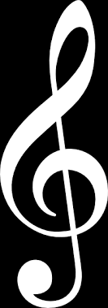

> In which the big swirly thing finally equals the sum of the little swirly things.

In the following section,  {width: 15px} will denote the line integral over the curve representing my parents' disappointment and regret at not having just sent me to music school instead as a function of time.

