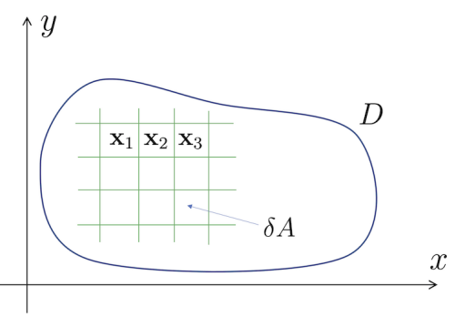
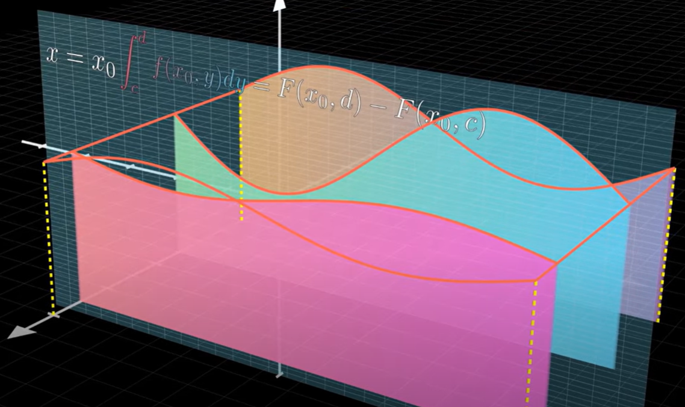
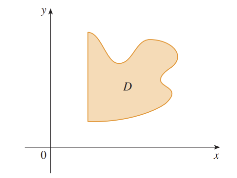

## Generalizing the integral

While the previous section concerned itself with generalizing the integral to different paths - paths slightly more interesting that just a straight line on one coordinate axis - this section will be concerned with generalizing the integral to different **regions**: not just a curve in the two-dimensional plane, but surfaces in three-dimensional space, lower-dimensional projections of eldritch horrors inhabiting eleven-dimensional hyperspace, etc., etc.

Let's begin with two dimensions. Unless you're a victim of some highly advanced neurodegenerative dementia (and if you are, god bless), I would suppose that you recall what a **definite integral** in the normal sense entails:
$$
\int_a^{b} f(x)\ dx
$$
for a smooth function $f(x)$ and $a < b$ lying in the domain of $f(x)$ yields the area under the curve $f(x)$ from $x=a$ to $x=b$. The bog-standard, milque-toast, suburban-midlife-crisis-impending-dad-in-his-40s-energy definite integral is truly the vanilla ice cream of the calculus world.

Line integrals generalized the notion of a definite integral to any curve, but what about a surface where there are now two degrees of freedom rather than one? We will discuss this notion in two parts. First, an **area integral**, an integral over a flat shape in 2D; second, a **surface integral**, which generalizes area integrals to any surface in any number of dimensions.

## Area integrals

Suppose that $D$ is a region **lying flat in** two-dimensional space $\mathbb{R}^2$ (i.e. just a two-dimensional shape), and let $\phi(\mathbf{x})$ be a scalar function that maps points in $\mathbb{R}^2$ to scalars in $\mathbb{R}$. 

> Definition. Denote the **area integral** of $\phi$ over $D$ as 
$$
\int_D \phi(\mathbf{x})\ dA
$$
> with $A$ denoting area; this is to be distinguished from a surface integral by the fact that $D$ is a shape in 2D and not a surface.

The concept of an area integral evokes (some) familarity with the line integral. Whereas line integrals of the form
$$
\int_C \phi(\mathbf{x})\ ds
$$
summed over infinitesimal pieces of the arc length of the curve $ds$, the area integral
$$
\int_D \phi(\mathbf{x})\ dA
$$
sums over infinitesimal pieces of the **area of the shape** $dA$, analogous to the arc length of the curve. (You may have noticed that we are now using $D$ rather than $C$, which subtly alludes to the trajectory my grades will take once area integrals are introduced.)

This gives us a rough idea of how to formalize the area integral.

Suppose that we subdivide the region $D$ into small rectangles, each of length $dx$ and width $dy$; the area $dA$ of these small rectangles would thus be $dA = dx\ dy$. As such, we have
$$
\int_D \phi(\mathbf{x})\ dA = \lim_{\delta A \to 0}\sum_{i=1}^n \phi(\mathbf{x}_i)\ \delta A
$$
subdividing $D$ into $n$ small rectangles with $\mathbf{x}_i$ being the point $(x_i, y_i)$ in the center of each rectangle; as $\delta A$ approaches $0$, $D$ will be divided into an infinite number of rectangles and, at least by intuition, the Riemann sum should approach the true value of the integral. But this tells us nearly nothing; $\delta A$ holds no value as far as we are concerned. Instead, via $dA = dx\ dy$, try:
$$
\begin{aligned}
\int_D \phi(\mathbf{x})\ dA &= \lim_{\delta A \to 0}\sum_{i=1}^n \phi(\mathbf{x}_i)\ \delta A \\
&= \lim_{\delta x,\ \delta y \to 0}\sum_{i=1}^n \phi(x_i, y_i)\ \delta x\ \delta y \\
&= \lim_{\delta x, \ \delta y \to 0}\sum_{i=1}^m \sum_{j=1}^n \phi(x_{ij}, y_{ij})\ \delta x\ \delta y
\end{aligned}
$$
where we are now summing along the axes (i.e. labeling the areas as row $i$, column $j$, rather than area $1$, area $2$, ...). 

> This evokes many fond childhood memories of fifth-grade math problems, alongside twelfth-grade biology problems, where we were asked to estimate the area of a leaf with these funny little rectangles; it is immeasurably comforting to know that my mathematical journey since then has only been a footnote to struggling over mixed fractions and memorizing the first digit of $\pi$.

From what we know about Riemann sums and integrals, the above can be directly rewritten as
$$
\int_{y_a}^{y_b} (\int_{x_a}^{x_b} \phi(x,y)\ dx)\ dy
$$
which can be interpreted as 
$$
\lim_{\delta y\to 0}\sum_{i=1}^n \int_{x_a}^{x_b}\phi(x,y_i)\ dx
$$

i.e. a sum of integrals:

where $\int_{x_a}^{x_b}\phi(x, y_i)\ dx$, represented by the colored slices, is a regular definite integral for constant values of $y$ denoted $y_1, ..., y_n$, and the resulting double integral is the sum of these small slices. We will note now that just as single integrals represent areas under curves, as $z = \phi(x,y)$ can be represented as a surface in three dimensions, a double integral can also be interpreted as the **volume** under $z=\phi(x,y)$ bounded by the region $D$, as 
$$
\sum \phi(x,y)\ dA
$$
gives the volume of an infinitesimal cuboid of height $\phi(x,y)$ just as $f(x)\ dx$ gives the area of an infinitesimal rectangle of height $f(x)$. It would also be remiss not to point out that 

> Proposition. The area integral described by $\int_D 1 \ dA$ over a region $D$ gives the area of $D$.

This is all well and good when $x_a, x_b, y_a$ and $y_b$ are constants, i.e. $D$ is a rectangle, but what if we wanted to integrate along more complex regions? Suppose now that for the double integral
$$
\int_{y_a}^{y_b} (\int_{x_a}^{x_b} \phi(x,y)\ dx)\ dy
$$
that the range $x_a$ to $x_b$ that $x$ takes depends on $y$: at $y=1$ perhaps the region $D$ ranges from $x=0$ to $x=3$, and at $y=3$ perhaps from $x=1$ to $x=5$. Thus write
$$
x_a = x_a(y), x_b = x_b(y)
$$
as functions of $y$, and proceed as normal. Let's prove that this works!

> Proof (of sorts).
Let the rectangular region $R$ described by $a < x < b$, $c < y < d$ wholly encompass the region $D$; that is, $D$ lies entirely within the rectangle. We know how to integrate a function $\phi$ within $R$; drawing upon its example, we define the following function based on $\phi$:
$$
\Phi(x,y) = \begin{cases}
\phi(x,y)\text{ if }(x,y) \in D \\
0\ \text{otherwise}
\end{cases}
$$
such that the area integral
$$
\int_R \Phi(x,y)\ dA  
$$
will only take nonzero values within the region $D$, and thus equal the area integral over $D$
$$
\int_D \phi(x,y)\ dA.
$$
Suppose now that at any point $y_0$ in region $D$, the x-coordinate of $D$ has range $x_a(y_0) < x < x_b(y_0)$. Consequently, we have
$$
\Phi(x,y_0) = \begin{cases}
\phi(x,y_0)\text{ if } x_a(y_0) < x < x_b(y_0) \\
0\ \text{otherwise}
\end{cases}
$$
And thus the integral 
$$
\int_a^b \Phi(x,y)\ dx
$$
in reality ranges over
$$
\int_{x_a(y)}^{x_b(y)} \phi(x,y)\ dx.
$$

The main caveat of this derivation lies thus:

$$
 x_a(y_0) < x < x_b(y_0)
$$

Did you catch it? I certainly didn't, and in the spirit of explaining both to you and to my own unfortunately dull-witted mind, the issue is this: if a region is "sufficiently annoying" (and indeed this is a proper mathematical term), i.e. if you draw a horizontal or vertical line through it and it crosses more than two points:

Then $x$ or $y$ are most assuredly not bounded by a single interval, and the above proof fails. Fortunately, just like a piecewise-smooth curve being divisible into finite numbers of smooth curves, we may divide certain "sufficiently annoying" regions into a finite number of insufficiently annoying regions, defined below:

> Definition. A **simple** region $D$ (proper terminology: insufficiently annoying) is one in $\mathbb{R}^2$ defined by

$$
D = \{(x,y)\ |\ a \leq x \leq b, y_a(x) \leq y \leq y_b(x)\}
$$
> or
$$
D = \{(x,y)\ |\ x_a(y) \leq x \leq x_b(y), a \leq y \leq b\}
$$
> with all the above functions being continuous, i.e. $D$ is bounded by a single interval for either all points in the $x$- or the $y$-direction; passing a vertical or horizontal line through $D$ will always intersect $D$ no more than twice. 

Calculating area integrals over non-simple regions necessitates a division into a suitable number of simple regions. Another useful tool is

> Theorem. **Fubini's theorem** states that the **order of integration** for an area integral does not matter, under the condition that the region $D$ can be subdivided into a finite number of simple regions and the integrand $f(x,y)$ is continuous over $D$:

$$
\int_{c}^{d} \int_{x_a(y)}^{x_b(y)} f(x,y)\ dx\ dy = \int_{a}^b \int_{y_a(x)}^{y_b(x)} f(x,y)\ dy\ dx
$$