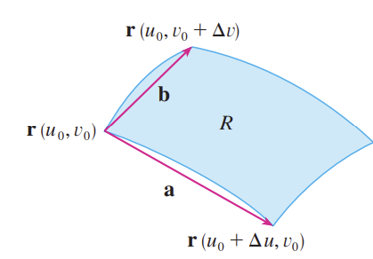
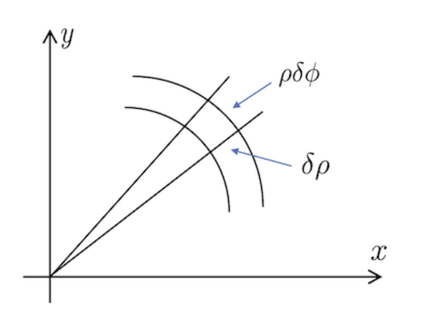

## The Jacobian
~~...were a group of revolutionaries who presided over the French Revolution's reins during its Reign of Terror from 1795 to 1800.~~ 

Just as integrals of the type
$$
\int f(x) f'(x)\ dx
$$
can be solved via a substitution $u = f(x)$, $du = f'(x)$, can we choose to substitute in a set of two alternate variables $(u,v)$ in place of $(x,y)$ and derive consequent expressions for $du$ and $dv$?

The answer is yes - though such expressions are a great deal more complicated than the single-integral case. We claim the following

> Theorem. For a change of variables $(x,y) \to (u,v)$ in which $u$ and $v$ are continuous and invertible functions of $x$ and $y$, an area integral over a region $D$ can be written as
$$
\int_D \phi(x,y) \ dx \ dy = \int_D \phi(u,v)\ |J(u,v)| \ du \ dv
$$
> where the **Jacobian** $J(u,v)$ is defined as the matrix determinant
$$
J(u,v) = \begin{vmatrix}
\frac{\partial x}{\partial u} & \frac{\partial x}{\partial v} \\
\frac{\partial y}{\partial u} & \frac{\partial y}{\partial v}
\end{vmatrix} = \begin{vmatrix}
x_u & x_v \\
y_u & y_v
\end{vmatrix}
$$
> with alternative notation
$$
J(u,v) = \frac{\partial (x,y)}{\partial (u,v)}.
$$
Note that we stipulated for $u$ and $v$ to be invertible; this means that for the transformation $u = u(x,y), v = v(x,y)$, we have the corresponding inverse transformation $x = f(u,v), y = g(u,v)$.

> Proof (insanely non-rigorous).

This proof is sketchier than an eyewitness courtrom sketch of the Zodiac Killer, but we forge ahead regardless. The crux of the transformation from $(x,y)$ to $(u,v)$ in the context of an area integral is that the area differential $dA$ must now be represented not as $dx\ dy$, but some expression of $du$ and $dv$; thus, the crucial question is what that expression is.

Let's denote an infinitesimal change in $u$ and $v$ as $\delta u$ and $\delta v$ respectively; at such infinitesimal scales, both can be assumed to be perfectly straight, but not necessarily orthogonal (unlike $dx$ and $dy$). The small region bounded by $\delta u$ and $\delta v$ is thus a parallelogram:

Given that $x = f(u,v)$ and $y = g(u,v)$, the question is now how to express the product $\delta x \delta y$ in terms of $\delta u$ and $\delta v$. By Taylor's Theorem, we have

$$
\begin{aligned}
\delta x &= f(u + \delta u, v + \delta v) - f(u,v) \\
&= [f(u,v) + ((\delta u, \delta v)\cdot \nabla)f(u,v) + ...] - f(u,v) \\
&= ((\delta u, \delta v)\cdot \nabla)f(u,v) \\
&= (\delta u, \delta v) \cdot (f_u, f_v) \\
&= (\delta u) f_u + (\delta v) f_v
\end{aligned}
$$
where the $...$ in the Taylor expansion conceal second-order and higher-order terms which vanish for very small $\delta v$ and $\delta u$, and
$$
\begin{aligned}
\delta y &= g(u + \delta u, v + \delta v) - g(u,v) \\
&= [g(u,v) + ((\delta u, \delta v)\cdot \nabla)g(u,v) + ...] - g(u,v) \\
&= ((\delta u, \delta v)\cdot \nabla)g(u,v) \\
&= (\delta u, \delta v) \cdot (g_u, g_v) \\
&= (\delta u) g_u + (\delta v) g_v
\end{aligned}
$$
or, in matrix form,
$$
\begin{bmatrix}
\delta x \\ 
\delta y
\end{bmatrix} = \begin{bmatrix}
f_u & f_v \\
g_u & g_v
\end{bmatrix}
\begin{bmatrix}
\delta u \\
\delta v
\end{bmatrix} = J(u,v)\begin{bmatrix}
\delta u \\
\delta v
\end{bmatrix}
$$
thus indicating that the determinant $|J(u,v)|$ represents the (signed) area of the parallelogram formed by $\delta u$ and $\delta v$.

## Polar coordinates in 2D

Trigonometric substitution for single integrals are useful, but for double integrals, they are downright lifesaving. As it turns out, **many** regions - from circles to half-circles to quarter-circles to... well, mainly just circles, but anything involving angles - are better represented with polar coordinates $(r, \theta)$ than with Cartesian coordinates $(x,y)$; for instance, the circle $x^2 + y^2 = 1$ is simply represented by $r=1$ in polar coordinates. 

Thus let us define the change of coordinates
$$
\begin{cases}
r = \sqrt{x^2 + y^2} \\
\theta = \tan^{-1}(\frac{y}{x})
\end{cases}
$$
or, conversely and more familiarly,
$$
\begin{cases}
x = r\cos \theta \\
y = r\sin \theta.
\end{cases}
$$
Using the Jacobian as above gives us a clue into how double integrals expressed in polar coordinates are evaluated. As formulated previously, we have
$$
J(r,\theta) = \frac{\partial (x,y)}{\partial (r,\theta)} = \begin{vmatrix}
x(r,\theta)_r & x(r,\theta)_\theta \\
y(r,\theta)_r & y(r,\theta)_\theta 
\end{vmatrix} = 
\begin{vmatrix}
\cos \theta & -r \sin \theta\\
\sin \theta &  r\cos\theta
\end{vmatrix} = r!
$$
(No factorial intended.)

Thus we simply have

> Theorem. **Change of coordinates from Cartesian to polar in double integration**.

$$
\int_D f(x,y)\ dx\ dy = \int_D f(r,\theta) \ r\ dr\ d\theta
$$
which is quite agreeable, as far as mathematical results go. 

A further geometric argument may lend much-needed credence to this Jacobian willy-nilly nonsense:

> I have never glanced upon such curious symbols in my entire life. Perchance you meant to type in $r$ and $\theta$ but slipped, sir or madam? 

Subdividing a region with respect to polar coordinates results in infinitesimal sectors, which - when small enough - can be treated as sectors of a circle with radius $r$ at that point. The arc length of such a sector is $r \ d\theta$, in radians; the "rectangle" pictured above thus has area $r\ dr\ d\theta$.

***

The following example is quite nice. By this point it should be well-known that me and Vector Calculus are mortal enemies and neither of us can live while the other survives, etc., etc., and good opinion from me towards a problem is rarely bestowed and therefore more worth the earning, so you can be assured that this example is very nice indeed:

> Example. Find the value of $\int_{-\infty}^{\infty} e^{-x^2}\ dx.$

The famed **Gaussian integral**, at long last! **Normally** this question would be reserved for a Statistics course, though the expression is so ubiquitous it surely **rings a bell**; this is one **mean** integral, not least because it is non-elementary - the antiderivative of $e^{-x^2}$ cannot be described using elementary functions like polynomials, exponentials, trigonometry, and the like.

So what to do? We propose that there is another integral, now a double integral instead of a single integral, that embeds within it our desired value, but is far, far simpler to evaluate:
$$
I = \int_{D_a} e^{-(x^2+y^2)}\ dx\ dy
$$
where $D_a$ is a circular disk of radius $a$ centered about the origin. As $a \to \infty$, the integral will range over all real numbers and the two-dimensional slice of the integrated volume when $y=0$ will be our desired answer. 

But why is this a simplification? Let's think back to polar coordinates - what in particular attracts us to them? Perhaps the fact that $x^2 + y^2 = r^2$ lies chief among our clues: under transformation $(x,y) \to (r,\theta)$, we have

$$
I = \int_{D_a}e^{-r^2}\ r\ dr\ d\theta = \int_{0}^{2\pi}\int_0^a re^{-r^2}\ dr\ d\theta
$$
where $\theta$ ranges from $0$ to $2\pi$ for a full circle, and $r$ ranges from $0$ to $a$ to describe that circle. The inner integral can now be solved via substitution, observing that $r^2$ differentiates into $r$:

$$
\int_0^{a}re^{-r^2}\ dr\ d\theta = -\frac{1}{2}[e^{-r^2}]^{a}_0 = -\frac{1}{2}[e^{-a^2}-1]
$$
which converges to $\frac{1}{2}$ as $a\to \infty$. Thus we have, miraculously:
$$
\lim_{a\to\infty}I = \int_0^{2\pi}\frac{1}{2}\ d\theta = \pi. 
$$
One last step: how do we get from here, the double integral of $e^{(-x^2+y^2)}$, to where we wanted to go - the single integral of just $e^{-x^2}$? Symmetry. Taking a closer look at $I$ reveals that
$$
\begin{aligned}
I &= \int_{D_a} e^{-(x^2+y^2)}\ dx\ dy \\
&= \int_{D_a} e^{-x^2} e^{-y^2}\ dx\ dy \\
&= \int_{-\infty}^{\infty}e^{-y^2}(\int_{-\infty}^{\infty}e^{-x^2}\ dx)\ dy\\
\end{aligned}
$$
as $e^{-y^2}$ can be treated as constant w.r.t. $x$, and thus
$$
I = (\int_{-\infty}^{\infty}e^{-x^2}\ dx)(\int_{-\infty}^{\infty}e^{-y^2}\ dy)
$$
but the two terms in the above product should be identical because they are the same integral under a different variable, leading to
$$
I = (\int_{-\infty}^{\infty}e^{-x^2}\ dx)^2 = \pi
$$
by the above, and finally, that
$$
\int_{-\infty}^{\infty}e^{-x^2}\ dx = \sqrt{\pi}
$$
taking the positive root as the integrand is positive everywhere in $\mathbb{R}$. 

This is a pretty amazing result. I'm hard-pressed to say exactly what's so amazing about it - maybe I could wax poetic about how it near-miraculously connects $e$ to $\pi$, or maybe it finally reveals the mysterious connection between the normal distribution and the presence of $\frac{1}{\sqrt{2\pi}}$, but in cases like this, no words can more eloquently describe the elegance of such results than these: *holy fricking shit.*

