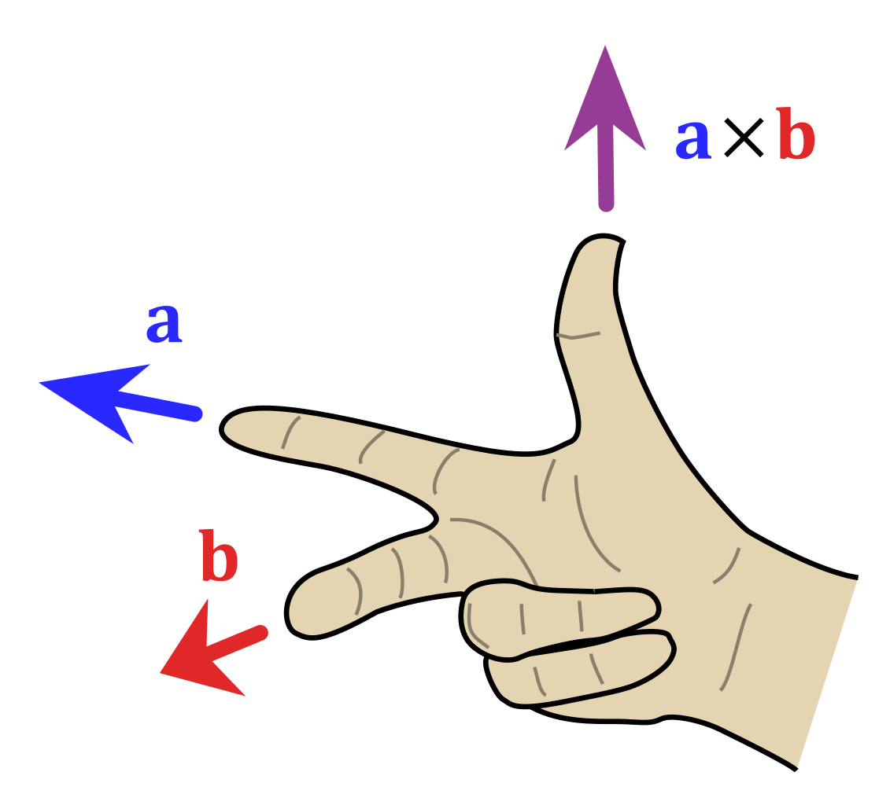
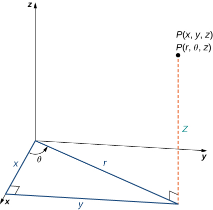
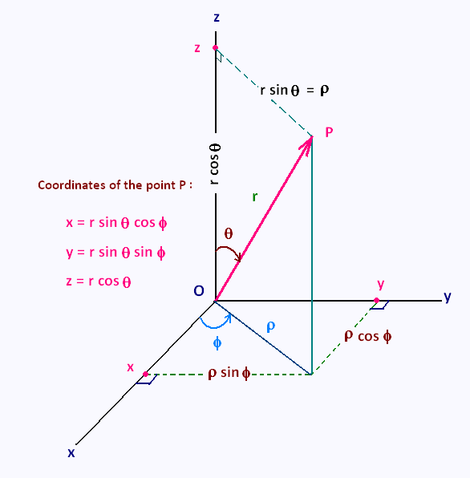

> It doesn't make sense, but keep going.

### Vector notation

> **Declaration**. The author of these notes will henceforce refer to ourselves by the royal "we".

We play a little fast and loose with vector notation because of the flamboyance of youth. For example, the vector
$$
\begin{bmatrix}
e_1 \\ e_2 \\ e_3
\end{bmatrix}
$$
in $\mathbb{R}^3$ will be notated $(e_1,e_2,e_3)$ whenever morally, ethically, and legally justifiable; doing this relieves me of my burning, visceral hatred for LaTeX and the societal construct of \begin{bmatrix} just a little more every time.

> Is this a consequence of the divergence theorem?

**Orthonormal bases** are not to be confused with *orzonormal bases*, which are Italian death camps the disembodied ghost of Mussolini sends you to one femtosecond after committing the cardinal sin of breaking pasta in half, and *oh-so-normal bases*, which are how the mathematical community at large refers to houses, parties, and all regular human settlements.

> Definition. **Orthonormal bases** (and normal bases, and ~~orthogonal bases~~, and perpendicular bases, and inorganic bases, and the strong base I just poured over the corpse in my basement) are a group of vectors which are pairwise normal and have magnitude $1$ each. 

In other words, $\mathbf{e} = \{\mathbf{e_1,e_2,...,e_n}\}$ is an orthonormal base if and only if
$$
\mathbf{e_i \cdot e_j} = \delta_{ij}
$$
where $\delta_{ij}$ is the *Kronecker delta symbol*: $\delta_{ij} = 1$ if $i = j$, $0$ otherwise. Now say your teary goodbyes to \mathbf{} and bold text, because you're never gonna see it again.

> Is this a consequence of the divergence theorem?

Sike! Mathematicians denote vectors with bold text $(\mathbf{e})$ or with a funny little arrow plus bold text $(\vec{\mathbf{e}})$, because it's probably the only place in their lives where they've learned to be bold. I speak from personal experience. 

To confirm that a orthonormal basis $(e_x, e_y, e_z)$ of $\mathbb{R^3}$ is **right-handed**, you will perform the following Rite of Honors. Take your right hand - your sword hand - and erect your thumb skyward in preparation:

If your index finger is jabbed towards $e_x$, your middle finger towards $e_y$ (and, God willing, no person of significant import), and your thumb towards $e_z$, you shall have confirmed the right-handedness of $(e_x,e_y,e_z)$, draped yourself in an eternal cloak of dignity, and readied yourself for the formation of the Arch of Honors. ~~Now take your thumb and stick it up your ass sideways.~~ 

> We hereby induct the above demonstration into the distinguished ranks of "things you can do or say in both the math classroom and in bed", alongside "this is really hard", "it's so infinitesimal I can't even see it", and moaning really loudly.

> Definition. **Right-handedness and left-handedness**.

Slightly more formally, a basis in $\mathbb{R}^3$ $(e_1,e_2,e_3)$ is **right-handed** if for $i, j, k$ being some permutation of $1, 2, 3$, we have 
$$
e_i \times e_j = \epsilon_{ijk} e_k
$$
where $\epsilon$ is the **alternating tensor**; e.g. $e_1 \times e_2 = e_3$. To test for right-handedness without doing pesky cross products, simply form the Arch of Honors. Similarly, a basis is left-handed if
$$
e_i \times e_j = -\epsilon_{ijk} e_k
$$
or if an Arch of Honors can be thrusted and plunged in the direction of the basis vectors by the left hand. Note that $e_{ij}e_{ik}$ or some such term with a repeating index ($i$) in the suffixes denotes summation notation, except when it doesn't and interpreting it as so is an alarm bell for a clinical psychopathy diagnosis.

### Basic properties of vector addition and multiplication

Ignored for the sake of brevity. For more information, consult either your kindergarten teacher, your mommy, your second mommy, or this helpful video on vector calculus: 
https://www.youtube.com/watch?v=dQw4w9WgXcQ

## Polar coordinates in $\mathbb{R^3}$

### Cylindrical polar coordinates

A polar point $(r,\theta,z)$ is where:
1. $z$ remains $z$ in Cartesian coordinates,
2. $(r,\theta)$ are the equivalent polar coordinates of the point $(x,y)$ in two dimensions: 
- $r$ is the distance of $(x,y)$ from the origin (in the two-dimensional $xy$-plane), and 
- $\theta$ is the angle, measured counterclockwise, from the $x$-axis. 

As such we have
$$
(r,\theta,z) = (r \cos \theta, r\sin \theta, z)
$$
in Cartesian coordinates. True to the name, a cylinder ~~made from organic material (5.1 inches in length, 4.5 inches in girth) stuck in a mini M&Ms tube filled with butter and microwaved mashed banana~~ of radius $k$ is denoted by $r = k$ in cylindrical coordinates.

### Spherical polar coordinates

A spherical point $(r, \theta, \phi)$ is where:
- $r$ is the *three-dimensional* Cartesian distance of the point from the origin;
- $\theta$ is the "latitude" angle, i.e. the angle formed by the point and the $z$-axis measured clockwise;
- $\phi$ is the "longitude" angle, i.e. the angle $\theta$ in cylindrical coordinates.

As shown by the helpful image above, 
$(r, \theta, \phi) = (r\sin \theta \cos \phi, r\sin \theta \sin \phi, r\cos \phi)$ in Cartesian coordinates. True to form, $r = k$ forms a sphere of radius $k$.

Unfortunately, based on the current literature empirical evidence, $r = k$ in Cartesian coordinates does not summon forth the bodiless apparition of Rene Descartes of length and girth $k$ to the material realm.

> Is this a consequence of the divergence theorem?

## Determinants

> End me now.

For centuries, pro-Determinant cults (known as "math classes") have secretly paraded around in the following names:
- The Black Death
- It That Lurks In The Darkness
- Satan's Hemmorhoids
- The Antichrist in Human Clothing 

They teach their followers these secret Satanical axioms, disregarding the ruin and doom they bring forth to the world:

$$
\det A = \epsilon_{j_1 j_2 ... j_n}A_{j_1 1} A_{j_2 2} ... A_{j_n n}
$$
$$
\det(AB) = \det A \det B
$$
$$
\det(A^{-1}) = \frac{1}{\det A}
$$
> This is not a consequence of the divergence theorem.