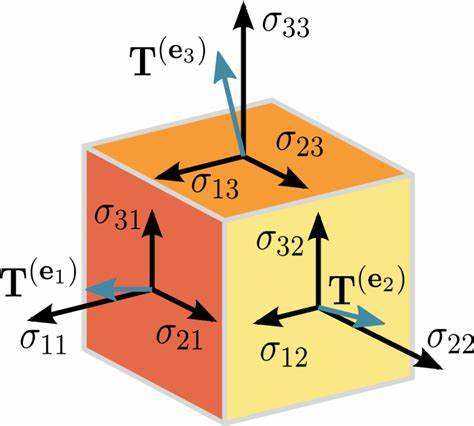
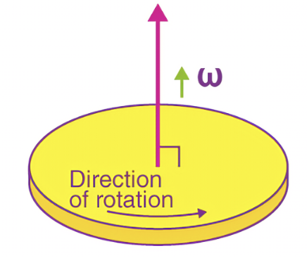

## The existential question

After the better part of roughly fifteen hours spent in various Starbucks around the neighborhood wrangling, duking it out, and generally having an absolute blast with tensors, we arrive at the existential question at last: why are we doing all this? Besides transforming every undergrad math lecture hall into the world's least arousing sadomasochistic blood-dungeon devoted to the pleasure of pain - and being 99% of the reason why "import tensorflow as tf" takes at least five different autocorrect checks to spell right - why do any of this?

> Coincidentally, "tf" was also my reaction to finding out that tensors were a thing for the first time.

It turns out that, putting aside my adamantium-clad prejudice and fire-forged hatred for tensors and their four-dimensional states of being for a millisecond, maybe they're occasionally somewhat useful in describing physical phenomena - especially ones that don't change when your frame of reference rotates. 

In fact, tensors derive their name from the Latin root "tensio", meaning to stretch but itself derived from "tendere", meaning "tender", which is further derived from the Japanese "tsundere". This is a reference to ~~how I'd like to tenderize every last one of them with a human-sized meat mallet~~ a reference to how they were originally used to measure *tensile forces*: forces that stretch, compress, and shear an object. For the simplest case, a tiny three-dimensional cube, there were nine such forces to consider: three directly parallel to the axes - stretching forces in $x$, $y$ and $z$ directions - and three *pairs* of forces which act as *shearing* forces: they stretch the object along the angle mid-way between two coordinate axes.

As shown by the above diagram, nine forces act on a microscopic cube: $\sigma_{ii}$ for $i= 1, 2, 3$ representing forces purely acting along a certain axes, $\sigma_{ij}$ for $i\neq j$ representing shearing forces which act in-between axes $i$ and $j$ and make me think of that time I used a pair of garden shears to (REDACTED) (REDACTED). By the way, how much compressive force do I need to squeeze a 70-kilogram, roughly-cylindrical object into a meter-long bathtub filled with corrosive acid? I need to know by Friday.

This lends itself naturally to the following embedding of all the information we need to know:

> Definition. The **stress tensor** of a microscopic cube in $\mathbb{R^3}$ is given by
$$
\mathbf{\sigma}= \begin{bmatrix}
\sigma_{xx} & \sigma_{xy} & \sigma_{xz} \\
\sigma_{yx} & \sigma_{yy} & \sigma_{yz} \\
\sigma_{zx} & \sigma_{zy} & \sigma_{zz}
\end{bmatrix}.
$$
Each of the entries describe a force in a certain direction - that is, even though it's just a number, the entries of this matrix are vectors. The forces these vectors represent do not change no matter what basis you're looking at them through; thus, $\sigma$ is a rank-$2$ tensor as we understand them. 

> It's worth noting that $\sigma_{ij}$ in the above matrix can itself be expressed as the contraction of a tensor product $\sigma_{ij} = C_{ijkl}e_{kl}$, where $C_{ijkl}$ is the **elasticity tensor** and $e_{kl}$ is the **strain tensor** describing how a small displacement in the $k$-direction stretches the object in the $l$-irection.

This leads us to a better question to ask. Instead of "where do tensors pop up", it now becomes even more natural to ask: why use tensors at all? Why represent these forces as a tensor, instead of adding them to equilibrium via Newton's Second Law? Why disguise the physical reality of these forces under a layer of mathematical abstraction in the form of tensors, or matrices, or even vectors?

The answer - as it so often is in math, with not just tensors, but unending swarms of other things as well - is that studying tensors as a whole, not necessarily this particular stress tensor but the properties of tensors as a mathematical object in general, leads us to the discovery of useful facts and theorems about that object: tensor decompositions, tensor integral theorems, and many more. 

We then use these facts we've discovered through an additional veil of abstraction and apply them back onto the non-abstract physical scenario the tensor was originally designed for - for instance, maybe a tensor decomposition would yield something useful: not necessarily here, but in many other cases indeed so. Let's look at just a few of these other cases now!

## Tensors in electric fields

If you weren't obsessively figuring out a way to beat the entirety of Plants vs. Zombies using only Puff-Shrooms and throwing love-letter paper-airplanes asking a certain someone out to prom from the back row that accidentally hit your teacher instead in all four years of high school physics, you should probably remember Ohm's Law.

> Wait, my therapist tells me that apparently the paragraph I just wrote is something called "projection" and is threatening to stop our sessions if I don't cooperate. I'm now being physically coerced to tell you that by "you" I actually mean "me", and by "me" I mean "who?"

Ohm's Law states that the electric current $I$ flowing through a metallic conductor placed in an electric field is proportional to the potential difference $V$ throughout the conductor:
$$
I = \frac{V}{R},
$$
where $R$ is a little something we call *resistance*.

There's a lot missing from this statement of Ohm's Law, censored and redacted and baby-ified for innocent eyes not yet wise to the wickedness of the world. For one, it assumes that the metal object in question is *isotropic*; it looks exactly the same in all directions, with the same resistance, density, thickness etc. throughout. But even more importantly, it doesn't generalize well to our current microscopic understanding of the electric field: the potential difference $V$ refers to a discrete difference in potential $\phi$ between two points, not some continuous quantity at every single point. Rather, if we were to measure potential difference continuously at every point in the field, we would have
$$
V = \nabla \phi = \mathbf{E}
$$
as $\nabla \phi$ represents the instantaneous change of potential in all directions at that point; call this the *electric field strength* $\mathbf{E}$ at the point. As such, we now have
$$
I = \frac{\mathbf{E}}{R}
$$
but given that $I$ is now a scalar field at every point and the material is **not** necessarily isotropic, meaning it may have different resistances in every direction, we rewrite Ohm's law in the form

> Theorem. **Tensor form of Ohm's law for non-isotropic conductors in an electric field.** For a **current density** scalar field $\mathbf{J}$, an electric field $\mathbf{E}$ and a **conductivity tensor** $\sigma$, we have
$$
\mathbf{J} = \sigma \mathbf{E}
$$
where $\sigma$ is a $2$-tensor (a $3\times 3$ matrix) which contains the resistance of the material in every pair of axes (parallel to each axis as well as in-between pairs of axes, as seen above with the stress tensor.)

If the material is indeed isotropic, then we have something much simpler. Isotropic materials lend themselves to isotropic tensors $\sigma$; in three dimensions (and tensor rank $2$), the only possible choice is $\delta_{ij}$, $i, j = 1, 2, 3$:
$$
\sigma_{ij} = \sigma \delta_{ij}
$$
for a constant $\sigma$, indicating that the material has the same resistance in every axis and no resistance in-between the axes.

In two dimensions, though - think an infinitely thin electric wafer, like a potato chip or a really thin wire - we have something altogether a bit more interesting. 

> Proposition. In $\mathbb{R^2}$, $\delta_{ij}$ is not the only isotropic $2$-tensor; $\epsilon_{ij}$ is also isotropic ($i, j = 1, 2$.)

> Proof. 

By the tensor transformation law:
$$
\begin{aligned}
\epsilon_{ij}' &= \epsilon_{kl}R_{ik}R_{jl} \\
&= \epsilon_{12}R_{i1}R_{j2} + \epsilon_{21}R_{i2}R_{j1} \\
&= R_{i1}R_{j2} - R_{i2}R_{j1} \\ 
\end{aligned}
$$
I'm pretty sure that out of the million gazillion bajillion different ways you could prove this by, this is by far and away **the** stupidest one, but as long as it works:
$$
\begin{cases}
i = 1,\ j = 2, \epsilon_{ij} = 1, \epsilon_{ij}' = R_{11}R_{22}-R_{12}R_{21} = \det R = 1 \\
i  = 2, j= 1, \epsilon_{ij} = -1, \epsilon_{ij}' = R_{12}R_{21} - R_{11}R_{22} = -\det R = -1 \\
i = j = 1, \epsilon_{ij} = 0, \epsilon_{ij}' = R_{11}R_{12} - R_{12}R_{11} = 0 \\
i = j = 2, \epsilon_{ij} = 0, \epsilon_{ij}' = R_{21}R_{22} - R_{22}R_{21} = 0

\end{cases}
$$
with $\epsilon_{ij} = \epsilon_{ij}'$ in all four cases.

***

As such, isotropic $2$-tensors in $\mathbb{R^2}$  can be any linear combination of the symmetric isotropic tensor $\delta_{ij}$ and the antisymmetric isotropic tensor $\epsilon_{ij}$; thus, the conductivity tensor $\sigma$ is in the form

> Definition. **Conductivity tensor for isotropic material in $\mathbb{R^2}$.**
$$
\sigma = \sigma_{xx} \delta_{ij} + \sigma_{xy}\epsilon_{ij} = \begin{bmatrix}
\sigma_{xx} & \sigma_{xy} \\
-\sigma_{xy} & \sigma_{xx}
\end{bmatrix}
$$
for constants $\sigma_{xx}$ and $\sigma_{xy}$ representing the *longitudinal conductivity* and the *Hall conductivity* respectively. The most interesting consequence of this is that, given an electric field vector $\mathbf{E}$ that points only in the $x$-direction
$$
\mathbf{E} = \begin{bmatrix}
x \\
0
\end{bmatrix}
$$
the current density in the two-dimensional object beecomes
$$
\mathbf{J} = \sigma \mathbf{E} = \begin{bmatrix}
\sigma_{xx} x \\
-\sigma_{xy} x
\end{bmatrix}
$$
implying that there will also be an induced current in the $y$-direction as long as the Hall conductivity $\sigma_{xy}$ is nonzero. 

What use did we have for tensors in all of this? Quite a lot, actually. Because we knew conductivity was a $2$-tensor; we immediately knew exactly what form it should take for an isotropic substance both in $\mathbb{R^3}$ and in $\mathbb{R^2}$; and because of that, we were able to infer that a Hall conductivity exists - the induction of an electric current in a direction perpendicular to the field through the *Hall effect*, something which is traditionally explained through electromagnetic induction and magnetic fields but was derived and manifested into existence purely through the properties of tensors.

## The inertia tensor

Consider a rigid body modeled by a collection of point masses $m_a$ at position $\mathbf{x}_a$; suppose that the body is tied to some origin, or *pole*, and rotating about that origin with an angular velocity $\omega$, defined as the rate of change of the angle of the object as it revolves. (Fun fact: these sentences describe what I have in my basement right now almost exactly.) 

Suppose that every point on the rigid body is moving with the same linear velocity $\mathbf{v_a}$; in particular, linear velocity is given as the cross product of position and angular velocity, i.e.
$$
\mathbf{v_a} = \omega \times \mathbf{x_a}
$$
where, by convention, we define the angular velocity to be **pointing upwards**/**in the $z$-direction** if the object is rotating in the $xy$-plane, so as to 1) have angular velocity point towards an easily-pinned-down constant direction; and 2) given that $\mathbf{v_a}$, the linear velocity, is provided by the dot product between radius and angular velocity, ensure that the linear velocity is constantly perpendicular to the radius (as is expected for circular motion) and that linear velocity, radius, and angular velocity form an orthonormal basis.

We define the **total angular momentum** of the rigid body, a vector, as the sum of the angular momentums of all of its point masses, themselves defined as the cross product
$$
\mathbf{L} = m_a(\mathbf{x_a} \times \mathbf{v_a}) = m_a\mathbf{x_a}\times(\mathbf{\omega} \times \mathbf{x_a}) = m_a((\mathbf{x_a \cdot x_a})\mathbf{\omega} - (\mathbf{x_a \cdot \omega})\mathbf{x_a})
$$
by the vector triple product identity for point mass $a$. (We also have $\mathbf{L} = \mathbf{x_a} \times (m_a\mathbf{v_a})$, where the second term is recognizable as linear velocity; this is maximized when $\mathbf{x}$ and $\mathbf{v}$ are orthogonal, i.e. with circular motion.) The total angular momentum of the rigid body is thus given by
$$
\mathbf{L} =\sum_{a}m_a((\mathbf{x_a \cdot x_a})\mathbf{\omega} - (\mathbf{x_a \cdot \omega})\mathbf{x_a})
$$
for a discrete collection of finite point charges. Summation notation reveals this to be equal to
$$
\begin{aligned}
\mathbf{L}_i &=\sum_{a}m_a((\mathbf{x_a \cdot x_a})\mathbf{\omega} - (\mathbf{x_a \cdot \omega})\mathbf{x_a})_i \\

&= \sum_{a}m_a(|\mathbf{x_a}|^2\mathbf{\omega}_i - (\mathbf{x_a})_j\mathbf{\omega}_j      (\mathbf{x_a})_i) \\

&= \sum_{a}m_a(|\mathbf{x_a}|^2\delta_{ij}\mathbf{\omega}_j - (\mathbf{x_a})_i     (\mathbf{x_a})_j\mathbf{\omega}_j ) \\

&= [\sum_a m_a(|\mathbf{x_a}|^2\delta_{ij} - (\mathbf{x_a})_i     (\mathbf{x_a})_j)]\omega_j \\

&= I_{ij} \omega_j
\end{aligned}
$$
where $I$ is a $3\times 3$ matrix - indeed a tensor, because it is formed from a linear combination of tensors $\delta_{ij}$ and $\mathbf{x_a}$ - defined below:

> Definition. The **inertia tensor** $I$ is the $2$-tensor in $\mathbb{R^3}$ with elements
$$
I_{ij} =\sum_a m_a(|\mathbf{x_a}|^2\delta_{ij} - (\mathbf{x_a})_i     (\mathbf{x_a})_j)
$$
> for a rigid body containing point masses $m_a$ at position $\mathbf{x_a}$.

If we have a continuous rigid body containing an infinite number of infinitesimal point masses, we instead have the following integral form for the inertia tensor:
$$
I_{ij} = \int_V \rho(\mathbf{x})(|\mathbf{x}|^2\delta_{ij} - \mathbf{x}_i \mathbf{x}_j)\ dV
$$
with density $\rho$ replacing discrete point mass $m_a$, continuous position $\mathbf{x}$ replacing discrete position $\mathbf{x_a}$, and $V$ being the region describing the rigid body.

In particular, we observe that the inertia tensor is symmetric; from [[Linear Algebra.Eigenvalues and Eigenvectors.Eigenvalues and Eigenvectors of Hermitian Matrices]], we know that the matrix $I$ representing the inertia vector is diagonalizable, yielding three mutually orthogonal principal axes equalling the eigenvectors of $I$. But what do these principal axes actually mean for the rigid body at hand? To understand this, we turn to a physical interpretation of the inertia tensor:

> Proposition. The component $I_{ij}$ of the inertia tensor describes the **moment of inertia** of the rigid body, analogous to mass in linear scenarios: the greater $I_{ij}$ is, the more rotational "force" (**torque**) will be applied to the object about axis $j$ when a small angular acceleration or velocity is applied to it about axis $i$.

This can be demonstrated via the original equation relating angular momentum $\mathbf{L}$, $I$ and $\omega$:
$$
L_{x} = I_{xj}\omega_{j}\ (= I_{xx}\omega_x + I_{xy}\omega_y + I_{xz}\omega_z)
$$
taking the $x$-axis as an example in $\mathbb{R^3}$. Just as the time-derivative of linear momentum is net linear force, the time-derivative of angular momentum about a certain axis is net angular force (torque) about the axis, denoted by $\tau$; as such, we have
$$
\tau_x = I_{xj}\dot\omega_j = I_{xj}\mathbf{a}_{j}
$$
where $\mathbf{a}$ is angular acceleration; this resembles Newton's Second Law $F= ma$. Thus the components of $I$ can be thought of as analogous to mass: $I_{ij}$ describes the amount of "angular mass", or moment of inertia, present along axis $j$ with respect to an  acceleration about axis $i$.

As such, if we can identify three eigenvectors of $I$ - the principal axes - then if we take these principal axes as our new coordinate system, $I$ will look like the diagonal matrix
$$
I = \begin{bmatrix}
\lambda_1 & & \\
& \lambda_2 & \\
& & \lambda_3

\end{bmatrix}
$$
with all components $I_{ij}$ with $i \neq j$ equalling zero, meaning that all the "mass" of the object is concentrated purely along these axes - there are no mixed-axes inertias. But what kind of object does this describe? This leads us to the following example:

> Example. Find the inertia tensor of a sphere of radius $R$ and constant density $\rho_0$.

> Solution. 

We utilize the integral form of the components $I_{ij}$ of the inertia tensor $I$:
$$
I_{ij} = \int_V \rho(\mathbf{x})(|\mathbf{x}|^2\delta_{ij} - x_i x_j)\ dV
$$
with $V$ being a ball with radius $R$ centered about the origin and $\rho$ being a constant $\rho_0$. In particular, the latter term
$$
T_{ij} = -\int_V \rho(\mathbf{x}) x_i x_j\ dV
$$
is an invariant tensor (see example above); as such, by the Integral Invariance Theorem we have
$$
T_{ij} = \alpha \delta_{ij}
$$
for some constant $\alpha$; from the trace of $T_{ij}$ we also have
$$
T_{ii} = -\int_V \rho(\mathbf{x}) x_i x_i\ dV = -\int_V \rho(\mathbf{x})|\mathbf{x}|^2\ dV = \alpha\delta_{ii}=3\alpha
$$
and thus 
$$
\alpha = -\frac{1}{3}\int_V \rho(\mathbf{x})|\mathbf{x}|^2\ dV.
$$
In total, we have
$$
I_{ij} = \frac{2}{3}\delta_{ij}\int_V\rho(\mathbf{x})|\mathbf{x}|^2\ dV
$$
summing everything together, and when $\rho(\mathbf{x})$ is a constant $\rho_0$ we have
$$
I_{ij} = \frac{2}{3}\rho_0 \delta_{ij}\int_V |\mathbf{x}|^2\ dV
$$
which is easily evaluated via a change of variables to spherical coordinates.

***

From the above example, we make one important observation: the inertia tensor of a spherical object 
$$
I_{ij} = \frac{2}{3}\rho_0 \delta_{ij}\int_V |\mathbf{x}|^2\ dV
$$
is a diagonal matrix, with $\delta_{ij}$ being zero when $i\neq j$; this tells us that a sphere has no **moment of inertia** along the mixed axes, meaning that there is no way you can give the sphere a small angular acceleration along one axis and have it spin on another axis - conforming to our expectations of reality. In general, we expect a rigid body that has **mass symmetry** about a certain axis, like a cylinder or a sphere, to have no mixed moments of inertia about that axis; if you spin it about that axis, it'll spin about that axis and that axis only instead of wobbling about wildly and toppling over like a freshly-castrated mule after overdosing on an entire barrel of anesthetics mixed with beer from the tap. 

As such, what do the principal axes of a rigid body in 3D indicate? The axes of symmetry where the rigid body can be considered balanced, and a rotation about which produces no mixed effects upon the body on other axes.

> **Quest complete**!